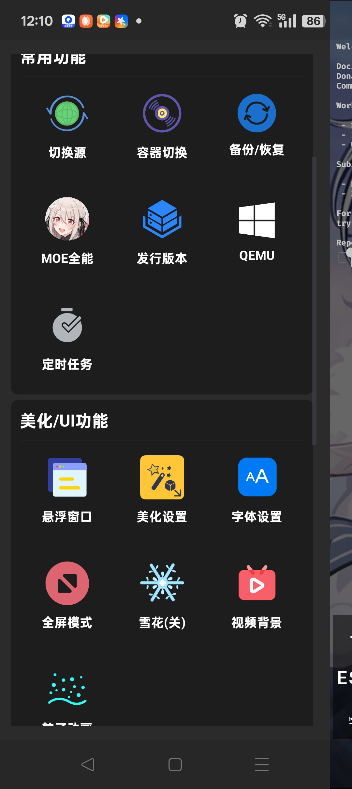
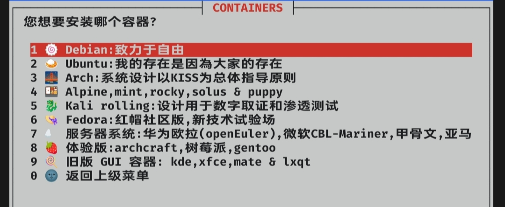
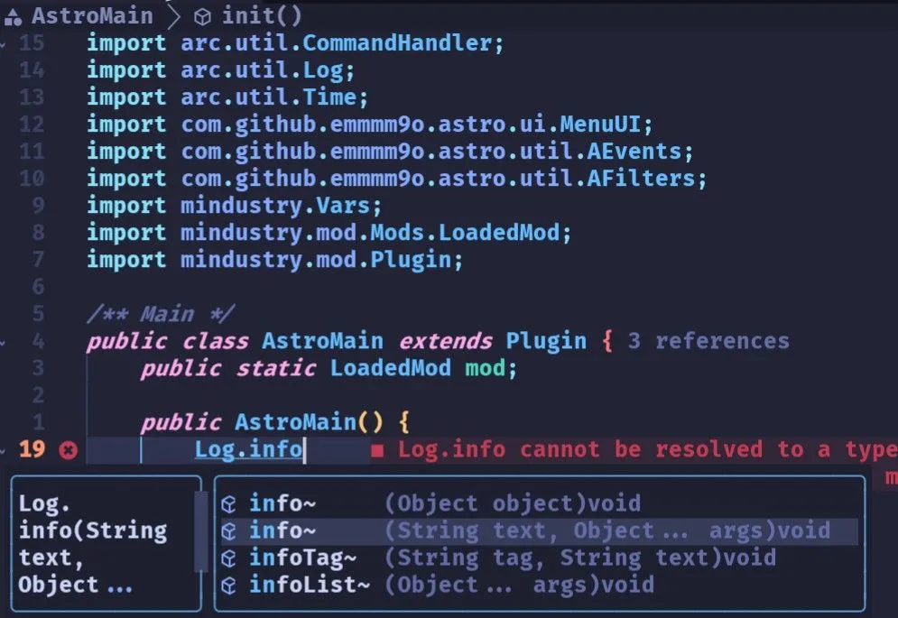

# 如果你只有Android设备
> [!IMPORTANT] 
> 本教程需要一定Linux基础

2025-03-17 Novarc

本教程将讲述在android手机上使用termux开发mdt mod的 基本配置 和 容器安装\
由于部分设备不支持容器 也加入了如果不安装容器的一些配置方案(因为termux的路径系统 一些东西可能会有问题)

# Termux配置
> [!NOTE]
> Termux是一个**适用于 Android 的终端模拟器，其环境类似于 Linux 环境**。 无需Root或设置即可使用。 Termux 会自动进行最小安装 - 使用 APT 包管理器即可获得其他软件包。

> [!TIP]
> 推荐新人使用功能更加强大的**ZeroTermux**\
> **ZeroTermux**基于**Termux**进行修改，内置一键切换apt/pkg软件源、一键备份恢复等多种便捷功能\
> 另外支持背景

下面ZeroTermux和Termux二选一
> [!TIP]
> 建议熟悉后换成Termux
:::: tabs

::: tab ZeroTermux
<GitHubCard repo="hanxinhao000/ZeroTermux"/>
[官方下载站](https://d.icdown.club/repository/main/ZeroTermux/)
[下载最新版](http://getzt.icdown.club/)
::: details 预览


:::

::: tab Termux
<GitHubCard repo="termux/termux-app"/>
[**github下载**](https://github.com/termux/termux-app/releases/download/v0.118.1/termux-app_v0.118.1+github-debug_arm64-v8a.apk)
:::

::::
## Termux基础介绍
- ~/
  - .termux/， Termux配置
   - termux.properties， termux基础配置
   - colors.properties， 配色配置
   - font.ttf， 字体 可以替换
   - shell
  - storage/， 挂载的外部储存卡
   - download/， /storage/emulated/0/Download/
   - documents/， /storage/emulated/0/Documents/
   - ...

挂载存储卡请运行`termux-setup-storage`
## 基础配置(可选)
### 小键配置
修改~/.termux/termux.properties
### 配色方案
修改~/.termux/colors.properties
### 字体设置
修改~/.termux/font.ttf
### ZeroTermux配置(可选)
打开左菜单 自行配置
### 镜像配置
**清华源**
::: code-group

```txt [ZeroTermux]
打开左菜单选择切换源
```

```shell [Termux图形界面]
termux-change-repo
```

```shell [Termux命令行]
sed -i 's@^\(deb.*stable main\)$@#\1\ndeb https://mirrors.tuna.tsinghua.edu.cn/termux/apt/termux-main stable main@' $PREFIX/etc/apt/sources.list
apt update && apt upgrade
```

:::
# 容器安装
部分国产安卓系统可能不支持容器\
如果不想安装容器就跳过\
安装容器后基本上就是相当于拥有了一个linux系统 配置模组开发环境和IDE可以参考前面的教程

对于没有toot的 推荐使用PRoot
>[!NOTE]
>PRoot 是一个 chroot, mount –bind, 和 binfmt_misc 的用户空间实现。这意味着，用户不需要任何特殊权限和设置就可以使用任意目录作为新的根文件系统或者通过QEMU运行为其它CPU架构构建的程序。

对于已root的 推荐使用chroot
>[!NOTE]
>Chroot 是一种修改当前进程及其子进程的可见根目录的操作。修改后，进程将不能访问该环境目录树以外的任何文件和命令，这种修改后的环境叫作 chroot jail（直译为 chroot 监狱）


> [!TIP]
> 由于直接使用proot/chroot安装比较麻烦 一些配置比较复杂 本教程使用Tmoe安装容器
## Tmoe
>[!NOTE]
>**TMOE** More Optional Environments.

<GitHubCard repo="2moe/tmoe"/>

[官方文档](https://doc.tmoe.me/)\
安装tmoe
::: code-group

```txt [ZeroTermux]
打开左菜单选择`MOE全能`
```

```shell [Termux]
 if ! which curl; then pkg install;fi
curl -LO https://gitee.com/mo2/linux/raw/2/2.awk
awk -f 2.awk
```

:::
后续使用`tmoe`或者`awk -f 2.awk`命名便可直接打开
### 容器
选择`proot/chroot容器`选择`arm64发行版列表`

> [!NOTE]
> Arch Linux 是一个轻量级和高度可定制的 Linux 发行版，最初发布于 2002 年。与其他流行的发行版不同，Arch Linux 是一个简约的发行版，采用自己动手（DIY）的方式。它是为中高级 Linux 用户设计的，他们喜欢控制和灵活性而不是易用性

> [!NOTE]
> Ubuntu 由 Canonical 创建，它是最受欢迎的 Linux 发行版之一，为所有用户和各种使用情况而设计。你可以将 Ubuntu 用于日常工作、开发环境、休闲浏览等方面。

> [!TIP]
> 似乎因为tmoe过老 arch安装过程似乎因为镜像问题速度有点慢了
自行选择 推荐ArchLinux或者Ubuntu

因为tmoe安装过程十分人性化\
而且有中文 所以自己配置 记住认真选择\
别没用的都安了\
如果需要使用idea或者vsc(不算code-server)的请记得通过tmoe安装桌面并且安装vnc

### tmoe tools
在linux容器里运行tmoe选择tools即可进入tmoe tools辅助安装软件了

### 图形化界面和VNC
> [!NOTE]
> VNC (Virtual Network Console)是虚拟网络控制台的缩写。它 是一款优秀的远程控制工具软件，由著名的 AT&T 的欧洲研究实验室开发的\
直接启动tmoe tools来安装\
本教程不介绍其他自行安装的方法

### ZSH配置(可选)
> [!NOTE]
> 尽管Tmoe安装zsh比较方便\
> 但是因为使用的是oh my zsh性能堪忧\
> 推荐查看[Zsh配置教程]() 配置zsh+zinit

打开TMOE Tools\
找到ZSH\
配色和主题自选
::: details 预览
预览为p10k

:::
### VNC客户端安装
本教程使用AVNC客户端

<GitHubCard repo="gujjwal00/avnc"/>
[github下载](https://github.com/gujjwal00/avnc/releases/download/v2.8.0/AVNC-2.8.0.apk)

# 无容器配置
无容器环境下的一些配置与linux相似但又区别 其他教程中的Termux分组指的就是无容器环境下的配置方案\
自行参考其他教程

## 使用tmoe配置zsh(可选)
尽管tmoe一般是来安装容器的\
不过也可以通过tmoe安装zsh美化终端\
按照上面方法安装/打开tmoe\
选择 **configure zsh美化终端**\
后面操作和linux中使用tmoe配置zsh一样

# 常用IDE介绍

开发Mindustry Java Mod需要的IDE
下面介绍一些常用IDE

下面是一个对比表格
| IDE | 介绍 | 特征 | 建议 |
| ------- | :---: | :------: | :-----: |
| **IDEA** | 由JetBrains开发的专业Java/Kt IDE | 强大的功能 简单的配置 | 开发Java/Kt mod的最佳选择 |
| **vscode** | 免费开源的多语音IDE | 需要安装插件配置 较为复杂 | 都能跑vsc了给我用idea去 |
| **Neovim** | Vim的升级版本 | 需要复杂的配置 当然可以使用一些现有配置 | Termux无容器用户的必然选择 Linux命令行用户的选择 低配android跑linux的选择 |
| **AndroidIDE** | 安卓平台上的Java Ide | 本质上是内置了一个Termux 外面提供GUI | 可以尝试但是问题较多 |

> [!TIP]
> 对于无容器的Termux仅能使用Neovim
> 对于安装linux容器的Termux(需要安装桌面)
> 如果配置好可以使用IDEA 6GB运存能基本使用了
> 追求便利/现代可以使用Vscode/code-server
> code-server网页操作上可能有点问题
> 屏幕太小不好操控
> 追求性能和操作可以使用Neovim

# IDEA

**IntelliJ IDEA**
[官网](https://www.jetbrains.com/zh-cn/idea/)
## 介绍
面向专业开发的 IDE
适用于 Java 和 Kotlin
- 卓越的 Java 和 Kotlin 体验 
- 深度代码理解 在每个上下文中提供相关建议，实现极快的导航和智能体验。 
- 开箱即用的无缝体验

> [!NOTE]
> IDEA分为Ultimate(专业版)/Community(社区版)
> 专业版需要付费 功能更加强大
> 但是对于mdt mod开发人员来讲社区版完全够用
> 当然你可以通过education白嫖


## 安装
前往官网安装指定平台即可
含容器的termux请安装linux arm64版本
使用简单方便

## 推荐插件
- Rainbow Brackets 彩虹括号插件 (超级推荐)
- Color Highlighter 显示颜色代码 (超级推荐)
- Translation 翻译插件
- Key Promoter X 快捷键提示插件
- CamelCase 驼峰命名和下划线命名转换
- CodeGlance 显示代码缩略图
- CheckStyle 代码风格检查插件
- Save Actions 格式化代码插件
- SonarLint 代码质量检查插件
- Statistic 代码统计插件
- IdeaVim Idea使用vim特征

## 关于安卓设备
安卓设备安装容器后即可跑IDEA 需要下载Linux arm64版本
注意 配置要求较高 至少6GB运存
::: details 预览

:::

# Vscode/Code-server

# Neovim
> [!IMPORTANT]
> 需要Lua基础和vim基础

<GitHubCard repo="neovim/neovim"/>


Neovim 是一款现代化、高效且功能丰富的编辑器，完全兼容 Vim。它支持插件、图形界面、语言服务器协议（LSP）、Lua 编程语言等功能。
Neovim配置主要使用Lua

vim/neovim的优势在于
- 只用键盘很舒服
- 高度可定制性
- 一些高效功能
- 轻量

>[!NOTE]
> 需要注意的是使用vim/neovim能提高部分码字速度
> 但对于大部分人来讲不能提高实际编码速度
> 对于真正熟练的大佬才行
> 编程的大部分时间在思考而非码字
> 纯键盘化操作能带来舒适 繁琐操作鼠标会有一定麻烦

::: details 预览
AstroNvim


:::

# 命令行安装
Nvim安装需要很多辅助的库\
git,gcc,ripgrep,fd,unzip,tree-sitter,luarocks
:::: tabs

::: tab "Windows" id="windows"
## 使用安装包
[stable版本位置](https://github.com/neovim/neovim/releases/tag/stable)
下面选择zip/msi安装
- zip [github下载地址](https://github.com/neovim/neovim/releases/download/stable/nvim-win64.zip)
自行解压
- msi [github下载地址](https://github.com/neovim/neovim/releases/download/stable/nvim-win64.msi)
自行运行

## 从包管理工具安装
关于包管理工具请看前面教程\
环境安装
### 使用Scoop
```shell
scoop install git gcc ripgrep fd unzip tree-sitter luarocks
```
```shell
scoop install neovim
```
> [!NOTE]
> **自行添加进环境变量**
:::

::: tab "Debian/Ubuntu" id="debian"
```shell
sudo apt install neovim
```
:::

::: tab "Arch Linux" id="arch"
```shell
sudo pacman -S neovim
```
:::

::: tab "Termux" id="termux"
```shell
pkg install neovim
```
:::

::::


> [!TIP]
> 长期在图形化界面使用**neovim**非常非常推荐安装**GUI客户端**\
> Termux无容器不支持GUI!\
> 安卓上运行的Linux也不建议使用**GUI**

# GUI安装
有非常多Neovim GUI客户端\
下面给出一些
## nvim-qt
<GitHubCard repo="equalsraf/neovim-qt"/>

:::: tabs

::: tab "Windows" id="windows"
> [!TIP]
> 在Neovim 0.10.0开始 Neovim Qt不在和neovim捆绑在一起\
> 在0.10.0之前 Neovim Qt包含在Neovim包里面

## 使用安装包
[最新版Release](https://github.com/equalsraf/neovim-qt/releases/latest)
- [zip github 下载v0.2.19](https://github.com/equalsraf/neovim-qt/releases/download/v0.2.19/neovim-qt.zip)
- [msi github 下载v0.2.19](https://github.com/equalsraf/neovim-qt/releases/download/v0.2.19/neovim-qt-installer.msi)
> [!NOTE]
> **自行添加进环境变量**
## 从包管理工具安装
```shell
scoop install neovim-qt
```
:::

::: tab "Debian/Ubuntu" id="debian"
```shell
sudo apt install neovim-qt
```
:::

::: tab "Arch Linux" id="arch"
```shell
sudo pacman -S neovim-qt
```
:::

::: tab "Termux" id="termux"
无容器Termux无GUI不支持
:::

::::

## neovide
> [!NOTE]
> neovide需要neovim `0.10`及以上

<GitHubCard repo="neovide/neovide"/>
:::: tabs

::: tab "Windows" id="windows"
## 使用安装包
[最新版Release](https://github.com/neovide/neovide/releases/latest)
- [zip github 下载v0.14.1](https://github.com/neovide/neovide/releases/download/0.14.1/neovide.exe.zip)
- [msi github 下载v0.14.1](https://github.com/neovide/neovide/releases/download/0.14.1/neovide.msi)
> [!NOTE]
> **自行添加进环境变量**
## 从包管理工具安装
```shell
scoop install neovide
```
:::

::: tab "Debian/Ubuntu" id="debian"
[最新版Release](https://github.com/neovide/neovide/releases/latest)\
[x86 linux版github下载v0.14.1](https://github.com/neovide/neovide/releases/download/0.14.1/neovide-linux-x86_64.tar.gz)\
貌似没有arm64的 需要自行构建
:::

::: tab "Arch Linux" id="arch"
```shell
sudo pacman -S neovide
```
如果需要在X11下运行 还需要`libxkbcommon-x11`
```shell
sudo pacman -S libxkbcommon-x11
```
:::

::: tab "Termux" id="termux"
无容器Termux无GUI不支持
:::

::::

# 配置
Neovim配置比较复杂\
下面有一些常用的第三方配置

# 镜像配置
讲一些neovim常用管理插件通用的镜像配置\
下面的`require().setup`有时候并不会直接出现
自行寻找哪里配置配置选项
## Lazy.nvim
Lazy.nvim安装插件从github.com安装\
在Lazy.nvim的setup文件(比如`lazy_setup.lua`)里面
```lua{5}
require("lazy").setup({
...
},{
...
  git = { url_format = "{镜像}/https://github.com/%s.git" },
-- 比如"https://github.tbedu.top/https://github.com/%s.git"
...
})
```
另外Lazy本身安装时候的镜像配置\
找到`init.lua`将里面的`https://github.com`前面加上镜像就好了

## Mason
Mason安装部分包时候默认从github.com安装\
找到Mason setup的位置\
部分集成化配置(比如AstroNvim在`~/.local/share/nvim/lazy/AstroNvim/lua/astronvim/plugins/mason.lua`里面)自行寻找
```lua{3}
require("mason").setup({
  ...
  github = {download_url_template = "{镜像}/https://github.com/%s/releases/download/%s/%s",},
-- 比如"https://github.tbedu.top/https://github.com/%s/releases/download/%s/%s"
  ...
})
```
# AstroNvim

<GitHubCard repo="AstroNvim/AstroNvim"/>


::: details 预览

:::
**AstroNvim** 是一个美观且功能丰富的 **Neovim** 配置方案，注重可扩展性和可用性。
[官方文档](https://docs.astronvim.com/)

## 需求
- [Nerd Fonts](https://www.nerdfonts.com/font-downloads) 含有图标的字体
- **Neovim** v0.9.5+ (不含nightly版)
- 粘贴板管理器 (Linux用户)
- 支持真彩色的终端
- 可选
  - [ripgrep](https://github.com/BurntSushi/ripgrep) - 实时全局搜索（通过 Telescope 插件，快捷键 `<Leader>fw`）
  - [lazygit](https://github.com/jesseduffield/lazygit) - Git 终端可视化界面（快捷键 `<Leader>tl` 或 `<Leader>gg` 切换终端）
  - [gdu](https://github.com/dundee/gdu) - 磁盘用量分析工具（快捷键 `<Leader>tu` 切换终端）
  - [bottom](https://github.com/ClementTsang/bottom) - 进程监控器（快捷键 `<Leader>tt` 切换终端）
  - [Python](https://www.python.org/) - Python 交互式终端（快捷键 `<Leader>tp` 切换）
  - [Node.js](https://nodejs.org/) - 为多数 LSP 提供支持，同时开启 Node 交互式终端（快捷键 `<Leader>tn` 切换）

## 安装
使用[官方模板](https://github.com/AstroNvim/template)
:::: tabs

::: tab "Windows" id="windows"
备份 原有配置(可选)
```shell
Move-Item $env:LOCALAPPDATA\nvim $env:LOCALAPPDATA\nvim.bak
```
进一步备份 (可选)
```shell
Move-Item $env:LOCALAPPDATA\nvim-data $env:LOCALAPPDATA\nvim-data.bak
```
安装
```shell
git clone --depth 1 https://github.com/AstroNvim/template $env:LOCALAPPDATA\nvim
Remove-Item $env:LOCALAPPDATA\nvim\.git -Recurse -Force
nvim #等待安装
```
:::

::: tab "Debian/Ubuntu" id="debian"
备份 原有配置(可选)
```shell
mv ~/.config/nvim ~/.config/nvim.bak
```
进一步备份 (可选)
```shell
mv ~/.local/share/nvim ~/.local/share/nvim.bak
mv ~/.local/state/nvim ~/.local/state/nvim.bak
mv ~/.cache/nvim ~/.cache/nvim.bak
```
安装
```shell
git clone --depth 1 https://github.com/AstroNvim/template ~/.config/nvim
rm -rf ~/.config/nvim/.git
nvim #等待安装
```
:::

::: tab "Arch Linux" id="arch"
备份 原有配置(可选)
```shell
mv ~/.config/nvim ~/.config/nvim.bak
```
进一步备份 (可选)
```shell
mv ~/.local/share/nvim ~/.local/share/nvim.bak
mv ~/.local/state/nvim ~/.local/state/nvim.bak
mv ~/.cache/nvim ~/.cache/nvim.bak
```
安装
```shell
git clone --depth 1 https://github.com/AstroNvim/template ~/.config/nvim
rm -rf ~/.config/nvim/.git
nvim #等待安装
```

:::

::: tab "Termux" id="termux"
备份 原有配置(可选)
```shell
mv ~/.config/nvim ~/.config/nvim.bak
```
进一步备份 (可选)
```shell
mv ~/.local/share/nvim ~/.local/share/nvim.bak
mv ~/.local/state/nvim ~/.local/state/nvim.bak
mv ~/.cache/nvim ~/.cache/nvim.bak
```
安装
```shell
git clone --depth 1 https://github.com/AstroNvim/template ~/.config/nvim
rm -rf ~/.config/nvim/.git
nvim #等待安装
```

:::

::::
安装好后将`~/.config/nvim/lua/plugins/`下的每个文件首行
```lua
if true then return {} end -- WARN: REMOVE THIS LINE TO ACTIVATE THIS FILE
```
去掉激活文件
## 特征
- 通过 [AstroCommunity](https://github.com/AstroNvim/astrocommunity) 实现通用插件规范  
- 使用 [Heirline](https://github.com/rebelot/heirline.nvim) 定制状态栏、窗口标题栏和标签栏  
- 基于 [lazy.nvim](https://github.com/folke/lazy.nvim) 的插件管理  
- 通过 [mason.nvim](https://github.com/williamboman/mason.nvim) 管理语言工具包  
- [Neo-tree](https://github.com/nvim-neo-tree/neo-tree.nvim) 提供文件树导航  
- [Cmp](https://github.com/hrsh7th/nvim-cmp) 实现智能代码补全  
- [Gitsigns](https://github.com/lewis6991/gitsigns.nvim) 集成 Git 差异标记  
- [Toggleterm](https://github.com/akinsho/toggleterm.nvim) 支持可切换终端  
- 通过 [Telescope](https://github.com/nvim-telescope/telescope.nvim) 进行模糊搜索  
- [Treesitter](https://github.com/nvim-treesitter/nvim-treesitter) 增强语法高亮  
- 借助 [none-ls](https://github.com/nvimtools/none-ls.nvim) 实现代码格式化与静态检查  
- [Native LSP](https://github.com/neovim/nvim-lspconfig) 提供语言服务器协议支持  

## 配置 

要开始自定义配置，您只需**将自己的 `nvim` 文件夹视为专属 Neovim 配置**！您还可以将其同步到 Git 仓库进行备份。AstroNvim 本质上是一个由 [Lazy](https://github.com/folke/lazy.nvim) 包管理器管理的插件，它提供了一系列预置插件及其配置。

### 启动模板
如果你使用的是上面的安装方式\
会得到下面的文件树

- ~/.config/nvim/
  - README.md
  - init.lua 安装Lazy.nvim插件管理器 在这里修改lazy安装镜像
  - lua/
    - community.lua 导入AstroCommunity插件
    - lazy_setup.lua 配置并启动lazy.nvim 这里修改Lazy安装其他插件时用镜像
    - plugins/ 配置插件
      - astrocore.lua
      - astrolsp.lua
      - astroui.lua
      - mason.lua
      - none-ls.lua
      - treesitter.lua
      - user.lua
      - ... 
    - polish.lua 最后执行Lua

## 核心配置解析

### 顶层文件 `init.lua`
- **核心作用**：作为配置入口文件
- **执行流程**：
  1. 自动检测并安装 [`lazy.nvim`](https://github.com/folke/lazy.nvim) 插件管理器（若未安装）
  2. 调用 `lua/lazy_setup.lua` 完成 AstroNvim 核心插件与用户插件的协同加载
  3. 通过模块化设计实现配置分层管理

### `plugins/` 插件目录结构
- **核心配置**：前三个插件文件用于 AstroNvim 基础配置（如 `astronvim.lua`）
- **增强配置**：后续四个文件用于扩展内置插件功能（如 `treesitter.lua` 优化语法解析）
- **用户自定义**：默认通过 `user.lua` 集中管理插件，支持按需拆分为独立文件（推荐按插件名命名文件）

### AstroCommunity 
```lua title="lua/community.lua"
return {
  -- 添加社区插件规范仓库
  "AstroNvim/astrocommunity",
  --插件可以在https://github.com/AstroNvim/astrocommunity找到
  --下面推荐一些常用插件
  { import = "astrocommunity.pack.lua" },
  -- Lua环境
  { import = "astrocommunity.editing-support.neogen" },
  -- 注解生成
  { import = "astrocommunity.bars-and-lines.lualine-nvim" },
  { import = "astrocommunity.bars-and-lines.bufferline-nvim" },
  --更好的底部状态条
  { import = "astrocommunity.colorscheme.tokyonight-nvim" },
  -- tokyonight主题 Preview使用的
  { import = "astrocommunity.color.transparent-nvim" },
  -- 背景透明 :TransparentToggle激活
}
```
## Java Lsp配置
使用Neovim开发Java Mod使用\
`eclipse-jdtls`作为Java的LSP

<GitHubCard repo="eclipse-jdtls/eclipse.jdt.ls"/>

> [!IMPORTANT]
> 较新版本的Jdtls不支持java 17\
> 实测1.39.0版本可以运行\
> arch linux如果想用pacman安装jdtls要学会降版本

### 通过Mason安装jdtls
运行`:MasonInstall jdtls`即可

### 本地安装
下载[https://download.eclipse.org/justj/?file=jdtls/milestones/1.39.0](https://download.eclipse.org/justj/?file=jdtls/milestones/1.39.0)里面的对应文件\
自行解压 配置环境变量\
运行`mkdir ~/.local/share/nvim/mason/packages/jdtls`诱骗Mason认为jdtls已经安装

## 无容器Termux特别注意
> [!IMPORTANT] 
> jdtls安装好后 因为Termux的路径系统问题需要调整

```shell
vim ~/.local/share/nvim/lazy/nvim-lspconfig/lua/lspconfig/configs/jdtls.lua
```
修改文件
```lua{6}
...
  return {
    default_config = {
        cmd = {
            'python3',
            '{到jdtls的绝对路径}',
            '-configuration',--这行没变
            ...
          }
      }
}
...
```

# AndroidIDE
AIDE目前还有一些潜在问题\
可以试试
::: details 预览
图片由E 355416854提供

:::
