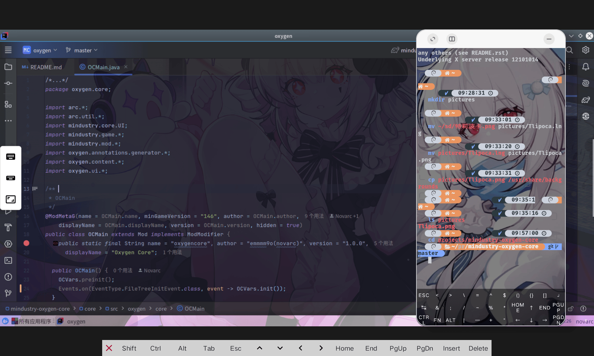

# IDEA

**IntelliJ IDEA**
[官网](https://www.jetbrains.com/zh-cn/idea/)
## 介绍
面向专业开发的 IDE
适用于 Java 和 Kotlin
- 卓越的 Java 和 Kotlin 体验 
- 深度代码理解 在每个上下文中提供相关建议，实现极快的导航和智能体验。 
- 开箱即用的无缝体验

> [!NOTE]
> IDEA分为Ultimate(专业版)/Community(社区版)
> 专业版需要付费 功能更加强大
> 但是对于mdt mod开发人员来讲社区版完全够用
> 当然你可以通过education白嫖

## 系统要求
- 64 位 Windows 10 1809 及更高版本，或 Windows Server 2019 及更高版本
- 最低 2 GB 可用 RAM 和 8 GB 系统总 RAM
- 3.5 GB 硬盘空间，推荐 SSD
- 最低屏幕分辨率 1024x768

## 安装
前往官网安装指定平台即可
含容器的termux请安装linux arm64版本
使用简单方便

## 推荐插件
- Rainbow Brackets 彩虹括号插件 (超级推荐)
- Color Highlighter 显示颜色代码 (超级推荐)
- Translation 翻译插件
- Key Promoter X 快捷键提示插件
- CamelCase 驼峰命名和下划线命名转换
- CodeGlance 显示代码缩略图
- CheckStyle 代码风格检查插件
- Save Actions 格式化代码插件
- SonarLint 代码质量检查插件
- Statistic 代码统计插件
- IdeaVim Idea使用vim特征

## 关于安卓设备
安卓设备安装容器后即可跑IDEA 需要下载Linux arm64版本
注意 配置要求较高 至少6GB运存
::: details 预览

:::
