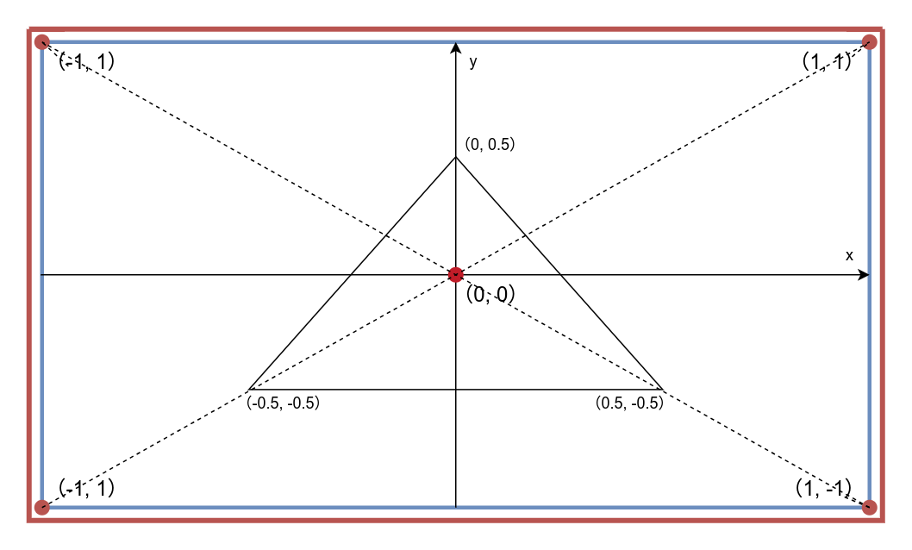
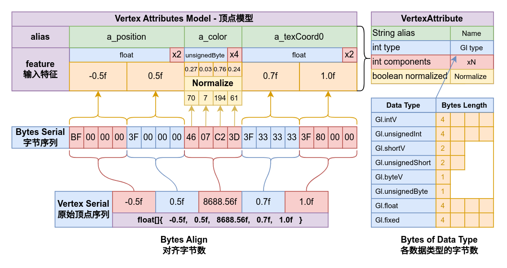

# 图像是如何被渲染到屏幕上的？

> ***“你知道吗？这个世界上的一切的形状都可以用三角形来概括。”***

一般来说，OpenGL图形渲染，会将输入的数据经过其渲染管线的各个阶段后，将图像输出到屏幕上，这是一张老生常谈的GL渲染管线示意图：


其中，几何着色器在Arc GL中无法使用，这里，我们会用更直观更容易理解的语言来讲解这个过程。

### Mesh

在OpenGL中，绘制图形需要向GL提供一组顶点来描述绘制的图像的位置以及其他信息。

所谓的**顶点（Vertex）**，实际上就是一串数据，即存储了诸如*顶点坐标*，*顶点颜色*，*纹理坐标*一类数据的序列，向OpenGL提交的顶点数据实际上就是这些数据序列一个接一个串在一起的大序列。

例如，我们定义一个顶点的数据构成为`二维坐标`，`颜色`，`纹理坐标`，那么一个顶点的数据序列就是：

```
// 顶点坐标  颜色                   纹理坐标
{  x, y,    color.toFloatBits(),  0f, 0f }
```

> 注意，颜色的顶点数据会将其rgba值组合起来存储为一个浮点数据，rgba各占8位精度，理解不了也没关系，你只需要知道对`arc.graphic.Color`颜色对象直接调用`color.toFloatBits()`就可以获得这个浮点数。

多个顶点组合起来，就是一个更大的数据序列，例如下面定义了一个三角形的三个顶点：

```
{  
//顶点坐标        颜色                   纹理坐标
  -0.5f, -0.5f,  color.toFloatBits(),  0f, 0f,
  0f,    0.5f,   color.toFloatBits(),  0.5f, 1f,
  0.5f,  -0.5f,  color.toFloatBits(),  1f, 0f,
}
```

::: tip 标准化设备坐标
OpenGL的绘图坐标以屏幕中心为原点（0, 0），屏幕的左下角（-1, -1），右上角为（1, 1），即**标准化设备坐标（Normalized Device Coordinates）**。


运行平台的实际屏幕尺寸并不受关注，在绘图时这个尺寸会被OpenGL标准化，或者通俗点说绘图坐标会被缩放到从-1到1的范围内进行绘图，超出范围的像素会被丢弃，如下所示为标准化坐标的示意图，上面定义的三角形在标准化坐标中看起来是这样的：

:::

而用于提交这些顶点数据的对象为**VAO（Vertex Array Object，顶点数组对象）**或**VBO（Vertex Buffer Object，顶点缓冲对象）**，但是我们通常并不需要使用VAO或者VBO，他们被包装在了一个类型`arc.graphic.Mesh`当中。

一个Mesh对象会保存一组顶点序列，即这些顶点的数据一个接一个排在一起的大序列，同时Mesh还会保存这些顶点的数据模型，即在一个顶点的数据序列中，其中哪一个部分代表的是顶点的哪一个属性。

顶点属性被包装为类型`arc.graphic.VertexAttribute`，该类型用于描述一个顶点中某一个属性的数据格式，例如在这个类型中已经定义的几个默认的顶点属性静态常量：

- `VertexAttribute.position` - 顶点的二维坐标（x, y）
- `VertexAttribute.position3` - 顶点的三维坐标（x, y, z）
- `VertexAttribute.texCoords` - 顶点的纹理坐标（u, v）
- `VertexAttribute.normal` - 顶点的法向量（dx, dy, dz）
- `VertexAttribute.color` - 顶点颜色（colorBits）
- `VertexAttribute.mixColor` - 顶点的混合颜色（colorBits）

属性也可自定义，构造一个`VertexAttribute`对象需要指定它的顶点属性名称，数据类型，以及数据大小等信息，例如：

```java
VertexAttribute attr1 = new VertexAttribute(
    4,              //components
    GL.unsignedByte,//type
    false,          //normalized
    "attr1"         //alias
); 

//也可以使用简化的构造函数，类型默认为Gl.floatV
VertexAttribute attr2 = new VertexAttribute(
    3,             //components
    "attr2"        //alias
);
```

其中的`normalized`参数会影响数据在传入后是否对数据进行归一化处理，将数据从其数据类型的上下界映射到0到1的范围内，例如对于`GL.unsignedByte`类型的数据其上下界为`0-255`，输入`128`时会被归一化到`0.5`。

> 值得注意的是，数据序列中数据的内存会被对齐到`byte`，也就是说，这个`attr1`使用了四个`Gl.unsignedByte`类型的数据，其在顶点的数据序列中只占据一个`float`的位置，这也是传入顶点颜色时rgba只需要一个`float`数据的原因。

这是顶点模型的序列长度对齐到`byte`的方式：



Mesh的数据模型定义通过其构造函数的可变参数提供，传入为一个数组序列，依次描述顶点的每一个属性，对于上述的那个三角形序列，依次传入顶点属性以定义此Mesh的数据模型，如下所示：

```java
void example(Color color){
  Mesh mesh = new Mesh(
      true,//isStatic
      3,   //maxVertices
      0,   //maxIndices
      VertexAttribute.position,
      VertexAttribute.color,
      VertexAttribute.texCoords
  );
  mesh.setVertices(new float[]{
      //顶点坐标      颜色                   纹理坐标
      -0.5f, -0.5f,  color.toFloatBits(),  0f,   0f,
       0.0f,  0.5f,  color.toFloatBits(),  0.5f, 1f,
       0.5f, -0.5f,  color.toFloatBits(),  1f,   0f
  });
}
```

注意到，Mesh的构造函数中，除了数据模型定义外，还定义了`maxVertices`和`maxIndices`两个参数，这两个参数分别代表顶点序列的最大长度和索引序列的最大长度，索引序列的作用我们稍后会讨论，此处不使用索引，设为0即可。这两个参数会决定这个Mesh会分配多大的内存用于存放顶点和索引数据，而稍后传入的顶点数量不能超过设置的最大值。

此外还有一个布尔值`isStatic`，这个布尔值表示这个Mesh是否为静态的，静态Mesh在提交数据后，其顶点数据将不会再发生改变，OpenGL可以对其进行性能优化。

直接调用Mesh的`setVertices`方法，就可以将顶点数据序列提交给Mesh，Mesh会自动将顶点数据序列按照数据模型去划分为OpenGL认识的顶点数据序列，在绘制Mesh时提交到OpenGL。

### 图元类型

设置好顶点信息的Mesh就已经准备好进行绘制了，通过调用Mesh的`render`方法即可开始提交顶点数据序列到OpenGL。

绘制Mesh需要提供一个着色器程序，这个着色器程序会定义顶点着色器与片段着色器，用于处理顶点数据并进行像素染色，arc已经将着色器包装为了类型`arc.graphid.gl.Shader`，我们只需要传入这个包装的着色器对象即可，在下一节我们会着重介绍Shader，本篇暂且略过。

而除了需要提供用于绘制该Mesh的着色器程序`Shader`外，最少还需要一个**图元类型**参数来表示如何将顶点组合成几何形状，例如：

```java
void example(Mesh mesh){
  shader.bind();
  mesh.render(shader, Gl.triangles);
}
```

其中，`shader.bind()`用于绑定着色器，每次更换着色器之后必须在绘制前进行绑定。

> 另外两个`render`方法的重载只是添加了限定绘制的顶点数据范围以及着色器的自动绑定，在Mesh的源代码中有JavaDoc注释，这里不再赘述。

这是因为顶点只描述了其位置，但是OpenGL并不知道我们要怎么将这些点组合成图形，所以需要传入一个图元类型来告知GL如何去组装这些点。
这里提供的`Gl.triangles`意为将连续的三个顶点组合成一个三角形。

OpenGL中定义的图元类型有：

- `Gl.points` - 将顶点绘制为点
- `Gl.lines` - 将顶点绘制为每两个点相连的线段
- `Gl.lineStrip` - 将顶点绘制为连续的线段
- `Gl.lineLoop` - 将顶点绘制为闭合的连续线段
- `Gl.triangles` - 将每三个顶点绘制为一个三角形
- `Gl.triangleStrip` - 将顶点与随后的三个顶点连续的绘制为多个三角形
- `Gl.triangleFan` - 以第一个顶点为原点，按扇形绘制三角形

是的，如果你查阅资料时发现OpenGL中还有`Gl.quads`和`Gl.quadStrip`，那么它们在Arc中是不存在的，因为OpenGL es并不支持这些图元类型。

以下是各图元的几何组装效果，`v1`-`v6`依次在顶点序列中顺序提交：


`lines`及其相关的图元类型提供了一些额外的参数，用于控制点的大小和线段的宽度，它们需要Gl的控制流来进行操作，例如：

```java
void example(Mesh mesh){
  shader.bind();
  Core.gl20.lineWidth(10f);
  mesh.render(shader, Gl.lines);
}
```

> 很诡异的一点是Arc GL支持`points`图元，却没有设置点图元尺寸的相关函数...

### 光栅化

图元只是将顶点组装为抽象的几何形状，而如果要将一个几何形状绘制到屏幕上，还需要将几何形状转化为屏幕上的像素，这个过程就称为**光栅化（Rasterization）**。

所谓光栅化，事实上就是将组装的几何形状覆盖到屏幕上，然后将它们所接触到的所有像素点取出用于后续的像素染色，或者叫作**片段着色**，在下一节我们会详细讲解这个过程。

我们在绘制图形时其实并不需要去考虑光栅化这个过程，因为OpenGL已经帮我们处理好了，但是我们仍然有必要知道光栅化的逻辑，这是片段生成的基础，在下一篇讲解的片段着色器上处理的实际上就是这些像素点。

光栅化的示意图：


光栅化所涉及到的像素点就被称为**片段（Fragment）**，它们会被传递给片段着色器，由片段着色器对这些像素点进行染色，最后显示到屏幕上。

> 同样也是因为光栅化的原因，几何图形被离散化为像素，这会引起图形失真，即图形边缘的锯齿，OpenGL有许多种抗锯齿技术，详情可见：[LearnOpenGL 抗锯齿](https://learnopengl-cn.github.io/04%20Advanced%20OpenGL/11%20Anti%20Aliasing/)

### 索引序列

在讨论索引序列前，我们先引入一个问题：如果我们要绘制一个矩形，需要几个三角形，几个顶点？

还记得图元装配是如何将顶点组装成几何形状的吗？使用`Gl.triangles`图元类型，可以将连续的三个顶点组装成一个三角形，那么一个矩形需要两个三角形，也就是六个顶点。

```
{
//顶点坐标         颜色                  纹理坐标
//第一个三角形
  -0.5f, -0.5f,   color.toFloatBits(), 0f, 0f,
  0.5f,  -0.5f,   color.toFloatBits(), 1f, 0f,
  0.5f,  0.5f,    color.toFloatBits(), 1f, 1f,
//第二个三角形
  -0.5f, -0.5f,   color.toFloatBits(), 0f, 0f,
  0.5f,  0.5f,    color.toFloatBits(), 1f, 1f,
  -0.5f, 0.5f,    color.toFloatBits(), 0f, 1f,
}
```

这与我们的几何直观不符，我们往往认为一个矩形只需要四个顶点，当我们通过绘制两个三角形来绘制一个矩形时，在提交的6个顶点中实际上有两个顶点是重叠了。


这还仅仅是一个矩形，如果我们需要绘制更加复杂的二维或者三维图形，重叠的顶点可能会更多，这可能会浪费大量的内存空间来存放重复的顶点数据。

这也就引出了一个重要的需求：**顶点复用**。而OpenGL实现顶点复用的方法就是**顶点索引**。

顶点索引是一个并列于顶点序列的索引序列，可以通过Mesh的`setIndices`方法来设置顶点索引：

```java
void example(Mesh mesh) {
  mesh.setIndices(new short[]{ 0, 1, 2, 0, 2, 3 });
}
```

在正常情况下，如果我们不设置索引序列，那么OpenGL在将顶点装配为图元的过程，会按顶点序列的顺序依次处理顶点。

但是当我们设置顶点序列时，情况就发生了变化，OpenGL将会按索引序列为基准来处理顶点，依次根据索引序列中的索引来从顶点序列中取出顶点，组装成图元。


具体来说，对于上文的那个四边形顶点定义，如果我们使用索引序列来绘制，那么只需要定义矩形的四个顶点和6个索引组成的序列即可：

```java
void example(){
  Mesh mesh = new Mesh(true, 4, 6,  
      VertexAttribute.position,
      VertexAttribute.color,
      VertexAttribute.texCoords
  );
  mesh.setVertices(new float[]{
      //顶点坐标     颜色                  纹理坐标
      -0.5f, -0.5f, color.toFloatBits(), 0f, 0f,
      0.5f,  -0.5f, color.toFloatBits(), 1f, 0f,
      0.5f,  0.5f,  color.toFloatBits(), 1f, 1f,
      -0.5f, 0.5f,  color.toFloatBits(), 0f, 1f,
  });
  mesh.setIndices(new short[]{ 
      0, 1, 2, //第一个三角形
      0, 2, 3  //第二个三角形
  });
  
  shader.bind();
  mesh.render(shader, Gl.triangles);
}
```

这样，我们就节约下了两个顶点的内存空间，而在规模更大的问题中，这个数字会更加庞大。

### 思考题

如果我们需要构造一个正六边形，如何用最少的顶点来将它绘制出来？如果要绘制的是很多六边形瓷砖的拼贴图呢？

::: details 小提示
###### 小提示：多个六边形的重叠顶点会非常多。
:::
