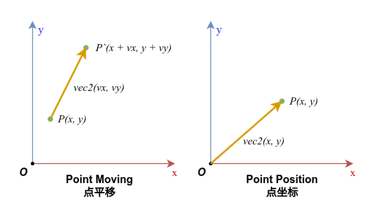
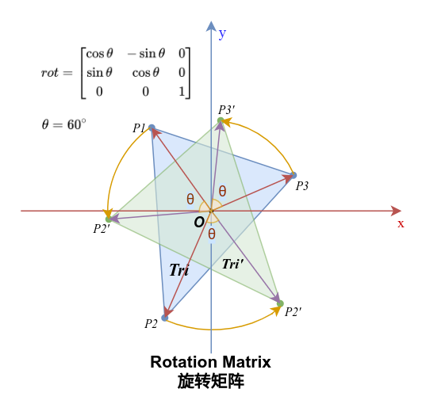
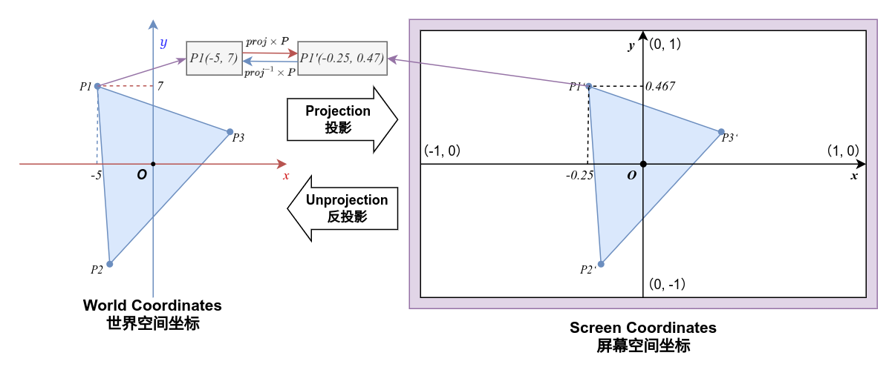

# 变换，投影与摄像机（Camera）

> 本节会有非常多数学计算与线性代数的知识，尽管我们会将这些过程简化为简单的程序代码，但是仍然很有必要对背后的数学原理有所了解。
> <br>
> 建议先学习线性代数的相关知识，但是并不建议学习教材中那脱离几何意义的枯燥的公式，推荐3Blue1Brown制作的线性代数系列视频，以建立对线性变换的基本几何直观：
> <br>
> **【3Blue1Brown】线性代数的本质** https://www.bilibili.com/video/BV1ys411472E

你可能会奇怪，按照我们之前的案例绘制出来的图形为什么总是被拉伸的很夸张，明明我们提供的是一张正方形的纹理，定义的四边形也明明是正方形，渲染到屏幕上怎么就被拉伸成了一个长方形？

其实原因很简单，我们第二节的时候讲过，屏幕的坐标已经被OpenGL转换为了从-1到1的**标准化设备坐标（Normalized Device Coordinates）**，而我们的四边形顶点坐标没有经过任何变换，直接以原始坐标绘制到了屏幕上：


而这并不符合我们所需要的效果，如果我们需要正确的将这个正方形绘制到屏幕中，就需要引入**变换（Transform）** 与**投影（Projection）**。

### 变换（Transform）

> 再次建议首先通过3Blue1Brown的线性代数系列视频建立对线性变换的基本几何直观后，再继续阅读接下来的内容，或者直接跳过原理相关的叙述，直接看应用，但是这并不是各明智的行为。

**变换**，更具体的来说是**线性变换（Linear Transform）**，是线性代数中的一个重要概念，如果你有高中以上的数学知识，变换可以被类比为一个**函数**，只是它的输入与输出都是**向量（Vector）**，而这个函数在线性变换当中，就是我们会经常用到的数学工具——**矩阵（Matrix）**。

到这里其实你听不懂也没有关系，只需要简单的将**向量**理解成是**坐标**，而线性变换的本质就是在对这个坐标，或者说一系列的坐标进行**映射（Mapping）** 的过程。

#### 向量（Vector）

在着色器当中我们很常用的那个`vec2` `vec3`其实就是向量，vec正是**Vector**的缩写。所谓向量，数学上将它定义为 **“若干个数按照一定顺序排列的数组”**，这个定义很准确的描述了“向量”是什么，但是对于几何意义有些不知所云：

$v = \left ( a_{1}，a_{2}，a_{3}，...,a_{n}  \right )$

而物理上定义向量为 **“既有大小又有方向的量”**，更直接的说，我们可以将向量认为是一段**平移**，而当我们将这个平移的原点放在坐标原点时，就可以将向量中的各个元素视为**坐标**，一个n维向量，就是在n维空间中的一个点坐标：

$vec2 = \left ( x, y  \right )$

$vec3 = \left ( x, y, z  \right )$

$vec4 = \left ( x, y, z, w  \right )$



我们很自然的能想到向量的加法正是将向量首尾串联在一起，而减法则是将它翻转过来再相加，而如果我们将起点为原点的向量作为对象的坐标的话，那么向量的一系列加减法就描述了这个对象的平移过程：


```glsl
vec2 v1 = vec2(x, y);
vec2 v2 = vec2(dx1, dy1);
vec2 v3 = vec2(dx2, dy2);

vec2 P = v1;
vec2 P1 = P + v2;
vec2 P2 = P1 + v3;
vec2 moved = v1 + v2 + v3;

//P2 == moved --> true
```

而关于向量的乘法，在glsl中两个向量的直接相乘并非数学上定义的**点积（Dot Product）**，而是对向量元素逐一相乘，为书写方便，我们将向量的表达式竖起来：

$v1 = \left [ \begin{matrix} x_{1} \\ y_{1} \end{matrix} \right ]$

$v2 = \left [ \begin{matrix} x_{2} \\ y_{2} \end{matrix} \right ]$

$v1*v2 = \left [ \begin{matrix} x_{1} \\ y_{1} \end{matrix} \right ] * \left [ \begin{matrix} x_{2} \\ y_{2} \end{matrix} \right ] = \left [ \begin{matrix} x_{1} \times x_{2} \\ y_{1} \times y_{2} \end{matrix} \right ]$

或者认为是将其中一个向量**转置（Transpose）** 后，进行**矩阵乘法**：

$v1*v2 = \left [ \begin{matrix} x_{1} & y_{1} \end{matrix} \right ] \left [ \begin{matrix} x_{2} \\ y_{2} \end{matrix} \right ] = \left [ \begin{matrix} x_{1} \times x_{2} & y_{1} \times y_{2} \end{matrix} \right ]$

> 我们很快会讲到矩阵，向量事实上可以被看作是只有一列或者一行的矩阵，矩阵的乘法规则就可以用在向量上，这里暂且不展开。

直接作除法也是如此：

$v1/v2 = \left [ \begin{matrix} x_{1} \\ y_{1} \end{matrix} \right ] / \left [ \begin{matrix} x_{2} \\ y_{2} \end{matrix} \right ] = \left [ \begin{matrix} x_{1} / x_{2} \\ y_{1} / y_{2} \end{matrix} \right ]$

而计算向量的点积，则需要使用glsl的内置函数`dot`：

$dot(v1, v2) = x_{1} \times x_{2} + y_{1} \times y_{2}$

```glsl
float dotTimes = dot(v1, v2);
```

点积的结果是一个**标量（Scalar）**，更通俗点说两个向量作点积会得到一个数字而非向量，这个数字表达的是两个向量的**相似性**，或者说是它们的方向一致的程度，当两个向量互相垂直（数学上更严谨的说法叫做**正交，Orthogonal** 时），点积的结果会为0，直到两个向量方向完全相同时点积结果达到**最大值**。

这里我们不去解释点积的数学意义，仅需直到其特性，在我们计算光照之类需要计算向量的共方向性问题的地方，点积会很有用。

#### 矩阵（Matrix）

而变换的目的，就是将输入的点坐标按我们给定的规则去进行映射。那么这个映射过程具体要怎么执行呢？

使用**矩阵（Matrix）** 可以很方便的描述一个线性变换的平移规则，矩阵是一个有若干行和列的**二维数组**，它的行和列数不一定相等，只是在我们的使用场景中行列数一致的方阵是最常用的。

一个矩阵的数学表达式：

$A = \left [ \begin{matrix} a_{11} & a_{12} & a_{13} & ... & a_{1n} \\ a_{21} & a_{22} & a_{23} & ... & a_{2n} \\ a_{31} & a_{32} & a_{33} & ... & a_{3n} \\ ... & ... & ... & ... & ... \\ a_{m1} & a_{m2} & a_{m3} & ... & a_{mn} \end{matrix} \right ]$

在我们的使用场景中，往往只会用到三阶矩阵（二维平面变换）和四阶矩阵（三维空间变换）：

$mat3 = \left [ \begin{matrix} a_{11} & a_{12} & a_{13} \\ a_{21} & a_{22} & a_{23} \\ a_{31} & a_{32} & a_{33} \end{matrix} \right ]$

$mat4 = \left [ \begin{matrix} a_{11} & a_{12} & a_{13} & a_{14} \\ a_{21} & a_{22} & a_{23} & a_{24} \\ a_{31} & a_{32} & a_{33} & a_{34} \\ a_{41} & a_{42} & a_{43} & a_{44} \end{matrix} \right ]$

矩阵对向量的变换，形式上就是将向量与矩阵作乘法（右乘法）：

$trn = mat3 \times vec3(vec2, a) = \left [ \begin{matrix} a_{11} & a_{12} & a_{13} \\ a_{21} & a_{22} & a_{23} \\ a_{31} & a_{32} & a_{33} \end{matrix} \right ] \left [ \begin{matrix} x \\ y \\ a \end{matrix} \right ]$

其中出现了一个新变量`a`，我们用这个a和原本的向量`vec2`构造了一个三维向量来与矩阵相乘，这是因为矩阵的维度要求与向量的维度一致，而矩阵的维度是3，所以向量也必须是3维的。

`a`在这里的作用是构造**齐次坐标（Homogeneous Coordinates）**，让向量存在于提升维度的**齐次空间（Homogeneous Space）** 中进行变换。这是一个数学概念，我们并不需要去深究它的含义，之所以要插入这个变量来构造三维向量，是因为二维图形的平移变换对矩阵而言需要在三维齐次空间中进行，在实际应用中我们将`a`固定为`1.0`即可。

经过这个乘法以后，得到的新向量`trn`就是经过矩阵变换后的向量。

另外，矩阵与矩阵也能进行乘法，矩阵与矩阵相乘的结果也是一个矩阵：

$matC = matA \times matB = \left [ \begin{matrix} a_{11} & a_{12} & a_{13} \\ a_{21} & a_{22} & a_{23} \\ a_{31} & a_{32} & a_{33} \end{matrix} \right ] \times \left [ \begin{matrix} b_{11} & b_{12} & b_{13} \\ b_{21} & b_{22} & b_{23} \\ b_{31} & b_{32} & b_{33} \end{matrix} \right ] $

矩阵乘法的具体进行方式是，将第一个矩阵的每一行与第二个矩阵的每一列分别相乘，然后将结果相加，以得到新矩阵的对应元素：

$matC = \left [ \begin{matrix} c_{11} & c_{12} & c_{13} \\ c_{21} & c_{22} & c_{23} \\ c_{31} & c_{32} & c_{33} \end{matrix} \right ]$

$c_{ij} = \sum_{k=1}^{3} a_{ik} \times b_{kj}$

用一个比较形象的图来描述这个过程：


矩阵的乘法事实上就是将两个矩阵所表示的变换从右向左进行叠加，当输入一个向量去乘以矩阵`matC`时，结果等同于先乘以`matB`再乘以`matA`：

$trn = matC \times vec3(vec2, a) = matA \times matB \times vec3(vec2, a)$

接下来为书写方便，我们将齐次向量的第三维固定为`1.0`，并记为

$vec2^* = vec3(vec2, 1.0) = \left [ \begin{matrix} x \\ y \\ 1 \end{matrix} \right ]$

### 变换矩阵

在我们了解了向量与矩阵乘法的意义后，就该具体讨论线性变换的具体形式了。我们目前暂且只讨论在平面上的线性变换，在之后的3D篇中我们会进一步探讨在三维空间中的线性变换。

#### 0. 单位矩阵（Identity Matrix）

我们将单位矩阵放到最开始，这是我们之后各个变换的基础矩阵，之后的每一个矩阵都是在单位矩阵的基础上去填写特定位置的元素值来进行的。

当向量乘以单位矩阵时，向量不会发生任何变化，或者说是**向量被线性映射到它自身**。矩阵与单位矩阵相乘同样不会发生任何变化。

单位矩阵表示为主对角线（左上至右下）元素为1，其余为0的方阵，其数学表达式如下：

$idt = \left [ \begin{matrix} 1 & 0 & 0 \\ 0 & 1 & 0 \\ 0 & 0 & 1 \end{matrix} \right ]$

在接下来的变换中，我们定义一个三角形`Tri`，用该三角形与变换矩阵`mat`相乘，得到变换后的三角形`Tri'`：

$Tri = \begin{Bmatrix} P1\\ P2\\ P3 \end{Bmatrix}$

$Tri' = \begin{Bmatrix} P1'\\ P2'\\ P3' \end{Bmatrix} = \begin{Bmatrix} mat \times P1^*\\ mat \times P2^*\\ mat \times P3^* \end{Bmatrix} = mat \times Tri$


#### 1. 平移矩阵（Translation）

平移矩阵的变换将向量沿给定的增量进行平移，增量被定义在三阶单位矩阵的第三列第一二两个元素上：

$trn = \left [ \begin{matrix} 1 & 0 & dx \\ 0 & 1 & dy \\ 0 & 0 & 1 \end{matrix} \right ]$

当向量乘以平移矩阵时，向量会沿x轴和y轴分别平移dx和dy：

$vec2 = \left [ \begin{matrix} x \\ y \end{matrix} \right ]$

$trn \times vec2^* = \left [ \begin{matrix} 1 & 0 & dx \\ 0 & 1 & dy \\ 0 & 0 & 1 \end{matrix} \right ] \left [ \begin{matrix} x \\ y \\ 1 \end{matrix} \right ] = \left [ \begin{matrix} x + dx \\ y + dy \\ 1 \end{matrix} \right ]$


#### 2. 缩放矩阵（Scaling）

缩放矩阵将坐标系沿原点按给定的坐标轴比例进行缩放，缩放比例被定义在三阶矩阵主对角线的第一二两个元素上：

$scl = \left [ \begin{matrix} sx & 0 & 0 \\ 0 & sy & 0 \\ 0 & 0 & 1 \end{matrix} \right ]$

当向量乘以一个缩放矩阵，向量会沿x轴和y轴分别缩放sx和sy：

$vec2 = \left [ \begin{matrix} x \\ y \end{matrix} \right ]$

$scl \times vec2^* = \left [ \begin{matrix} sx & 0 & 0 \\ 0 & sy & 0 \\ 0 & 0 & 1 \end{matrix} \right ] \left [ \begin{matrix} x \\ y \\ 1 \end{matrix} \right ] = \left [ \begin{matrix} sx \times x \\ sy \times y \\ 1 \end{matrix} \right ]$

 

#### 3. 旋转矩阵（Rotation）

旋转矩阵将坐标系按原点逆时针旋转给定的角度$\theta$，在矩阵中定义为在一二两行一二两列上的三角函数映射值：

$rot = \left [ \begin{matrix} \cos\theta & -\sin\theta & 0 \\ \sin\theta & \cos\theta & 0 \\ 0 & 0 & 1 \end{matrix} \right ]$

当一个向量与一个旋转矩阵相乘时，向量会绕原点逆时针旋转一个$\theta$角度：

$vec2 = \left [ \begin{matrix} x \\ y \end{matrix} \right ]$

$rot \times vec2^* = \left [ \begin{matrix} \cos\theta & -\sin\theta & 0 \\ \sin\theta & \cos\theta & 0 \\ 0 & 0 & 1 \end{matrix} \right ] \left [ \begin{matrix} x \\ y \\ 1 \end{matrix} \right ] = \left [ \begin{matrix} \cos\theta \times x - \sin\theta \times y \\ \sin\theta \times x + \cos\theta \times y \\ 1 \end{matrix} \right ]$



### 叠加矩阵

我们已经定义了**平移，缩放以及旋转**三种基本的变换形式，将它们组合起来就可以得到我们想要的绝大多数的变换效果。

而组装这些基本变换的方法，就是前面我们已经讨论过的矩阵乘法。当我们需要将变换一个个叠加起来时，我们只需要将变换矩阵从右向左依次相乘即可，例如当我们想让图形先旋转60度，然后平移到(10, 10)位置，那么我们只需要先构造这两个变换的矩阵：

$rot = \left [ \begin{matrix} \cos60^{\circ} & -\sin60^{\circ} & 0 \\ \sin60^{\circ} & \cos60^{\circ} & 0 \\ 0 & 0 & 1 \end{matrix} \right ]$

$trn = \left [ \begin{matrix} 1 & 0 & 10 \\ 0 & 1 & 10 \\ 0 & 0 & 1 \end{matrix} \right ]$

接着，将他们按照顺序从右向左相乘：

$mat = trn \times rot = \left [ \begin{matrix} 1 & 0 & 10 \\ 0 & 1 & 10 \\ 0 & 0 & 1 \end{matrix} \right ] \left [ \begin{matrix} \cos60^{\circ} & -\sin60^{\circ} & 0 \\ \sin60^{\circ} & \cos60^{\circ} & 0 \\ 0 & 0 & 1 \end{matrix} \right ]$

我们就构造出了表示这个旋转与平移组合起来的变换矩阵：

$mat = \left [ \begin{matrix} \cos60^{\circ} & -\sin60^{\circ} & 10  \\ \sin60^{\circ} & \cos60^{\circ} & 10  \\ 0 & 0 & 1 \end{matrix} \right ]$

应用这个矩阵与向量进行乘算，图形就会先旋转60度，然后平移到(10, 10)位置：


#### 变换是可逆的

线性变换的基本性质之一：**所有维数一致的线性变换都是可逆的。**

即，对于任意一个向量矩阵乘法，只要矩阵**可逆（invertible）**，或者用更通俗的语言来说在图形绘制上合法，那么我们就可以通过这个变换后的结果向量和变换的矩阵去反推出与这个矩阵相乘的输入向量。

更具体的说，一个在图形绘制上合法的矩阵，它总是可以进行取逆矩阵操作，我们将逆矩阵记为$mat^{-1}$，那么对于任意一个向量$vec$，都有：

$mat \times vec = vec'$

$mat^{-1} \times vec' = vec$

在glsl中可以通过内建函数`inverse(mat)`来获取矩阵的逆矩阵$mat^{-1}$。

```glsl
vec2 vec = vec2(12.0, 20.0);
vec3 trned = mat * vec3(vec, 1.0);
mat3 inv = inverse(mat);
vec3 invTrn = inv * trned;

// invTrn.xy == vec --> true
```

> 不幸的是在OpenGL2.0上并没与这个内建函数，当你需要使用逆矩阵时，可能需要根据逆矩阵的数学公式去手动计算。

### 投影

说了那么多，那么也是时候这些变换应用到实际场景中了！

回到我们一开始的问题：如何正确的将正方形的顶点坐标映射到屏幕上，让它显示出来也是正方形而不是被拉伸变形的矩形？

我们能很自然的想到，根据屏幕的比例，对长宽取倒数构造一个缩放矩阵，并用它来缩放我们的顶点坐标，就可以还原正方形的比例了：

$scale = \left [ \begin{matrix} \frac{scl}{width} & 0 & 0 \\ 0 & \frac{scl}{height} & 0 \\ 0 & 0 & 1 \end{matrix} \right ]$

其中，$scl$为图像的缩放因子，其大小没有固定标准，这取决与你如何缩放你的纹理到屏幕上，我们本例中将缩放因子设为1000，以便让这个边长只有1的正方形能够被清晰的看到（否则它会只有一个像素那么大）。

我们略微修改上一节的范例，在顶点着色器中添加一个uniform变量来接收这个矩阵，然后用它来变换我们的顶点坐标：

`顶点着色器`
```glsl
attribute vec4 a_position;
attribute vec2 a_texCoord0;

varying vec2 v_texCoord;

uniform mat4 u_scale;

void main() {
    v_texCoord = a_texCoord0;
    gl_Position = u_scale*a_position;
}
```

> 注意`a_position`的维度与`u_scale`的阶数，我们处理的是二维向量，此处出现的四维向量是为满足齐次变换以及为便于输出坐标所增加的维度，我们在Mesh中定义的顶点坐标属性为vec2，提交顶点时只会设置前两个分量，多出的维度会被自动填充为1.0，而`uniform`与`vec4`类似，只填充我们传入的三阶矩阵，多余的一阶会按单位矩阵填充。

接着在Java中构造这个矩阵，并将它传递给着色器的uniform变量，Arc同样为我们封装了三阶矩阵类型`arc.graphic.Mat`和四阶矩阵`arc.graphic.Mat3D`，我们可以直接使用它们来构造矩阵：

```java
class Example{
  Mesh mesh = new Mesh(true, 4, 6,
      VertexAttribute.position,
      VertexAttribute.texCoords
  );
  Texture tex = new Texture(
      Vars.mods.getMod("example-mod").root.child("texture.png")
  );
  Shader shader = new Shader(vertexShaderFi, fragmentShaderFi);
  Mat scale = new Mat();
  
  float a = 1000;

  {
    mesh.setVertices(new float[]{
        //顶点坐标       纹理坐标
        -0.5f, -0.5f,  0f, 1f,
         0.5f, -0.5f,  1f, 1f,
         0.5f,  0.5f,  1f, 0f,
        -0.5f,  0.5f,  0f, 0f,
    });
    mesh.setIndices(new short[]{
        0, 1, 2, //第一个三角形
        0, 2, 3  //第二个三角形
    });
  }

  void draw(){
    shader.bind();
    tex.bind();   // 绑定纹理
    scale.setToScaling(a/Core.graphics.getWidth(), a/Core.graphics.getHeight());
    shader.setUniformMatrix("u_scale", scale);
    mesh.render(shader, Gl.triangles);
  }
}
```

让我们将它渲染出来，如果你的代码没有错误，那么图像就应该以正确的比例显示在了屏幕中央:


在这个过程中，我们做的事实际上是将一个坐标系以一定规则去映射到了另一个坐标系中，这个映射关系由这个缩放矩阵描述，而这个映射的过程，则被称为**投影（Projection）**，这个建立映射关系的矩阵就是**投影矩阵（Projection Matrix）**。

这里，我们人为的将未经过投影的顶点坐标定义为**世界坐标（World Coordinate）**，经过投影变换后的坐标被称为**屏幕坐标（Screen Coordinate）**，投影事实上就是在进行世界空间与屏幕空间的坐标系转换：



我们刚刚讲过线性变换是可逆的，在通过投影矩阵将世界坐标映射到屏幕坐标的同时，我们也可以通过投影矩阵的逆矩阵将屏幕坐标映射回世界坐标，这在处理鼠标或者触控事件时非常有用。

### 摄像机（Camera）

所有前置知识铺垫完成后，就来到图形绘制至关重要的问题了：怎么才能让我们屏幕的视角动起来？

我们现在需要引入另一个线性代数的概念：**基向量（Basis Vector）**与**仿射变换（Affine Transformation）**。

#### 仿射变换（Affine Transformation）

用通俗的语言解释，我们首先将一个向量的元素视为它在坐标系中各个坐标轴上的分量，我们可以将这个分量的意义分解为一个标量与一个和坐标轴同向的**单位向量（长度为1的向量）** 的乘积，那么我们就可以将这个坐标系内的任意点描述为各坐标轴方向上的单位向量的**线性组合**：

> 线性组合通俗的理解就是将向量可以表示为多个向量乘以多个系数然后相加，比如向量$vec_1 = (1, 0)$，向量$vec_2 = (0, 1)$，那么对于向量$vec_3 = (2, 3)$就可以表示为$vec_3 = 2 \times vec_1 + 3 \times vec_2$。


现在，我们知道，一个坐标系可以被描述为多个互相垂直的基向量，而我们对这个坐标系中的所有向量进行线性变换，事实上等同于我们对这个坐标系的基向量进行线性变换，来得到一个变换后的新坐标系。

观察上个部分我们将旋转与平移组合起来的那个变换矩阵：

$\left [ \begin{matrix} \cos \theta & -\sin \theta & x \\ \sin \theta & \cos \theta & y \\ 0 & 0 & 1 \end{matrix} \right ]$

观察它的一二两列与基向量在这个变换中的变化，我们可以发现，这个矩阵的前两列正好分别与旋转后的x轴与y轴基向量$i'$与$j'$同向，而这个矩阵的第三列则表示了基向量的平移量，当我们将$i'$和$j'$分别减去这个平移量时，它正好就是原坐标系中的基向量$i$与$j$转过角度$\theta$后的向量。

这里就出现了一个有趣的性质：**用变换之后的基向量组成一个新的矩阵，这个矩阵能够将变换前坐标系中的任意向量映射到变换后的坐标系中**，而这个矩阵就被称为**仿射矩阵（Affine Matrix）**。


#### 摄像机的原理

好，所有的基础知识都有了，我们正式开始聊摄像机是如何工作的。

首先，我们将摄像机定义为观察游戏场景的一个“眼睛”，而我们目前仅讨论二维视角，那么摄像机就会有一个二维坐标和一个缩放比例（在Mindustry中大概就是视角的高度）。

那么我们思考一下摄像机要做什么才能让场景里的物体正确的显示在屏幕上呢？

1. **将世界空间的物体投影到摄像机空间以防拉伸**
2. **将摄像机的挪动到它所在的世界位置，去观察物体**
3. **裁剪掉摄像机视角之外的物体**

第一点我们刚刚在投影那一部分已经解决，现在我们来看第二点“将摄像机挪动到它所在的世界位置”，之前提到过，屏幕空间始终是-1到1的标准化设备坐标，也就是说投影的中点始终都是屏幕的中点，也即$O(0,0)$。

既然无法改变屏幕坐标系的原点，那么我们不妨转换一个思路，我们可以让场景中的所有物体在绘制时将顶点全部平移到摄像机所在的位置，或者，我们可以这么说 **“以摄像机所在的位置为原点构建坐标系，使用这个仿射矩阵将场景中的所有物体坐标转换到摄像机的坐标系中”**。

结合上将坐标缩放到屏幕比例的变换矩阵以及将物体移动到摄像机视角位置的平移矩阵，我们就可以得到我们需要的这个从场景坐标转换到相机视角的**仿射矩阵**了！

平移的距离不能直接设置为摄像机坐标，这里还需要对摄像机坐标依据平移和缩放来作调整，才能得到正确的平移距离，这里我们直接给出正确的投影公式，此矩阵的形式被称为**正交投影矩阵（Orthographic Projection Matrix）**：

$proj=\left [ \begin{matrix} \frac{scl}{width} & 0 & -\frac{scl \times cameraX + width}{width} \\ 0 & \frac{scl}{height} & -\frac{scl \times cameraY + height}{height} \\ 0 & 0 & 1 \end{matrix} \right ]$

其中其中$cameraX$和$cameraY$为摄像机在世界空间中的坐标，$width$和$height$为屏幕的宽高，而缩放因子$scl$与我们之前讨论的因子作用相同，回忆标准化设备坐标的数据范围，自-1到1，长度为2，当我们为scl设置为2时，在世界空间中1个单位长度就会刚好对应一个像素的大小。

回看前文我们更改过后的那个顶点着色器，传入的变换矩阵会与输入的顶点坐标乘算作为绘制的坐标，那么，在我们传入这个变换矩阵时当然也可以使用这个投影矩阵，为命名规范，我们将这个矩阵的输入变量重命名为`u_projection`或者缩写为`u_proj`：

```glsl
attribute vec4 a_position;
attribute vec2 a_texCoord0;

varying vec2 v_texCoord;

uniform mat4 u_proj;

void main() {
    v_texCoord = a_texCoord0;
    gl_Position = u_proj * a_position;
}
```

然后我们修改上文的范例，将这个矩阵设置到我们需要的摄像机参数后，将它传递给`uniform`，在Arc中封装的`Mat`很贴心的为我们提供了`setOrtho()`方法，在这个方法中定义了我们上文用到的正交投影公式，使用摄像机的坐标和长宽来设置这个投影矩阵：

```java
Mat projection = new Mat();
Vec2 cameraPos = new Vec2(20, 10);

void draw(){
  shader.bind();
  tex.bind();   // 绑定纹理
  projection.setOrtho(
      // 将视角中点平移半个视角长宽，以确保世界坐标的原点与摄像机的中点坐标重合
      cameraPos.x - Core.graphics.getWidth()/2f,
      cameraPos.y - Core.graphics.getHeight()/2f,
      Core.graphics.getWidth(),
      Core.graphics.getHeight()
  );
  shader.setUniformMatrix4("u_proj", projection);
  mesh.render(shader, Gl.triangles);
}
```

然后，你会发现你只是在屏幕上画了一个像素点...


原因很简单，我们定义的网格尺寸仅仅只有1x1的场景空间尺寸，而我们的摄像机视角尺寸为屏幕的尺寸，这意味着这只有一个像素的大小。

要解决这个问题无非就是两个方法，修改顶点定义，或者让物体进行缩放变换。

我们先看缩放变换，前面我们提到过缩放可以让物体以坐标原点为中心进行缩放，而恰好我们定义的正方形边长为1，通过直接给予一个我们想要的尺寸的缩放倍率，就可以将它的尺寸调节到我们需要的大小。

为了对物体应用变换，我们继续修改顶点着色器，让它再接收另一个变换矩阵`u_transform`或者简写为`u_trns`，先用它处理物体本身的变换后，再将它投影到屏幕：

```glsl
attribute vec4 a_position;
attribute vec2 a_texCoord0;

varying vec2 v_texCoord;

uniform mat4 u_proj;
uniform mat4 u_trns;

void main() {
    v_texCoord = a_texCoord0;
    gl_Position = u_proj * u_trns * a_position;
}
```

然后在我们的绘制方法中将这个矩阵设置为缩放矩阵，然后传入uniform：

```java
Mat transform = new Mat();

void draw(){
  shader.bind();
  tex.bind();   // 绑定纹理
  projection.setOrtho(
      // 将视角中点平移半个视角长宽，以确保世界坐标的原点与摄像机的中点坐标重合
      cameraPos.x - Core.graphics.getWidth()/2f,
      cameraPos.y - Core.graphics.getHeight()/2f,
      Core.graphics.getWidth(),
      Core.graphics.getHeight()
  );
  shader.setUniformMatrix4("u_proj", projection);
  
  transform.setToScaling(100, 100);
  shader.setUniformMatrix4("u_trns", transform);
  mesh.render(shader, Gl.triangles);
}
```

很好！


现在，图像被正确的显示在了屏幕上，结合我们前面说过的变换矩阵性质，我们可以将物体平移到任何位置，旋转到任何角度，缩放到任何大小，现在我们不妨来试试话很多各角度，位置，大小都不一样的图案：

```java
long seed = System.nanoTime();
void draw(){
  shader.bind();
  tex.bind();   // 绑定纹理
  projection.setOrtho(
      cameraPos.x - Core.graphics.getWidth()/2f,
      cameraPos.y - Core.graphics.getHeight()/2f,
      Core.graphics.getWidth(),
      Core.graphics.getHeight()
  );
  shader.setUniformMatrix4("u_proj", projection);

  Mathf.rand.setSeed(seed);
  for (int i = 0; i < 10; i++) {
    float size = Mathf.random(100, 300);
    transform.idt()
        .translate(Mathf.range(1000), Mathf.range(1000))
        .scale(size, size)
        .rotate(Mathf.random(360));
    shader.setUniformMatrix4("u_trns", transform);
    mesh.render(shader, Gl.triangles);
  }
}
```

> Arc包装的`Mat`类型与`Vec`类型的所有操作方法均可链式调用。

it work!


事实上，Arc同样将摄像机也包装为了一个类型`arc.graphic.Camera`，这个类型替我们封装了摄像机的位置和视图尺寸，以及一些投影与反投影相关的工具方法并且已经帮我们将摄像机的半个长宽偏移附加到了坐标上，使用`Camera`编写投影变换会很简单：

```java
Camera camera = new Camera();
void draw(){
  shader.bind();
  tex.bind();   // 绑定纹理
  
  camera.position.set(10f, 20f);
  camera.width = Core.graphics.getWidth();
  camera.height = Core.graphics.getHeight();
  camera.update(); // 每次使用前需要更新一次数据
  shader.setUniformMatrix4("u_proj", camera.mat);

  Mathf.rand.setSeed(seed);
  for (int i = 0; i < 10; i++) {
    float size = Mathf.random(100, 300);
    transform.idt()
        .translate(Mathf.range(1000), Mathf.range(1000))
        .scale(size, size)
        .rotate(Mathf.random(360));
    shader.setUniformMatrix4("u_trns", transform);
    mesh.render(shader, Gl.triangles);
  }
}
```

效果与先前的完全一样。

而刚刚我们说到的另一种“更改正方形的顶点定义”这个方法，这其实不是一个很明智的方式，但是在Mindustry中被普遍的使用，这里先按下不表，之后的小节我会说明为什么不明智但是又普遍被使用。

### 小练习

现在我们已经学习了如何将场景坐标投射到屏幕，不妨试试挪动一下摄像机，调节一下摄像机的视图尺寸，看看会有什么样的效果。

然后，试试让一个小方块运动起来，接着让摄像机视角跟随它，应该怎么做？如果视角还需要跟随小方块的旋转呢？

> ###### 小提示：`Camera`类型没有旋转相关的方法，但是仍然能叠加结果矩阵。

另外我们再思考一个小问题，有一类特殊的变换矩阵我们没有提及，就是在矩阵的次要副对角线上放置一些数字（副对角线旁），这代表的是什么样的变换呢？

$mat=\begin{bmatrix}1&cx&0\\cy&1&0\\0&0&1\end{bmatrix}$

> ###### 这是一个线性代数知识，尽管不重要，但如果你想要思考但是又没有什么好思考的东西，不妨来想想这个（哈哈哈）。
