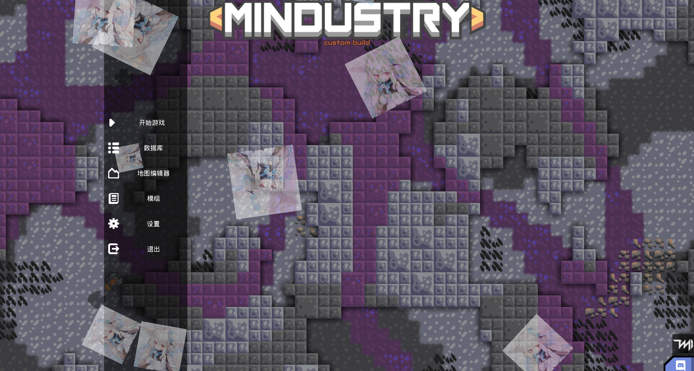
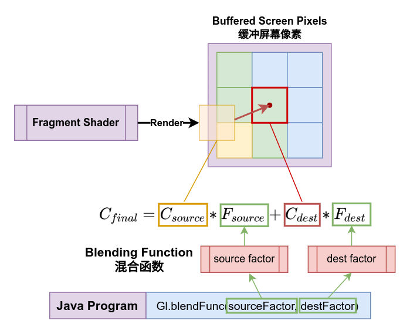
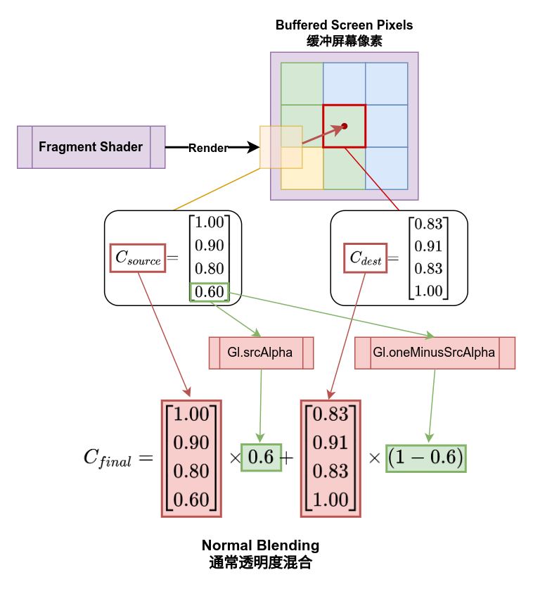
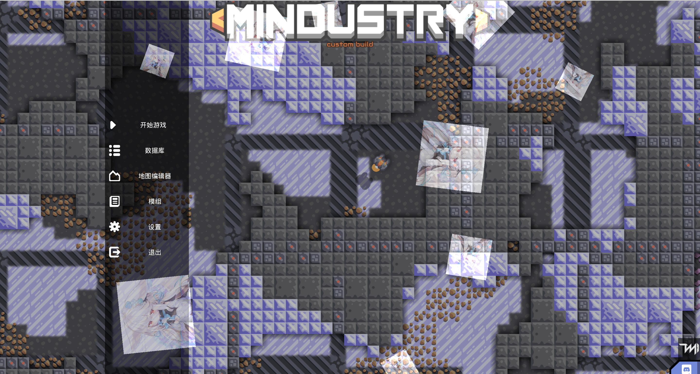

# 透明度与混合

> ***“透过窗户，你看到的是乌云还是彩虹？”***

上一节的最后，我们利用变换在屏幕上画了很多个正方形，你会注意到，他们有的互相重叠了甚至有的被完全覆盖了。

我们将它与先前绘制彩色三角形时使用的着色器与顶点格式结合起来，试试改变一下正方形的顶点颜色，调整一下它们的**透明度（Alpha值）**，看看会发生什么：

`顶点着色器`
```glsl
attribute vec4 a_position;
attribute vec4 a_color;
attribute vec2 a_texCoord0;

varying vec2 v_texCoord;
varying vec4 v_color;

uniform mat4 u_proj;
uniform mat4 u_trns;

void main() {
    v_texCoord = a_texCoord0;
    v_color = a_color;
    gl_Position = u_proj * u_trns * a_position;
}
```

`片段着色器`
```glsl
uniform sampler2D u_texture;

varying vec2 v_texCoord;
varying vec4 v_color;

void main() {
    gl_FragColor = texture2D(u_texture, v_texCoord)*v_color;
}
```

```java
class Example{
  Mesh mesh = new Mesh(true, 4, 6,
      VertexAttribute.position,
      VertexAttribute.color,
      VertexAttribute.texCoords
  );
  Texture tex = new Texture(
      Vars.mods.getMod("example-mod").root.child("texture.png")
  );
  Shader shader = new Shader(vertexShaderFi, fragmentShaderFi);
  Camera camera = new Camera();
  Mat transform = new Mat();
  long seed = System.nanoTime();

  {
    float c = Color.white.cpy().a(0.5f).toFloatBits(); // 透明度设置为0.5f
    mesh.setVertices(new float[]{
        //顶点坐标      颜色  纹理坐标
        -0.5f, -0.5f,  c,   0f, 1f,
         0.5f, -0.5f,  c,   1f, 1f,
         0.5f,  0.5f,  c,   1f, 0f,
        -0.5f,  0.5f,  c,   0f, 0f,
    });
    mesh.setIndices(new short[]{
        0, 1, 2, //第一个三角形
        0, 2, 3  //第二个三角形
    });
  }

  void draw(){
    shader.bind();
    tex.bind();   // 绑定纹理
    
    camera.position.set(10f, 20f);
    camera.width = Core.graphics.getWidth();
    camera.height = Core.graphics.getHeight();
    camera.update(); // 每次使用前需要更新一次数据
    shader.setUniformMatrix4("u_proj", camera.mat);

    Mathf.rand.setSeed(seed);
    for (int i = 0; i < 10; i++) {
      float size = Mathf.random(100, 300);
      transform.idt()
          .translate(Mathf.range(1000), Mathf.range(1000))
          .scale(size, size)
          .rotate(Mathf.random(360));
      shader.setUniformMatrix4("u_trns", transform);
      mesh.render(shader, Gl.triangles);
    }
  }
}
```

运行一下，看看结果：



和预期的一样，图像的alpha值降低后，我们可以透过物体看到它背后的图像，或者换个更严谨的说法“物体的颜色与它背后的图像颜色**混合（Blending）** 了”。

### 混合（Blending）

实际上，我们之所以直接使用透明度混合就能得到正确的结果，是在Mindustry的主渲染流程前已经设置了OpenGL的颜色混合模式。

我们又要拿出第二节时出现的那张GL渲染管线图：


能看到，在片段着色器为像素上色完成之后，还有一步是**测试（Testing）** 与混合（Blending），而我们讨论的正是其中的**混合**。

在片段着色器完成绘图以后，它需要将输出的像素显示到屏幕上，而此时屏幕上仍存储着之前绘制的图像，片段着色输出的像素颜色会需要与旧有的像素颜色进行混合才能正确显示透明纹理。

OpenGL默认是关闭了混合的，尽管Mindustry已经在渲染流程中开启了它，但我们还是应当知道如何设置它：

```java
void example(){
  // 开启混合
  Gl.enable(Gl.blend);
  // 禁用混合
  Gl.disable(Gl.blend);
}
```

如果不开启混合，那么片段着色器输出的颜色会直接覆盖旧有的颜色，而不是表现为透明图像。

启用混合后，还需要告诉OpenGL如何去混合新旧像素的颜色值，GL为这个混合方式建立了一个**混合函数（Blending Function）**，这个方程决定了新像素与旧像素的混合计算方式。

我们将颜色定义为记录rgba的四维向量：

$C_{source} = \begin{bmatrix} R_{source} \\ G_{source} \\ B_{source} \\ A_{source} \end{bmatrix}$

$C_{dest} = \begin{bmatrix} R_{dest} \\ G_{dest} \\ B_{dest} \\ A_{dest} \end{bmatrix}$

那么混合函数的形式是这样的：

$C_{final} = C_{source} * F_{source} + C_{dest} * F_{dest}$

其中：
- $C_{final}$：计算结果，像素最终的混合颜色
- $C_{source}$：来自片段着色器渲染的像素颜色
- $C_{dest}$：来自屏幕上缓存的现有的像素颜色
- $F_{source}$：源颜色的计算因子
- $F_{dest}$ 原有颜色的计算因子



我们需要为OpenGL提供的参数就是两个计算因子，计算因子由设置的生成函数来生成，可以通过OpenGL的操作函数`Gl.blendFunc(sourceFactor, destFactor)`来设置生成函数，OpenGL中提供了如下可选的因子生成函数，用$F_{s/d}$来表示生成的计算因子：

| 选项                          | 描述                    | 表达式                        |
|-----------------------------|-----------------------|----------------------------|
| Gl.one                      | 因子值恒定为1.0             | $F_{s/d}=1.0$              |
| Gl.zero                     | 因子值恒定为0.0             | $F_{s/d}=0.0$              |
| Gl.src_color                | 因子值等于源颜色的RGB值         | $F_{s/d}=C_{source}$       |
| Gl.src_alpha                | 因子值等于源颜色的alpha值       | $F_{s/d}=A_{source}$       |
| Gl.dst_color                | 因子值等于目标颜色的RGB值        | $F_{s/d}=C_{dest}$         |
| Gl.dst_alpha                | 因子值等于目标颜色的alpha值      | $F_{s/d}=A_{dest}$         |
| Gl.one_minus_src_color      | 因子值等于1.0减去源颜色的RGB值    | $F_{s/d}=1.0-C_{source}$   |
| Gl.one_minus_src_alpha      | 因子值等于1.0减去源颜色的alpha值  | $F_{s/d}=1.0-A_{source}$   |
| Gl.one_minus_dst_color      | 因子值等于1.0减去目标颜色的RGB值   | $F_{s/d}=1.0-C_{dest}$     |
| Gl.one_minus_dst_alpha      | 因子值等于1.0减去目标颜色的alpha值 | $F_{s/d}=1.0-A_{dest}$     |
| Gl.constant_color           | 因子值等于常量颜色RGB值         | $F_{s/d}=C_{constant}$     |
| Gl.one_minus_constant_color | 因子值等于1.0减去常量颜色RGB值    | $F_{s/d}=1.0-C_{constant}$ |
| Gl.constant_alpha           | 因子值等于常量颜色alpha值       | $F_{s/d}=A_{constant}$     |
| Gl.one_minus_constant_alpha | 因子值等于1.0减去常量颜色alpha值  | $F_{s/d}=1.0-A_{constant}$ |

看起来是不是很复杂？实际上我们最常用的就是`Gl.src_alpha`与`Gl.one_minus_dst_alpha`。

比如，Mindustry渲染流程中设置的默认混合方式其实就是这两个函数：

```java
void normalBlend() {
  Gl.blendFunc(
      Gl.srcAlpha,          // 源颜色混合因子生成函数
      Gl.oneMinusSrcAlpha   // 现有颜色混合因子生成函数
  );
}
```

这个组合产生的混合方程形式是这样的：

$alpha = A_{source}$

$C_{final} = C_{source} * alpha + C_{dest} * (1 - alpha)$

这个形式很明显，就是用绘制出来的颜色alpha值来在源颜色与缓存的旧颜色之间进行线性插值，而这就是最常见的透明度混合方式。



另外，我们还可以将`aplha`通道的计算和`RGB`值的混合函数分开设置，这样做的话计算混合的颜色通道和透明度通道会使用不同的混合函数：

```java
void example(){
  Gl.blendFuncSeparate(
      Gl.srcAlpha,          // 源颜色混合因子生成函数
      Gl.oneMinusSrcAlpha,  // 现有颜色混合因子生成函数
      Gl.one,               // 源透明度混合因子生成函数
      Gl.zero               // 现有透明度混合因子生成函数
  );
}
```

在Arc中对混合做了简单的封装（真的很简单...），这个封装类型为`arc.graphics.Blending`，这个类型包装了四个`int`值用于分别存储四个混合因子生成函数，构造器有两个，区分我们能前文提到过的颜色通道与透明度通道是否分开设置：

```java
Blending blend = Blending(srcColor, dstColor, srcAlpha, dstAlpha);
Blending blendComb = Blending(srcFactor, dstFactor);
```

在`Blending`中也定义了三个默认的混合模式，分别是：

- `normal`：默认的混合模式，可正确显示透明度纹理，源颜色与目标颜色使用`Gl.srcAlpha`与`Gl.oneMinusSrcAlpha`，透明度使用`Gl.one`与`Gl.zero`
- `additive`：加法混合模式，使用透明度乘算颜色值后直接与屏幕颜色相加，源颜色与目标颜色使用`Gl.srcAlpha`与`Gl.one`，透明度使用`Gl.one`与`Gl.oneMinusSrcAlpha`
- `disabled`：禁用混合，以非混合模式直接覆盖绘制

而`Blending`的使用也很简单，只需要调用其`apply()`方法即可，这里我们修改一下前文范例中的`draw`方法，测试一下使用`additive`会得到怎么样的效果：

```java
void draw(){
  shader.bind();
  tex.bind();   // 绑定纹理
  
  Blending.additive.apply(); // 设置混合模式为加法混合模式
  
  camera.position.set(10f, 20f);
  camera.width = Core.graphics.getWidth();
  camera.height = Core.graphics.getHeight();
  camera.update(); // 每次使用前需要更新一次数据
  shader.setUniformMatrix4("u_proj", camera.mat);

  Mathf.rand.setSeed(seed);
  for (int i = 0; i < 10; i++) {
    float size = Mathf.random(100, 300);
    transform.idt()
        .translate(Mathf.range(1000), Mathf.range(1000))
        .scale(size, size)
        .rotate(Mathf.random(360));
    shader.setUniformMatrix4("u_trns", transform);
    mesh.render(shader, Gl.triangles);
  }
  Blending.normal.apply(); // 重设为通常混合模式
}
```

嗯，因为颜色值相加会提升整体亮度，结果果然变亮了。



### 小练习

在不使用着色器去处理颜色的情况下，要怎么样进行反色渲染呢？再试试通过混合制作一个颜色滤镜。

::: details 小提示
###### 小提示：再看看那个混合函数？滤镜需要绘制一个全屏的图像，看看我们之前是怎么做的？
:::
