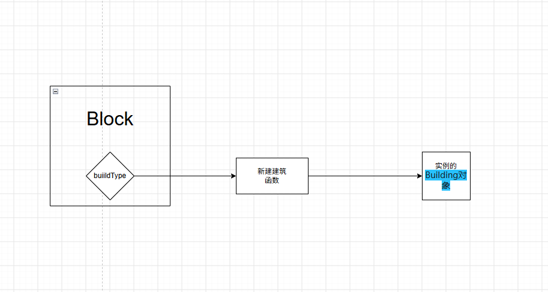

# 方块与建筑

从这一节开始,我们将开始学习mdt中最重要的成分--方块.

但在这一章的开始,我想对萌新经常混淆的几个概念(`Block`、`BuildType`和`Building`)进行辨析.

让我们通过下面这个例子来搞清它们的区别,这是一个萌新的求助,问我为啥墙体不会回血.

``` javascript
//错误示范
const nickelWall = extend(Wall,"nickel-wall",{
    updateTile(){
        this.heal(0.1)//每秒恢复6点
    },
    health: 360,
    armor: 1,
    size: 1,
    alwaysUnlocked: true,
    buildVisibility: BuildVisibility.shown,
    category: Category.defense,
    requirements: ItemStack.with(
        item.nickel, 6,),
});
exports.nickelWall = nickelWall;
```

其实这就是一个典型的由于混淆了`Block`和`Building`导致的问题.即`updateTile`是`Building`类的一个方法,但是这位萌新将其放到了`Block`类中,而游戏每tick调用的是`Building`类的`updateTile`,导致这位萌新的代码根本就没有被执行.

> 其实还有一个问题:`Wall`类本身`update`为`false`,因此即使创建的是`Building`类的`updateTile`,这位萌新的代码依旧不会被执行.

那么要怎么把`updateTile`写进`building`类里呢?其实很简单,像下面这样就可以了.

``` javascript
const nickelWall = extend(Wall,"nickel-wall",{
    update: true,
    health: 360,
    armor: 1,
    size: 1,
    alwaysUnlocked: true,
    buildVisibility: BuildVisibility.shown,
    category: Category.defense,
    requirements: ItemStack.with(
        item.nickel, 6,),
});
exports.nickelWall = nickelWall;
//Block和其对应的BuildType通常在一个文件中定义.
nickelWall.buildType = prov(() => extend(Wall.WallBuild,nickelWall, {
    updateTile(){
        this.heal(0.1)//每秒恢复6点
    }
}));

```

buildType在Block里面，来指向新建建筑的函数，然后函数创建一个实例的Building对象，更新调用Building里面的update.



## Block类

Block类是游戏中所有方块的父类,你可以将它理解为建造菜单和核心数据库中的那个元素.整个游戏里只有一份（每类方块一份），描述"它是什么"：尺寸、血量、贴图、建造需求、能否旋转、是否 update、消耗/产出规则、图鉴统计。它在加载时创建一次，之后基本只读.因此我们便不难理解,为什么`updateTile`写在`Block`里什么用都没有了.

> 唯一反常的是`setBars`方法.

## Building类

Building类描述的是游戏场景中的各种方块实体,描述"它现在怎么样"：当前血量、库存、液体、电力、进度、朝向、队伍。游戏每tick对它调用 `updateTile()`，被击中时调用 `damage()`，绘制时调用 `draw()`。

## 联系

两者的纽带在 `Tile`：放置时 `tile.setBlock(...)` 会调用 `Block.newBuilding()`（内部就是 `BuildType.get()`）创建出 Building 实例存入 `tile.Build`，而 `Building.Block` 又指回它的类型。

在前文中我们提到过,Block和其对应的BuildType通常在一个文件中定义.具体来说,让我们以`Wall.java`为例子,看看如何寻找对应的BuildType.

``` java
// Wall.java 节选

public class Wall extends Block{
    /** Lighting chance. -1 to disable */
    public float lightningChance = -1f;
    public float lightningDamage = 20f;
    public int lightningLength = 17;
    public Color lightningColor = Pal.surge;
    public Sound lightningSound = Sounds.shootArc;

    /** Bullet deflection chance. -1 to disable */
    public float chanceDeflect = -1f;
    public boolean flashHit;
    public Color flashColor = Color.white;
    public Sound deflectSound = Sounds.none;

    public Wall(String name){
        super(name);
        solid = true;
        destructible = true;
        group = BlockGroup.walls;
        buildCostMultiplier = 6f;
        canOverdrive = false;
        drawDisabled = false;
        crushDamageMultiplier = 5f;
        priority = TargetPriority.wall;

        //it's a wall of course it's supported everywhere
        envEnabled = Env.any;
    }

    // .......

    // 就是下面这一行,看到那个WallBuild,那就是我们想要的
    public class WallBuild extends Building{
        public float hit;

        @Override
        public void draw(){
            super.draw();

            //......
            
        }
     }
}

```

不过注意一下,`WallBuild`不能直接用,而要在前面加上Block类名,即我们应该写`Wall.WallBuild`.
