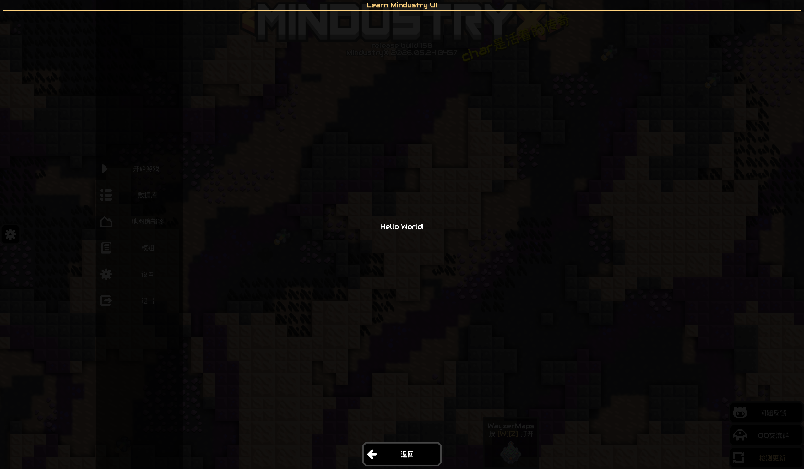
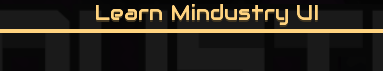
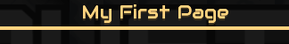
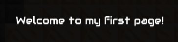
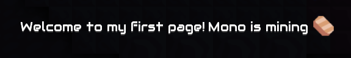
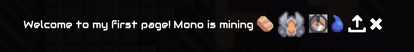

# Learn UI - 初识 UI

JS UI教程的编写采取“引导型”编写方式，也就是说：

1. 你需要一步一步**跟随**教程完成学习
2. 代码部分强烈建议**跟着手敲**，如果自己运行时出错了，对照教程代码修改即可
3. 教程会一步一步引导你理解UI的使用和相关概念，不会一次把所有原理都将明白

此外，跟随教程的引导，你也能掌握自己**探索代码功能**的方式。

## Hello World - 入门 UI

那么现在就开始我们的第一个页面（开屏页面），先在 `main.js` 中手动敲入以下代码：

```js
Events.on(ClientLoadEvent, (e) => {
  const dialog = new BaseDialog("Learn Mindustry UI")
  dialog.cont.add("Hello World!")
  dialog.addCloseButton()
  dialog.show()
})
```

保存后打开游戏，如果运行正常，你会看到如下页面：

<GridItem caption="Hello World">



</GridItem>

这样，我们就写出了第一份页面，之后的教程也将以此页面为基础，一步一步的引入更多UI的内容。

## My First Page - 初识页面

我们先修改 BaseDialog 的参数，看看页面会有什么不同：

```js
Events.on(ClientLoadEvent, (e) => {
  const dialog = new BaseDialog("Learn Mindustry UI") // [!code --]
  const dialog = new BaseDialog("My First Page") // [!code ++]
  dialog.cont.add("Hello World!")
  dialog.addCloseButton()
  dialog.show()
})
```

进入游戏后注意观察页面顶部，可以发现，页面顶部的标题发生了变动。

没错，BaseDialog 的第一个参数正是页面的**标题(title)**。

<Grid :gap="40">
    <GridItem width=200 caption="修改前">



</GridItem>
    <GridItem width=200 caption="修改后">



</GridItem>
</Grid>

---

同样，你也可以试试修改 `"Hello World!"` 看看页面会发生什么变化：

```js
Events.on(ClientLoadEvent, (e) => {
  const dialog = new BaseDialog("My First Page")
  dialog.cont.add("Hello World!") // [!code --]
  dialog.cont.add("Welcome to my first page!") // [!code ++]
  dialog.addCloseButton()
  dialog.show()
})
```

可以看到，页面中央的 **文本(Text)** 发生了变化：

<Grid :gap="40">
    <GridItem width=200 caption="修改前">


</GridItem>
    <GridItem width=200 caption="修改后">



</GridItem>
</Grid>

---

有了上述的探索，你应该能感受到下面部分代码的作用：

1. 我们是先创建了一个**标题**为 `My First Page` 的**页面**
2. 往页面上添加了**文本** `Welcome to my first page!`
3. 向页面添加了返回**按钮(Button)**
4. 把页面显示出来

```js
Events.on(ClientLoadEvent, (e) => {
  const dialog = new BaseDialog("My First Page") // 创建页面
  dialog.cont.add("Welcome to my first page!") // 添加文本
  dialog.addCloseButton() // 添加返回按钮
  dialog.show() // 显示页面
})
```

经过上述解释，现在你应该已经了解了一个页面的创建和显示过程。

现在你肯定还有一些疑惑：

1.  为什么我要写 `Events.on(ClientLoadEvent, (e) => {...})`，这是必须的吗？
    - 这是为了控制创建UI的时机，而控制创建UI的时机是**必须**的。如果你不控制好UI创建的时机，会导致游戏崩溃，或者脚本无法正常加载。
2.  控制时机必须选 `ClientLoadEvent` 事件吗？
    - 不一定，只要选取事件的时机是在UI加载完毕后就没问题，以下是部分可用的事件：
      - `ContentInitEvent`(最早可用的事件，但事件意义是内容初始化，不适合用于创建UI)
      - `ClientLoadEvent`(客户端加载完毕时)
      - `WorldLoadEvent`(地图加载完毕时)

## Label & Image - 初识文本、图片

现在，我们进一步添加新的内容：

```js
Events.on(ClientLoadEvent, (e) => {
  const dialog = new BaseDialog("My First Page")
  dialog.cont.add("Welcome to my first page!")
  dialog.cont.add("Mono is mining") // [!code ++]
  dialog.cont.image(Items.copper.uiIcon) // [!code ++]
  dialog.addCloseButton()
  dialog.show()
})
```

1. 调用 `add`，添加新文本
2. 调用 `image`，并传入图片，添加**图片元素(Image)**

这样，我们的页面就新增了文本和图片：
<GridItem caption="新增文本和图片">



</GridItem>

图片的来源非常广泛，在我们的代码里，通过 `Items.copper.uiIcon` 获取到了铜的图标。

- 任何`UnlockableContent`都有`uiIcon`的图标字段，因此你也可以试着把铜改成单位、建筑、液体等，来获取它们的图标。

- 除了获取内容的图标，你还可以获取游戏内的其他图标，这些图标都被放在了编译时生成的类`Icon`中。你可以在 LMM 群文件找到 `Icon` 文件。

- 当然你还可以添加自己模组的图片，这里我们先不演示，后续深入时再演示。

接下来我们就在代码里演示这些图片来源：

```js
Events.on(ClientLoadEvent, (e) => {
  const dialog = new BaseDialog("My First Page")
  dialog.cont.add("Welcome to my first page!")
  dialog.cont.add("Mono is mining")
  dialog.cont.image(Items.copper.uiIcon)

  dialog.cont.image(UnitTypes.flare.uiIcon) // [!code ++]
  dialog.cont.image(Blocks.duo.uiIcon) // [!code ++]
  dialog.cont.image(Liquids.water.uiIcon) // [!code ++]
  dialog.cont.image(Icon.upload) // [!code ++]
  dialog.cont.image(Icon.cancel) // [!code ++]

  dialog.addCloseButton()
  dialog.show()
})
```

<GridItem caption="新增更多图片!">



</GridItem>

## 小结

> 施工中...
