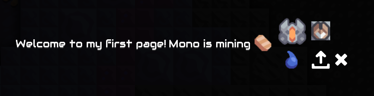
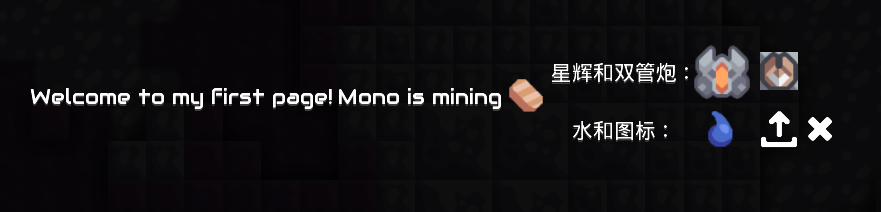
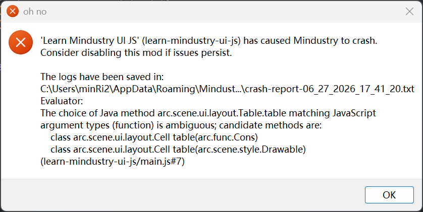
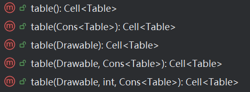
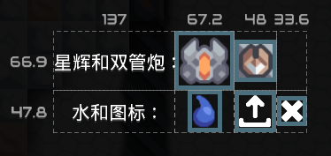
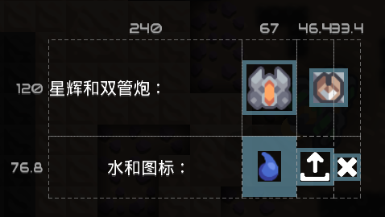
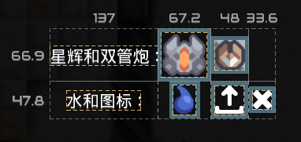
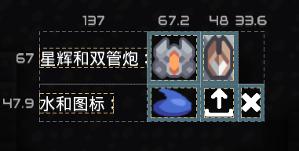

# Table & Layout - 表格与表格布局

目前，我们的 **UI元素(Element)** 还只能在一行摆放，如果希望实现换行，调整元素大小、间距，我们就必须引入一些专门用于 **布局(Layout)** 的元素。

在 Mindustry 的UI引擎里，最常用的布局元素就是 **表格(Table)**，相对应的布局方式就是 **表格布局(Table Layout)**。

## Table - 初识表格

- 我们先修改一下代码，给页面添加一个表格，再把图片元素放到表格内：

```js
Events.on(ClientLoadEvent, (e) => {
  const dialog = new BaseDialog("My First Page")
  dialog.cont.add("Welcome to my first page!")
  dialog.cont.add("Mono is mining")
  dialog.cont.image(Items.copper.uiIcon)

  // [!code --:5]
  dialog.cont.image(UnitTypes.flare.uiIcon)
  dialog.cont.image(Blocks.duo.uiIcon)
  dialog.cont.image(Liquids.water.uiIcon)
  dialog.cont.image(Icon.upload)
  dialog.cont.image(Icon.cancel)

  // [!code ++:7]
  dialog.cont.table(null, (table) => {
    table.image(UnitTypes.flare.uiIcon)
    table.image(Blocks.duo.uiIcon)
    table.image(Liquids.water.uiIcon)
    table.image(Icon.upload)
    table.image(Icon.cancel)
  })

  dialog.addCloseButton()
  dialog.show()
})
```

页面上的图标间距变紧凑了，而且似乎没有其他变化。

<Grid :gap="40">
    <GridItem caption="修改前">


</GridItem>
    <GridItem caption="修改后">


</GridItem>
</Grid>

- 那么继续修改代码，把间距加回来：

```js
Events.on(ClientLoadEvent, (e) => {
  const dialog = new BaseDialog("My First Page")
  dialog.cont.add("Welcome to my first page!")
  dialog.cont.add("Mono is mining")
  dialog.cont.image(Items.copper.uiIcon)

  // [!code focus:8]
  dialog.cont.table(null, (table) => {
    // [!code ++:5]
    table.image(UnitTypes.flare.uiIcon).pad(4)
    table.image(Blocks.duo.uiIcon).pad(4)
    table.image(Liquids.water.uiIcon).pad(4)
    table.image(Icon.upload).pad(4)
    table.image(Icon.cancel).pad(4)
  })

  dialog.addCloseButton()
  dialog.show()
})
```

现在，页面上图标间的间距就回来了。

<Grid gap="40">
    <GridItem caption="修改前">


</GridItem>
    <GridItem caption="修改后">


</GridItem>
</Grid>

- 继续修改代码，让表格在水的图标的前面换行：

```js
Events.on(ClientLoadEvent, (e) => {
  const dialog = new BaseDialog("My First Page")
  dialog.cont.add("Welcome to my first page!")
  dialog.cont.add("Mono is mining")
  dialog.cont.image(Items.copper.uiIcon)

  // [!code focus:8]
  dialog.cont.table(null, (table) => {
    table.image(UnitTypes.flare.uiIcon).pad(4)
    table.image(Blocks.duo.uiIcon).pad(4)
    table.row() // [!code ++]
    table.image(Liquids.water.uiIcon).pad(4)
    table.image(Icon.upload).pad(4)
    table.image(Icon.cancel).pad(4)
  })

  dialog.addCloseButton()
  dialog.show()
})
```

<GridItem caption="表格换行">



</GridItem>

- 只有图标还是有些单调，我们给表格加一些文字：

```js
Events.on(ClientLoadEvent, (e) => {
  const dialog = new BaseDialog("My First Page")
  dialog.cont.add("Welcome to my first page!")
  dialog.cont.add("Mono is mining")
  dialog.cont.image(Items.copper.uiIcon)

  // [!code focus:10]
  dialog.cont.table(null, (table) => {
    table.add("星辉和双管炮：") // [!code ++]
    table.image(UnitTypes.flare.uiIcon).pad(4)
    table.image(Blocks.duo.uiIcon).pad(4)
    table.row()
    table.add("水和图标：") // [!code ++]
    table.image(Liquids.water.uiIcon).pad(4)
    table.image(Icon.upload).pad(4)
    table.image(Icon.cancel).pad(4)
  })

  dialog.addCloseButton()
  dialog.show()
})
```

现在文本 `星辉和双管炮：` 和 `水和图标：` 在同一**列(Column)** 并且 **居中对齐(Center Alignment)**。图标也各自居中对齐。

<GridItem caption="表格文本">



</GridItem>

- 经过上面的探索，你会发现表格添加文本和图片的方式，和之前在页面上添加文本和图片的方式完全一致。这是因为，`dialog.cont` 其实就是一个 **表格(Table)**。

- 而且你可以看到，我们通过 `dialog.cont.table(...)` 向页面添加表格，`dialog.cont`本身也是个表格，这就说明，**表格是可以嵌套的**——这是表格布局的基础。

- 现在你对 **表格(Table)** 应该有了一定的理解，不过同样有些代码没有做解释：

1.  为什么在添加表格的时候，第一个参数是 `null`，这是必须的吗?

**这不是必须的。**

如果你省去 `null`：

```js
dialog.cont.table((table) => {})
```

你会发现游戏会报错：

<GridItem height=200 caption="报错">



</GridItem>

这是因为添加表格元素的函数有很多种，而它们的参数类型各不相同。JS 引擎会尝试根据你传入的类型，去匹配同名函数，上面的写法第一个参数类型是`Function`，引擎无法根据 `Function` 区分开 `table(Cons)` 和 `table(Drawable)` 函数。如果要写成单参数，正确的写法如下：

```js
dialog.cont.table(cons((table) => {}))
```

但这种写法会显得很啰嗦，而且容易漏掉一对小括号，或者漏掉大括号，不推荐。

<GridItem height=150 caption="添加表格的所有函数">



</GridItem>

2. `table.add` 和 `table.image` 函数的返回值是什么，为什么调用返回值`pad`函数就能调整边距?
   - 这将在下一章 **表格布局(Table Layout)** 里深入讲解。

## Table Layout - 表格布局

接下来我们将专注表格元素，先把其他UI元素删除：

```js
Events.on(ClientLoadEvent, (e) => {
  const dialog = new BaseDialog("My First Page")
  // [!code --:3]
  dialog.cont.add("Welcome to my first page!")
  dialog.cont.add("Mono is mining")
  dialog.cont.image(Items.copper.uiIcon)

  // [!code highlight:10]
  dialog.cont.table((table) => {
    table.add("星辉和双管炮：")
    table.image(UnitTypes.flare.uiIcon).pad(4)
    table.image(Blocks.duo.uiIcon).pad(4)
    table.row()
    table.add("水和图标：")
    table.image(Liquids.water.uiIcon).pad(4)
    table.image(Icon.upload).pad(4)
    table.image(Icon.cancel).pad(4)
  })

  dialog.addCloseButton()
  dialog.show()
})
```

### Cell 单元格及其参数

为了能让表格布局更加直观，本教程提供了一个用于可视化表格布局的工具函数，你可以在 [相关资源](./Z-resources.md#工具函数) 里找到这个函数，下面，我们先加上部分可视化：

```js
Events.on(ClientLoadEvent, (e) => {
  const dialog = new BaseDialog("My First Page")

  // [!code focus:14]
  dialog.cont.table((table) => {
    table.add("星辉和双管炮：")
    table.image(UnitTypes.flare.uiIcon).pad(4)
    table.image(Blocks.duo.uiIcon).pad(4)
    table.row()
    table.add("水和图标：")
    table.image(Liquids.water.uiIcon).pad(4)
    table.image(Icon.upload).pad(4)
    table.image(Icon.cancel).pad(4)

    // [!code ++:4]
    mountDebugElement(table, {
      drawCellBounds: true,
      drawPadding: true,
    })
  })

  dialog.addCloseButton()
  dialog.show()
})

// [!code focus:2]
// [!code ++:2]
// 把工具函数放到底下就好了，之后的教程代码中将不再展示该工具函数
function mountDebugElement(table, options){...}
```

下面是打开游戏的效果图，展示了表格的布局情况：

<GridItem height=150 caption="单元格参数">



</GridItem>

可以看到，表格布局就是将表格这个矩形，横向和纵向划分成若干个区块，而且每个区块内都只有一个元素，这个**区块**正是一个重要概念：**单元格(Cell)**。

我们调用 `table.image` `table.add` 函数的时候，它们的返回值都是**单元格(Cell)**。Cell 有很多布局参数，以下是它们的介绍：

- `minWidth` `maxWidth`：宽度、最小宽度、最大宽度
- `minHeight` `maxHeight`：高度、最小高度、最大高度
- `expandX` `expandY`：单元格是否向X、Y占领空闲区域（空闲区域的概念先按住不表）
- `colspan`：单元格占据的列宽（相当于“合并单元格”）
- `uniformX` `uniformY`：是否与行或列统一长或宽
- `pad`: 内边距

上图的蓝色部分正是单元格的 **内边距(Pad)**。

### 修改单元格参数

- 接下来，我们继续修改代码，让你体会一下单元格参数的修改：

1. 给第一行第一列的 `星辉和双管炮：` 单元格的宽高调整为 200、100
2. 让 `双管炮图标` 占据两列，即调整 colspan 为 2
3. 增大 `水图标的内边距`，调为16

```js
Events.on(ClientLoadEvent, (e) => {
  const dialog = new BaseDialog("My First Page")

  dialog.cont.table(null, (table) => {
    // [!code focus:11]
    table.add("星辉和双管炮：") // [!code --]
    table.add("星辉和双管炮：").width(200).height(100) // [!code ++]
    table.image(UnitTypes.flare.uiIcon).pad(4)
    table.image(Blocks.duo.uiIcon).pad(4) // [!code --]
    table.image(Blocks.duo.uiIcon).pad(4).colspan(2) // [!code ++]
    table.row()
    table.add("水和图标：")
    table.image(Liquids.water.uiIcon) // [!code --]
    table.image(Liquids.water.uiIcon).pad(16) // [!code ++]
    table.image(Icon.upload).pad(4)
    table.image(Icon.cancel).pad(4)

    mountDebugElement(table, {
      drawCellBounds: true,
      drawPadding: true,
    })
  })

  dialog.addCloseButton()
  dialog.show()
})
```

- 接下来看看游戏内的效果图的前后对比：

<Grid gap=32>
<GridItem height=100 caption="参数修改前">


</GridItem>

<GridItem height=150 caption="参数修改后">



</GridItem>
</Grid>

1. 我们调整了第一行的行高为100、第一列的列宽为200，游戏内实际的尺寸却是120x240，这与游戏设置的 **UI缩放** 有关，本教程的UI缩放为120%，实际尺寸也就是所填值的120%。

> 如果你得到的尺寸和教程所得的尺寸不同，也不用特意去调整 UI缩放，因为教程里的整体布局情况不受UI缩放的影响。

2. `双管炮图标` 占据了两列，并且图标居中。

3. `水图标` 的内边距扩大了(蓝色区域)，把第二行的行高撑大了。

4. 此外，你可能还注意到，调整参数时，我们把函数的调用串了起来：`table.add().width().height()`，也就是说我们在调用 `add` 函数后，又能够继续调用 `width` `height` 函数。

   这是因为`add`函数返回 Cell，Cell 的 `width` `height` 函数都返回它本身，这样就能实现函数的**链式调用**了。等效的代码如下：

   ```js
   const cell = table.add("星辉和双管炮：")
   const cell2 = cell.width(200)
   const cell3 = cell2.height(100)

   // 其中 cell 、cell2、cell3 都指向同一个对象
   ```

下面是所用函数的解释：

- `width(float)` 函数的作用是把参数 `minWidth` `maxWidth` 设置成了该值，`height` 函数也同理。
- `pad(float)` 函数是同时调整上、左、下、右的内边距。此外，`padTop(float)` `padLeft(float)` `padBottom(float)` `padRight(float)` 可以分别调整上、左、下、右的内边距，而 `pad(float, float, float, float)` 也可以单独调整上、左、下、右的内边距。

现在你应该对单元格参数 `minWidth` `maxWidth` `minHeight` `maxHeight` `colspan` `pad` 有了一定的理解，其他参数将在后续教程里涉及。

### 单元格内的元素布局

先回到开始的代码，添加一个元素边界的可视化：

```js
Events.on(ClientLoadEvent, (e) => {
  const dialog = new BaseDialog("My First Page")

  // [!code focus:17]
  dialog.cont.table(null, (table) => {
    table.add("星辉和双管炮：")
    table.image(UnitTypes.flare.uiIcon).pad(4)
    table.image(Blocks.duo.uiIcon).pad(4)
    table.row()
    table.add("水和图标：")
    table.image(Liquids.water.uiIcon).pad(4)
    table.image(Icon.upload).pad(4)
    table.image(Icon.cancel).pad(4)

    mountDebugElement(table, {
      drawCellBounds: true,
      drawPadding: true,
      drawElementBounds: true, // [!code ++]
    })
  })

  dialog.addCloseButton()
  dialog.show()
})
```

<GridItem height=150 caption="元素边界">



</GridItem>

将表格划分成单元格后，表格就会根据单元格参数，为每一个UI元素分配大小和位置，下图额外展示了每个元素的边界。你可以看到，每个元素的边界不一定充满每个单元格，而且位置默认是单元格居中。

**单元格(Cell)** 还有一些参数用于调整元素在单元格内的布局信息，以下是部分参数及其介绍：

- `fillX` `fillY`：元素是否在X、Y方向填充
- `align`: 元素在单元格内的对齐方式

### 修改单元格内的元素布局

接下来，我们将继续修改代码，让你体会单元格内的元素布局：

1. 让文字 `星辉和双管炮：` 和 `水和图标：` 在单元格内左对齐
2. 让 `双管炮图标` 和 `x图标` 在垂直方向（Y轴）填充单元格
3. 让 `水图标` 在水平方向（X轴）填充单元格

```js
Events.on(ClientLoadEvent, (e) => {
  const dialog = new BaseDialog("My First Page")

  // [!code focus:21]
  dialog.cont.table(null, (table) => {
    table.add("星辉和双管炮：") // [!code --]
    table.add("星辉和双管炮：").left() // [!code ++]
    table.image(UnitTypes.flare.uiIcon).pad(4)
    table.image(Blocks.duo.uiIcon).pad(4) // [!code --]
    table.image(Blocks.duo.uiIcon).pad(4).fillY() // [!code ++]
    table.row()
    // [!code --:2]
    table.add("水和图标：")
    table.image(Liquids.water.uiIcon).pad(4)
    // [!code ++:2]
    table.add("水和图标：").left()
    table.image(Liquids.water.uiIcon).pad(4).fillX()
    table.image(Icon.upload).pad(4)
    table.image(Icon.cancel).pad(4) // [!code --]
    table.image(Icon.cancel).pad(4).fillY() // [!code ++]

    mountDebugElement(table, {
      drawCellBounds: true,
      drawPadding: true,
      drawElementBounds: true,
    })
  })

  dialog.addCloseButton()
  dialog.show()
})
```

游戏内效果图：
<GridItem height=150 caption="单元格内的元素布局">



</GridItem>

这样，就实现了文字在单元格内左对齐，图片元素也在X或Y方向上填充，而且图片内容也被拉伸了。

下面是所用函数的解释：

- `Cell.fillX()` `Cell.fillY()` 分别调整了 `fillX` `fillY`参数。
- `Cell.left()` 函数调整了 `align` 参数。此外，`Cell.right()` `Cell.top()` `Cell.bottom()` 也可以调整 `align` 参数，你可以自己尝试一番。

## 表格布局的实战练习

> 施工中...

## 小结

现在，你应该对表格布局有了大概的理解：代码添加元素、描述何时换行、调整单元格的参数，表格按照代码的描述去划分单元格，根据单元格参数去分配每个元素的位置和大小。这样就完成了从代码到表格布局的过程。

<Grid>
<GridItem height=150 caption="参数修改后">


</GridItem>

<GridItem height=150 caption="单元格内的元素布局">


</GridItem>
</Grid>
