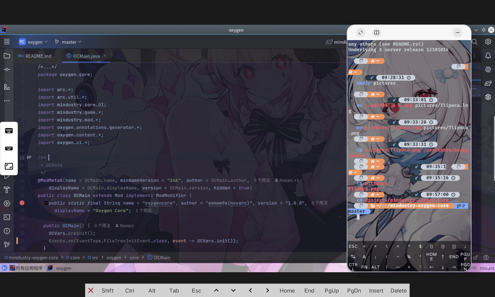
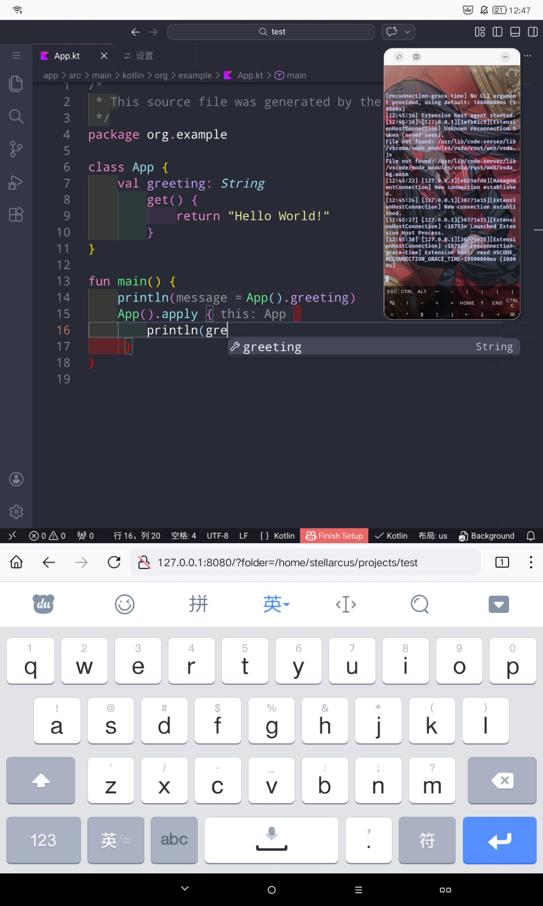
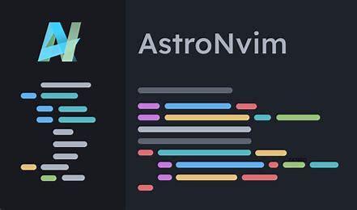
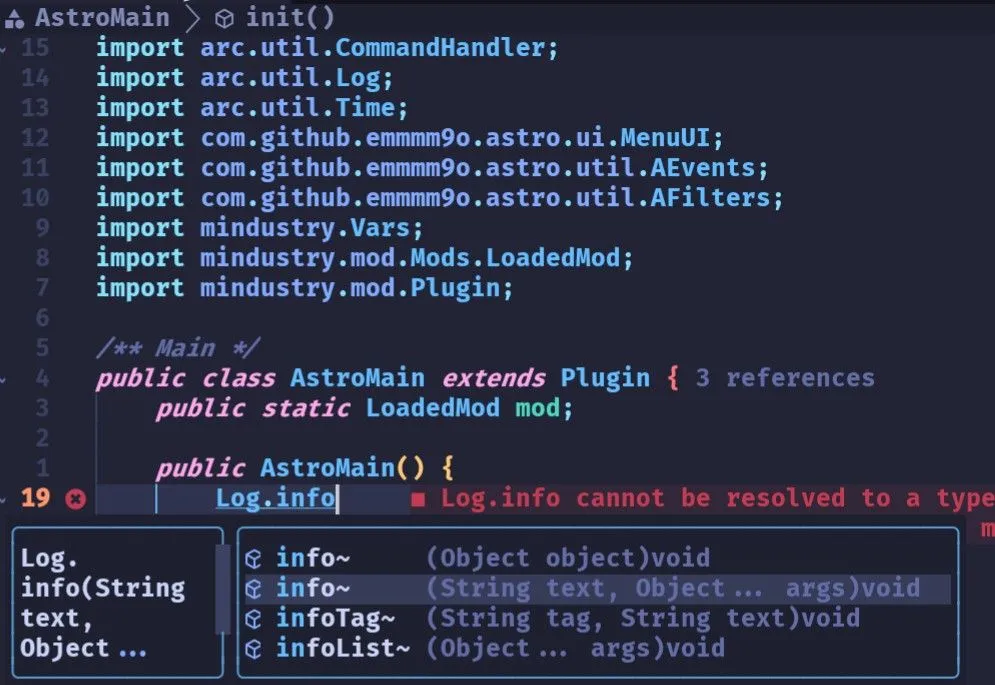
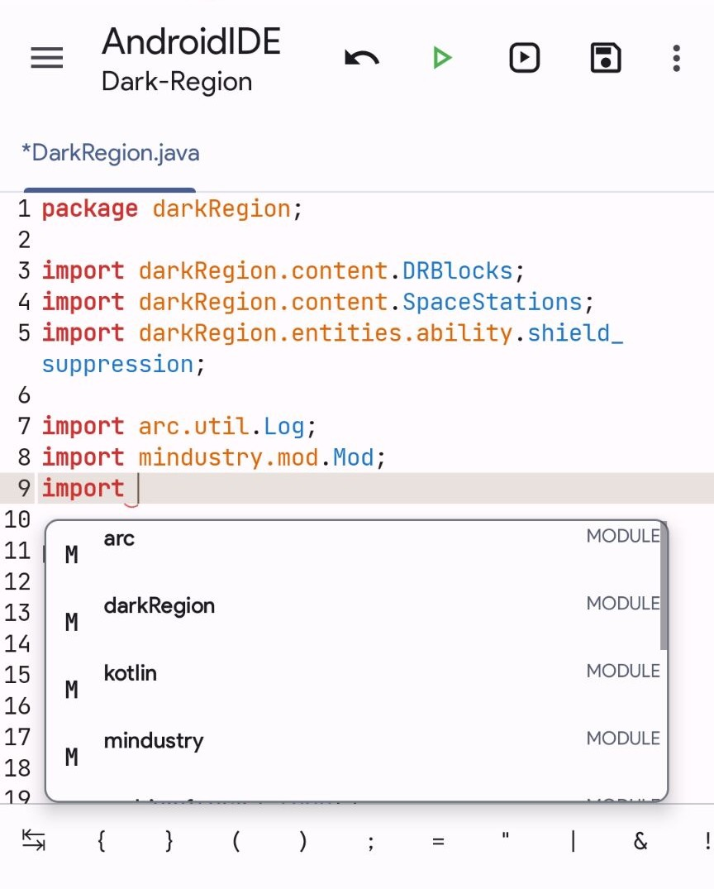

# 在 Android 上构建

> ***器不在大，能用则灵。***

::: info
本节面向只有 Android 设备、希望开发或构建 Mindustry Java/Kotlin 模组的读者。内容以 Termux 为主，也会介绍 Linux 容器、D8、Android SDK 和常用 IDE。
如果你还不了解 Gradle、JDK 和官方模板，建议先阅读[Gradle 环境与 Java/Kotlin](1-gradle-java-and-kotlin)以及[使用 Anuke 提供的模板](2-anuke-template)。
:::

Android 设备并不只能编辑 JSON 或 JavaScript。Termux 可以提供命令行环境，Linux 容器可以补齐标准 Linux 用户空间；配置正确后，手机也能完成 Mindustry JVM 模组的编译。

不过，手机的存储、内存和散热条件有限。建议先完成一次命令行构建，再决定是否安装桌面环境和大型 IDE。

## 命令行基础

| 命令 | 作用 |
| --- | --- |
| `pwd` | 显示当前目录 |
| `ls`、`ls -la` | 列出文件和隐藏文件 |
| `cd path`、`cd ..`、`cd ~` | 进入目录、返回上级、回到主目录 |
| `mkdir name` | 创建目录 |
| `cp source target` | 复制文件或目录 |
| `mv old new` | 移动或重命名 |
| `rm file` | 删除文件；命令行没有回收站 |
| `cat file` | 查看文本文件 |
| `Ctrl+C` | 中止当前命令 |

路径中包含空格时，请使用引号或反斜杠转义：

```shell
cd "My Mod Project"
cd My\ Mod\ Project
```

## 安装 Termux

Termux 是 Android 上的终端模拟器，不需要 Root 权限。建议从项目 Releases 页面获取与设备架构匹配的版本，不要混用不同来源的 Termux 及插件。

<GitHubCard repo="termux/termux-app"/>

社区发行版也可以使用，例如 ZeroTermux。它提供了更方便的软件源和备份入口，但底层命令仍以 Termux 文档为准。

<GitHubCard repo="hanxinhao000/ZeroTermux"/>

首次启动后更新软件包，并授权访问共享存储：

```shell
pkg update && pkg upgrade
termux-setup-storage
```

授权后，`~/storage/download/` 通常对应 Android 的 `Download` 目录。项目建议放在 Termux 私有目录或容器的 Linux 文件系统内，避免共享存储带来的权限、符号链接和文件监听问题。

使用交互式换源工具：

```shell
termux-change-repo
```


Termux 的可选配置位于 `~/.termux/`：

- `termux.properties`：快捷键和终端行为；
- `colors.properties`：配色；
- `font.ttf`：终端字体。

这些设置不会影响 Gradle 构建，可以在环境稳定后再调整。

## Linux 容器

不需要图形化 IDE 时，可以直接使用 Termux。需要 IntelliJ IDEA、标准 Linux 软件包或完整桌面环境时，再安装容器。

- **PRoot**：不需要 Root，兼容性较好，但运行开销更大；
- **chroot**：需要 Root，通常性能更好，但配置和权限管理更复杂。

### TMOE

:::tip
TMOE已经停止维护了 ，不建议通过其安装容器，但可以使用它安装软件。
:::

TMOE（More Optional Environments）可以辅助安装 PRoot/chroot 容器、桌面环境和常用工具。它的菜单会随版本变化，以下命令只表示启动方式：

```shell
pkg install curl
curl -LO https://gitee.com/mo2/linux/raw/2/2.awk
awk -f 2.awk
```

进入菜单后选择容器，按设备架构安装发行版。Ubuntu/Debian 的资料较多，Arch Linux 更精简但需要自行处理更多配置。

如果要运行图形化 IDE，还需要桌面环境和 VNC 服务。TMOE 可以辅助安装；VNC 客户端可以使用 AVNC：

<GitHubCard repo="gujjwal00/avnc"/>

图形化桌面会明显增加内存和耗电。低配置设备优先使用 Neovim，或把构建交给 GitHub Actions。

## 无容器环境

无法运行容器时，仍可直接在 Termux 中使用 JDK、Git、Gradle Wrapper 和 Neovim：

```shell
pkg install git unzip openjdk-25 neovim
java -version
```

Termux 的软件包名称与 Ubuntu/Arch 不完全相同，应先用 `pkg search` 查询。模板项目自带 Gradle Wrapper，进入项目根目录后使用 `./gradlew`，通常不需要全局安装 Gradle。

无容器方案的限制主要是：部分桌面 Linux 软件无法运行，Android SDK 的组件也可能缺少对应架构版本。遇到 SDK 或 native 工具不兼容时，使用 Linux 容器或 GitHub Actions 构建更实际。

## 构建模组

先完成[使用 Anuke 提供的模板](2-anuke-template)中的项目初始化，然后在项目根目录执行：

```shell
./gradlew tasks
./gradlew jar
```

`jar` 通常生成桌面端模组。模板的 Android 任务会随版本变化，应以 `./gradlew tasks` 的实际输出为准；不要仅凭教程中的任务名判断。

官方模板和本地示例通常将 Android 构建拆成三个步骤：

1. `jar` 生成桌面端 JAR；
2. `jarAndroid` 使用 D8 对 JAR 做 dex/desugar；
3. `deploy` 合并桌面端和 Android 端产物。

例如，本地 Mindustry 模组模板中的 `jarAndroid` 会检查 `ANDROID_HOME`、寻找包含 `android.jar` 的 platform，并调用 PATH 中的 `d8`；`deploy` 依赖它和 `jar` 后再生成最终 JAR。因此，任务名和参数必须以你使用的模板为准。

## 只安装 D8

如果目标只是构建大多数 Java/Kotlin 模组，而不是编译 Mindustry 本体，可以只安装 D8。Termux 软件源提供包时直接安装：

```shell
pkg search d8
pkg install d8
```

在 Linux 容器中也可以通过下面脚本安装

```shell
VERSION=33.0.3
wget -c "https://dl.google.com/android/repository/build-tools_r${VERSION}-linux.zip" -O "build-tools_r${VERSION}-linux.zip"
unzip -q "build-tools_r${VERSION}-linux.zip" -d "build-tools-${VERSION}"
sudo mkdir -p /usr/share/java
sudo cp "build-tools-${VERSION}/android-13/lib/d8.jar" /usr/share/java/d8.jar
sudo tee /usr/bin/d8 > /dev/null <<'EOF'
#!/bin/bash
exec java -Xmx2G -cp /usr/share/java/d8.jar com.android.tools.r8.D8 "$@"
EOF
sudo chmod +x /usr/bin/d8
rm -rf "build-tools-${VERSION}" "build-tools_r${VERSION}-linux.zip"
```

确认路径后，可以直接调用：

```shell
d8 --help
```

另外我们需要对`build.gradle`修改，这边展示对官方模板的修改
```groovy{7-14}
//…
tasks.register('jarAndroid'){// [!code focus:15]
    dependsOn "jar"
    def projectName = project.name

    doLast{
        //collect dependencies needed for desugaring
        def dependencies = (configurations.compileClasspath.asList() + configurations.runtimeClasspath.asList()).collect{ "--classpath $it.path" }.join(" ")

        def d8 = isWindows ? "d8.bat" : "d8"

        //dex and desugar files - this requires d8 in your PATH
        "$d8 $dependencies --min-api 14 --output ${projectName}Android.jar ${projectName}Desktop.jar"
                .execute(null, new File("build/libs")).waitForProcessOutput(System.out, System.err)
    }
}
//…
```

若模板需要 Android platform 的 `android.jar`，仅有 D8 仍然不够，还需安装 SDK platform。

## Android SDK

需要完整 Android SDK 时，目录通常包含：

```text
Sdk/
├── build-tools/
├── cmdline-tools/
├── platform-tools/
├── platforms/
└── ndk/
```

Android SDK 官方命令行工具并不总是提供 Linux ARM64 构建。设备架构不匹配时，可以使用社区提供的兼容工具，或把构建放到 GitHub Actions；不要把 x86_64 的 native 工具直接当作 ARM64 工具使用。

标准 Linux 环境中，命令行工具可以按以下结构放置：

```shell
mkdir -p "$HOME/Sdk/cmdline-tools/latest"
cd "$HOME/Sdk/cmdline-tools"
curl -L "https://dl.google.com/android/repository/commandlinetools-linux-15859902_latest.zip" -o tools.zip
unzip -q tools.zip
mv cmdline-tools/* latest/
rmdir cmdline-tools
rm tools.zip
```

然后设置环境变量并安装项目需要的组件。版本号应以模板的 Android Gradle Plugin 和构建脚本为准。
```shell
export ANDROID_HOME="$HOME/Sdk"
export PATH="$ANDROID_HOME/cmdline-tools/latest/bin:$ANDROID_HOME/platform-tools:$ANDROID_HOME/build-tools/35.0.0:$PATH"

sdkmanager --licenses
sdkmanager "platform-tools" "platforms;android-35" "build-tools;35.0.0"
```

建议把环境变量写入 `~/.bashrc` 或当前 shell 对应的启动文件，并重新打开终端。`ANDROID_HOME` 必须指向 SDK 根目录，而不是 `cmdline-tools` 子目录。

如果 Mindustry 本体构建报 `aapt2` 架构错误，还需要 ARM64 版本的 `aapt2`，从[android-sdk-tools releases](https://github.com/lzhiyong/android-sdk-tools/releases)获取，并在 `~/.gradle/gradle.properties` 中指定：

```properties
android.aapt2FromMavenOverride=/path/to/arm64/aapt2
```

这属于 Mindustry 本体 Android 构建的额外要求，不是所有模组构建都需要。

## 编译 Mindustry 本体

本节不是普通模组开发的必需步骤。编译本体前，应先熟悉 Gradle、Git、Linux 和 Mindustry 多模块项目。

### Arc 依赖
对于v159.7之前的版本，因为不存在ARM64所以需要本地构建Arc之后则不需要。
Mindustry 的构建脚本会根据 Arc 版本配置依赖。部分版本会优先使用同级目录中的本地 `Arc` 仓库，因此可将两个仓库放在同一父目录：

```text
workspace/
├── Arc/
└── Mindustry/
```

Arc 的 native 构建还会涉及 jnigen 和平台库。不同版本的构建脚本差异较大，应直接查看当前版本的 `arc-core/build.gradle`，为其添加`Arm64`架构的编译。

::: tip
编译**Arc**的native时候 **Arc**会拉取部分库，你可以修改`arc-core/build.gradle`里面的github链接 ，添加镜像。
:::

### Android 目标

Mindustry 本体的 Android 任务除了 SDK、build-tools、platform-tools 和 platforms，还可能需要与设备架构匹配的 `aapt2` 和 native 依赖。先列出任务，再运行目标任务：

```shell
./gradlew tasks
./gradlew android:deploy
```


## IDE 选择

| IDE | 适用场景 | 注意事项 |
| --- | --- | --- |
| IntelliJ IDEA | 容器 + 桌面环境 | Java/Kotlin 支持完整，内存占用较高 |
| VS Code / code-server | 容器或浏览器编辑 | 需要配置 Java/Kotlin 扩展和 Gradle |
| Neovim | 无容器 Termux、低配置设备 | 轻量，但需要自行配置 LSP |
| AndroidIDE | Android 原生环境 | 兼容性需按模板实际测试 |

选择 IDE 时，至少确认它能导入 Gradle 项目、跳转 Mindustry/Arc 源码、运行 Gradle 任务并查看完整日志。

### IntelliJ IDEA

[IntelliJ IDEA 官网](https://www.jetbrains.com/idea/)

社区版足以完成常规 Mindustry Java/Kotlin 模组开发。在 Linux 容器中运行时，应选择与设备架构匹配的 Linux ARM64 版本，并先确认 VNC 桌面稳定。


手机运存最好在 6 GB 以上。插件只安装确实需要的，例如 Rainbow Brackets、Translation、IdeaVim；插件越多，索引和内存开销越大。



### VS Code / code-server

VS Code 需要 Java、Kotlin 和 Gradle 相关扩展；code-server 通过浏览器提供编辑界面，更适合不方便运行完整桌面的设备。小屏触控操作可能不如终端编辑器高效。



### Neovim

```shell
pkg install neovim
```

Neovim 是 Vim 的现代化接班人，插件生态繁荣，支持 LSP、Lua 等先进特性。对于手机上的无容器环境，它几乎是唯一的专业级代码编辑器。

**它的优势在哪？**
- 纯键盘操作，熟悉后非常舒适
- 高度可定制，一切尽在掌控
- 轻得难以置信，适合低配设备

::: info 现实一点
Neovim 能提高你的*操作*速度，但不一定直接提高*编程*速度——毕竟大部分时间在思考。不过，它确实能让编码过程更享受。
:::

可以使用 AstroNvim 或 LazyVim 等预配置方案，也可以自行配置 LSP。Java 通常使用 Eclipse JDT Language Server；Kotlin 应使用与当前 Kotlin 版本匹配的官方 Kotlin LSP，而不是随意替换成第三方服务。

<GitHubCard repo="neovim/neovim"/>

无容器 Termux 可能需要在 jdtls 配置中填写可执行文件的绝对路径。若 LSP 无法导入 Gradle 多模块项目，先查看 jdtls 日志、JDK 版本和项目生成的 Gradle 配置，不要只重复安装插件。

### AstroNvim
**AstroNvim** 是一个美观且功能丰富的 **Neovim** 配置方案，注重可扩展性和可用性。
[官方文档](https://docs.astronvim.com/)
<GitHubCard repo="AstroNvim/AstroNvim"/>





### LazyVim
**LazyVim** 是一个由 **lazy.nvim** 驱动的 Neovim 配置方案，开箱即用，启动极快，兼顾美观与效率。
[官方文档](https://www.lazyvim.org/)
<GitHubCard repo="LazyVim/LazyVim"/>


::: tip
上面的neovim里面使用的blink可能需要一点手动操作才能确保其安装
:::

### 镜像配置
国内网络下，直接从 GitHub 拉取插件很慢。AstroNvim 使用 lazy.nvim 管理插件，可以配置镜像。
找到 lazy_setup.lua（或类似的 setup 文件），在 lazy.setup() 的选项里加入：
```lua{6}
--…
require("lazy").setup({-- [!code focus]
--…
},{-- [!code focus]
--…
  git = { url_format = "{镜像}/https://github.com/%s.git" },-- [!code focus]
--…
})-- [!code focus]
--…
```
另外Lazy本身安装时候的镜像配置，找到`init.lua`将里面的`https://github.com`前面加上镜像就好了
以及 mason.nvim 的镜像（通常在 mason.lua 里）
(对于AstroNvim则在`~/.local/share/nvim/lazy/AstroNvim/lua/astronvim/plugins/mason.lua`里面)
```lua{4}
--…
require("mason").setup({-- [!code focus]
--…
  github = {download_url_template = "{镜像}/https://github.com/%s/releases/download/%s/%s",},-- [!code focus]
--…
})-- [!code focus]
--…
```

### AndroidIDE
AIDE目前还有一些潜在问题
图片由E 355416854提供



## LSP
对于没有使用**IDEA**的则需要配置**LSP**
**LSP** 全称 **Language Server Protocol**，是一套由微软提出的开放标准，定义了编辑器（客户端）与语言服务器之间的通信协议。 它让编辑器能够以统一的方式获得**代码补全、跳转定义、错误诊断、悬停提示、代码格式化**等智能特性，而不必为每种语言重复造轮子。

Neovim 通过内置的 **LSP 客户端** 原生支持这一协议。配合 **nvim-lspconfig**、**mason.nvim** 等工具，可以轻松为 Java、Kotlin、Lua 等语言配置对应的语言服务器，获得接近 IDE 的开发体验。

像前面介绍的 **AstroNvim** 或 **LazyVim**，都已经将 LSP 的配置整合得相当完善，通常装好语言支持包就能直接使用。
下面我们将介绍一些mod开发需要的lsp

### Eclipse JDT LS (jdtls)

**jdtls** 全称 **Eclipse JDT Language Server**，是 Eclipse 基金会为 Java 语言实现的官方 **LSP** 服务器。它直接复用了 Eclipse IDE 积累多年的 Java 解析内核，能为任何支持 LSP 的编辑器提供**代码补全、跳转定义、错误诊断、重构、格式化和查找引用**等高级功能。

<GitHubCard repo="eclipse-jdtls/eclipse.jdt.ls"/>

对于**Vscode**直接安装**java**插件 对于**neovim**直接使用**mason**安装

:::info
Jdtls的功能并不好 甚至有时候无法支持gradle多模块项目，有的时候莫名导入项目失败
:::

### Kotlin-lsp
来自于**Kotlin**官方的lsp 基于**IDEA**开发 功能相较于其他kotlin lsp相当强大完整
<GitHubCard repo="Kotlin/kotlin-lsp"/>

对于**Vscode**直接安装仓库里面对应插件 对于**neovim**直接使用**mason**安装(注意不是kotlin-language-server)

## 构建失败排查

### 找不到 JDK

```shell
java -version
echo "$JAVA_HOME"
```

JDK 版本必须满足模板和 Mindustry 版本要求。不要只按本页示例固定版本；以项目的 Gradle 脚本和错误信息为准。

### 找不到 Android SDK 或 `android.jar`

```shell
echo "$ANDROID_HOME"
find "$ANDROID_HOME/platforms" -name android.jar
```

确认 `ANDROID_HOME` 指向 SDK 根目录，并安装模板实际需要的 platform。

### 找不到 `d8`

```shell
command -v d8
d8 --version
```

确认 D8 可执行脚本在 PATH 中，且脚本使用的 Java 和 `d8.jar` 路径有效。

### 依赖下载失败

先确认网络、仓库地址和代理配置，再重新运行同一任务。不要一遇到失败就删除 Gradle 缓存；只有确认缓存损坏时才清理。

### Android 设备上运行缓慢

降低 IDE 索引和 Gradle 并发，关闭不必要的插件，把项目放在内部存储。若仍无法稳定构建，使用 GitHub Actions 或电脑构建通常更合适。

## 小结

- 只写代码和运行 Gradle：无容器 Termux + Neovim；
- 需要标准 Linux 软件或 IDEA：Termux + PRoot/chroot 容器；
- 只构建模组 Android 产物：优先准备模板要求的 D8，必要时再安装 SDK platform；
- 编译 Mindustry 本体：额外检查 Arc、native 工具、ARM64 `aapt2` 和 Android 模块；
- 无论使用哪种路线，都先运行 `./gradlew tasks` 和一次最小 `jar` 构建，确认环境可用后再扩展配置。
