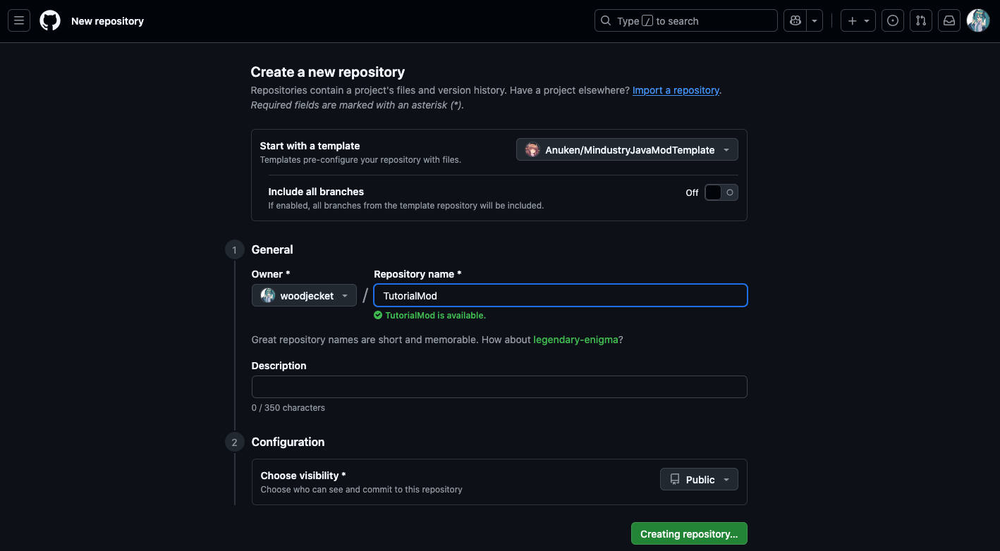

# 使用 Anuke 提供的模板

> ***从模仿到超越***

**模板（Template）**是一套即开即用、可以被编译成完整模组的、帮助新人modder快速上手的一套项目。我们接下来的教程都将围绕模板，而非从零搭建项目讲起。本节教程将介绍Mindustry模组的官方模板的使用方式。这里假定你已经拥有**GitHub账号**。

## 使用模板

模板的下载地址：
- Java版：[https://github.com/Anuken/MindustryJavaModTemplate](https://github.com/Anuken/MindustryJavaModTemplate) 
- Kotlin版：[https://github.com/Anuken/MindustryKotlinModTemplate](https://github.com/Anuken/MindustryKotlinModTemplate) 

::: info
Mindustry作者网名的正确拼写是`Anuke`，而GitHub用户名为`Anuken`， 这是由于`Anuke`被抢注了
:::


打开上述网址，如果你不打算使用GitHub托管你的模组，点击“Code -> Download Zip”并下载即可。下载后解压，使用IDEA打开此文件夹。

如果你想分享模组的源代码，或者上架**模组浏览器**，你可以在GitHub中使用此模组新建一个项目，直接点击绿色的“Use this template”，选择“Create a new repository”，并在页面中填写模组的仓库名，推荐与模组的名称保持一致。接下来，将直接跳转到你新建的repo中，以后如果想在GitHub上访问此repo，可以在GitHub网页端右上角转到“Your repositories”。



接下来，在IDEA中找到“从VSC中获取”，选择GitHub并登陆你的账号，在完成登陆后，你应当可以直接看到你的项目，双击之，等待即可。如果此阶段出现网络错误（如`Timeout`等），可能需要 **改善网络条件** 。

## 本地构建测试

下文所称`build.gradle`包括`build.gradle.kts`，`Java文件`包括`Kotlin文件`

打开项目后，请先暂停IDEA的所有活动（包括索引和下载gradle），先去找到`build.gradle`中的`mindustryVersion`变量，将其设置成最新的Mindustry版本。接下来，点击右边栏的Gradle图标，在弹出的窗口中点击刷新按钮。此过程可能需要耗费一段时间。如果此阶段出现网络错误（如`TimeOut` `Cannot find dependencies`等），可能需要 **改善网络条件** 。


接下来，在上方菜单“文件-项目结构”的“项目”子面中，设置“SDK”为你刚刚安装的Java 25，设置语言级别为对应的版本。


然后，在软件右边栏中的Gradle图标，找到“build/jar”，尝试运行，并等待一段时间，直到游戏输出“BUILD SUCCESSFUL”的字样。这证明你的开发环境已经配置完毕了。


::: info Hjson
JSON 本应易于人类读写——理论上确实如此。但现实中，JSON 仍存在大量稍不注意就会犯错的陷阱。Hjson 是一种基于 JSON 的语法扩展，它并非要取代 JSON 或将其纳入 JSON 规范，而是旨在为人类提供更友好的交互界面：先由人工阅读编辑，再交由机器解析JSON数据。

Hjson相比JSON的改进包括：省略逗号、支持注释、支持键名无引号、支持字符串无引号、支持多行字符串。Mindustry的所谓的json解析都是hjson解析，并且比hjson标准还要**宽松**，意味着你不如所有逗号和引号都不写了。
:::

然后，找到`mod.hjson`文件，按照第三节的内容进行更改，特别要注意`minGameVersion`和`main`。`minGameVersion`最好随最好版本保持一致。而`main`必须是`src`下那个继承`mindustry.mod.Mod`的类的 **全限定名（Fully Qualified Name）** ，即“包名+类名”，例如`example.ExampleMod   `。

再次编译，把修改好的模组导入游戏当中，重启游戏，你就会在屏幕当中看到一只大大的青蛙或ohno（这取决你有没有修改`modName`），这说明你的模组可以在桌面端运行了。如果你想要生成安卓端也能运行的模组，请确保Android SDK已安装，并执行“other/deploy”。


## 模板中的文件结构

- `assets/`：媒体文件，默认本文件夹内部所有文件将全部**原样**复制到模组安装包中
- `src/`：源代码文件，以后的教程中所有Java/Kotlin文件都应该放在此目录下；
- `gradle/`： **Gradle Wrapper** 的存放地点；
- `build.gradle`或`build.gradle.kts`：模组项目的配置文件；
- `gradlew.bat` `gradlew`：Windows和*nix下gradle的命令行入口；
- `mod.hjson`：模组的配置文件。

## 修改主类

假若我们把主类改成这样，这里的类名和包名可以按照你的意愿进行修改:

::: code-group

``` java
package tutorial;

import arc.util.Log;
import mindustry.mod.Mod;

public class TutorialMod extends Mod {
    
    public TutorialMod() {
        Log.info("Loaded TutorialMod constructor.");
    }
    
    @Override
    public void loadContent() {
        Log.info("Loading some tutorial content.");
    }
}
```

``` kotlin

package tutorial

import arc.util.Log
import mindustry.mod.Mod

class TutorialMod : Mod() {
    init {
        Log.info("Loaded TutorialMod constructor.")
    }

    override fun loadContent() {
        Log.info("Loading some tutorial content.")
    }
}

```

:::

你需要把`mod.hjson`同步修改，以适配你的class文件存放位置：

``` hjson
displayName: "示例模组"
name: "turorial-mod"
author: "LEARN-MINDUSTRY-MOD"
main: "turorial.TurorialMod"
description: "A Mindustry mod for tutorial."
version: 1.0
minGameVersion: 154
java: true
```

## Github Actions

使用Github托管模组的另一个好处是，你可以不在本地配置Android SDK，而是在需要安卓平台支持的时候从 **GitHub Actions** 上获取通用于两端的jar。

打开你的GitHub项目，在中间导航栏中找到Actions选项卡。打开最上方的条目，如果显示一个绿色的勾号，说明编译成功；如果显示一个红色叉号，说明编译失败，需要排查原因。然后在里面找到Artifacts一栏，下载并**解压**，即为全端通用的jar。


如果出现了Actions编译失败，可能是你的模组本身无法编译，存在Java错误；或者是你的Actions配置文件出现了错误，这时你需要手动更新`.github/workflows/commitTest.yaml`中过时的内容。

## 上架模组浏览器

打开模组的GitHub项目，点击右侧`About`的设置按钮（小齿轮），在其中的`Topics`项中输入mindustry-mod，等待网站响应后点选，然后点击“Save Changes”，这样就上架成功了。


模组浏览器每隔两小时更新一次，在更新后你就可以在模组浏览器中见到你的模组了。


