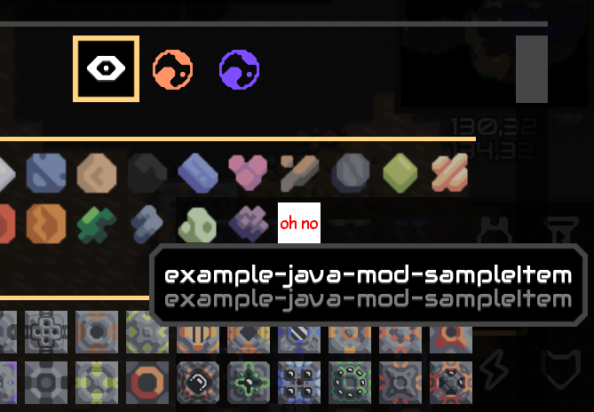
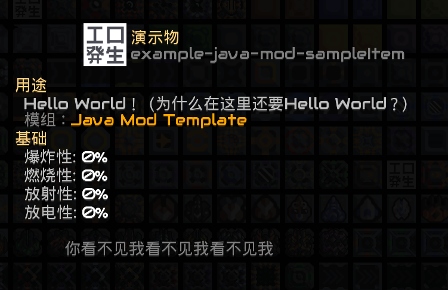
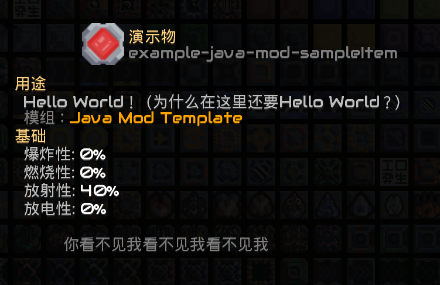

# 物品与流体

> ***“万事开头难”***

Mindustry的游戏内容大致可以划分为若干个板块，从作为材料的**物品**，**液体**，到进行加工的**工厂**，再到消耗产品的**功能性方块**与**炮塔**，以及用材料生产的**单位**，这些基本的游戏要素构成了游戏的核心玩法。

要入门mod开发，自然从最简单的制作一个物品开始，然后制作一个同样基础的流体。

## 创建一个Item

在Mindustry中，物品被封装为一个类型`mindustry.type.Item`，而创建一个Item实际上就是创建一个该类型的对象：

::: code-group

```java
new Item("tutorial-item", Color.red);
```

```kotlin
Item("tutorial-item", Color.red)
```

:::

其中，第二个参数传入的颜色会影响此物品在分类器中的显示色。Item还有一个不带颜色的构造方法，不过此构造方法仅供 Mindustry 内部使用。

只需要在Mod主类的`loadContent()`入口方法中创建这个Item对象，我们就能够在游戏中找到这个物品了：

::: code-group

```java TurorialMod.java
public class TutorialMod extends Mod{
  @Override
  public void loadContent(){
    new Item("tutorial-item", Color.red);
  }
}
```

```kotlin TutorialMod.kt
class TutorialMod: Mod(){
  override fun loadContent(){
    Item("tutorial-item", Color.red)
  }
}
```

:::

接着，打开游戏的核心数据库，你就能看到你的物品被添加到了“物品”这一类当中：



如你所见，物品此时还没有贴图，也没有名字，因此会显示为错误贴图（oh no）和一段内部名称作为名字，为了给这个物品提供贴图和名称，就需要做一些Java代码以外的工作了。

### 为物品赋予名称和描述

我们不能让物品在游戏内以内部名称显示，所以就需要给物品命名，这就需要将物品的名字写进mod的语言文件当中（即我们在*第一章第三节 mod文件结构*中所讲到的`bundles`目录及`bundle`文件）。

物品的显示名称，描述和细节文本分别被表示为语言文件中的几个固定格式的键值对：

- **item.[mod内部名称]-[物品名称].name**：物品的显示名称
- **item.[mod内部名称]-[物品名称].description**：物品的描述文本
- **item.[mod内部名称]-[物品名称].details**：物品的细节文本

其中`mod内部名称`填写你在`mod.json`中所写的`name`，而`物品名称`即在你创建物品对象时，在构造方法中写下的那个字符串。

例如，对于我们刚刚创建的那个物品，其名称为`tutorial-item`，我们例子中的演示mod内部名称为`tutorial-mod`，那么在bundle中的键值对键名就应当填写为`tutorial-mod-tutorial-item`，例如我们将如下信息填写到`bundle_zh_CN.properties`当中：

```properties
item.tutorial-mod-tutorial-item.name = 演示物
item.tutorial-mod-tutorial-item.description = Hello World！（为什么在这里还要Hello World？）
item.tutorial-mod-tutorial-item.details = 你看不见我看不见我看不见我
```

打开这个物品的详细信息：



> 其实不需要太多考虑bundle中间到底填什么，如你所见，在游戏的核心数据库和物品详情中，会以加灰的文本显示这个物品的内部名称，你只需要将那个文本填写到其中即可。

### 为物品分配贴图

物品没有贴图当然也是不行的，这就需要我们在mod的`sprites`目录中给物品提供它的贴图。

这一步很简单，我们只需要为物品绘制一张贴图，并把这张图片命名为你构造方法中写下的那个字符串，然后将它按照*第一章第三节 mod文件结构*中所讲的那样放入到`sprites`目录中即可。

需要注意的一点是，提供给物品的贴图尺寸**必须是32x32**，大于这个尺寸的贴图将会导致物品在流速显示页面上显示错误。

我们将这样一张图片按先前创建物品时提供的名称，命名为`tutorial-item.png`，并放进`sprites`目录里：

> 与语言文件中的键名称不同，物品贴图命名不需要在命名前附加mod名称。

~~(贴图来自笔者已暂停开发的mod)~~


重新构建并进入游戏，就可以看到物品成功的被分配了贴图：


## 物品的属性

正如你在详情页看到的那样，这个物品的所有基础属性都是`0%`，如果物品应该具有这些属性，那么就应该在创建物品时为他们设置这些值（其实不必在创建时，但是通常这样会更利于维护）。

物品中的属性和作用均如下所示，其中大部分属性都在一些工厂识别材料时使用：

- **explosiveness**：爆炸性，这个值会影响物品在容器和传送带上的效果，如果爆炸性较高，容器和传送带被破坏时会引发爆炸，强度取决于易爆性大小。
- **flammability**：燃烧性，会影响物品在容器和传送带上的效果，如果物品可燃性较高，那么火焰会引起容器燃烧。
- **radioactivity**：放射性，这个值通常只用于筛选工厂消耗的材料，例如RTG发电机。
- **charge**：带电性，同放射性，作为方块消耗的识别项
- **hardness**：硬度，当有一个矿物地板被采掘生产这个物品时，决定此矿物地板的硬度，即影响哪些钻头可以采掘此物品。
- **lowPriority**：影响矿物地板的效果，该值影响钻头的采掘优先级，如果钻头覆盖了多种矿物，则会忽略掉这个值为true的地板。
- **buildable**：虽然字面义上叫“能否建造方块”，但实际上控制的是能否进入Erekir的核心
- **cost**：当此物品参与方块的建造时，用于计算建造方块需要的时间，此值越大，消耗时间越长。
- **healthScaling**：此物品在方块未设定默认生命值时，在计算方块生命值时作为额外生命值参加计算。

我们可以使用这样的语法来在创建物品时就地为它们分配属性：

::: code-group

```java
new Item("tutorial-item"){{
  hardness = 3;
  explosiveness = 0f;
  flammability = 0f;
  radioactivity = 0.4f;
  cost = 1.25f;
}};
```

```kotlin
Item("tutorial-item").apply{
  hardness = 3
  explosiveness = 0f
  flammability = 0f
  radioactivity = 0.4f
  cost = 1.25f
}
```

:::

现在，再次看看它的详情：



::: tip 注意

上述的代码中`java`与`kotlin`的程序实际上并不等价，在java的就地分配属性中其实创建了一个**匿名类**，即`new Type(...){...}`表达式，然后在匿名类中仅定义了一个初始化块`{...}`来完成的属性分配，从而形成了`new Type(...){ {...} }`这样的形式，而kotlin则是实际的就地分配属性。

这并不重要，但是如果你很在意这一份开销的话，也可以把java声明拆开写。

:::

## 创建一个Liquid
在Mindustry中，流体被封装为`Liquid`。虽然叫“液体”，但这样的命名是源自v7前游戏没有原生的气体，而在v7中Anuke简单地把气体实现为不会产生水坑的液体，所以`Liquid`类的正确译名应当是流体。

<!----“流体”一名哪有这么容易，也是当年我在翻译斗争中争取来的---->

::: code-group

```java
new Liquid("tutorial-liquid", Color.blue);
```

```kotlin
Liquid("tutorial-liquid", Color.blue)
```

:::

分配贴图不再陈述。

```properties
liquid.tutorial-mod-tutorial-liquid.name = 演示液体
liquid.tutorial-mod-tutorial-liquid.description = 流体不做任何处理默认是液体。
liquid.tutorial-mod-tutorial-liquid.details = 上善似水。水善利万物而有静，居众之所恶，故几于道矣。
```
## 流体的属性

### 1. 基础类型与外观 (Basic Type & Appearance)

这些字段定义了流体的基本类别和视觉呈现。

*   `public boolean gas = false;`
    *   **是否为气体**。这是最基础的分类。
    *   **`true`**： 该流体是气体。它不会在地面上形成液体水坑（puddles），通常会向上飘散或具有特殊行为。
    *   **`false`**： 该流体是液体。它会在地面上形成水坑并流动。

*   `public Color color;`
    *   **基础颜色**。这是流体在管道中流动、或作为液体水坑存在时的**主要颜色**。

*   `public Color gasColor = Color.lightGray.cpy();`
    *   **气体颜色**。当 `gas = true` 时，流体会使用这个颜色进行渲染，而不是 `color`。通常气体颜色比液体颜色更浅、更半透明。

*   `public @Nullable Color barColor;`
    *   **状态条颜色**。**可为空**（`Nullable`）。在游戏UI中（例如显示储液罐容量、单位液体库存的条状图）所使用的颜色。如果为 `null`，则很可能回退使用 `color`。

*   `public Color lightColor = Color.clear.cpy();`
    *   **发光颜色**。用于绘制该流体发出的光效。
    *   **特别注意**： 这个颜色的 **Alpha通道（透明度）** 值决定了发光的**亮度**。`Color.clear` 表示完全不发光。

*   `public boolean hidden;`
    *   **是否隐藏**。如果为 `true`，该流体将在大多数UI（如选择器、数据库）中被隐藏，可能用于一些开发者流体或特殊场景流体。

---

### 2. 物理与化学属性 (Physical & Chemical Properties)

这些字段模拟了流体的“真实”物化性质，并直接关联到游戏玩法。

*   `public float flammability;`
    *   **易燃性（0-1）**。
    *   `0`： 完全不可燃。
    *   `> 0`： 暴露在高温（如岩浆、激光）下有可能**着火**。
    *   `>= 0.5`： 非常易燃（例如油）。

*   `public float temperature = 0.5f;`
    *   **基础温度（0-1）**。一个相对的标度。
    *   `0.5`： 环境温度（例如水）。
    *   `< 0.5`： 低温流体（例如冷冻液）。
    *   `> 0.5`： 高温流体（例如熔融金属、岩浆）。高温流体可能点燃可燃物或伤害单位。

*   `public float heatCapacity = 0.5f;`
    *   **热容量**。表示流体**储存热量能力**的大小。
    *   **值越高**，作为**冷却剂**的效果越好（因为它能吸收更多热量而自身温度上升较慢）。注释提到水（0.4）是相当不错的冷却剂。

*   `public float viscosity = 0.5f;`
    *   **粘度**。表示流体的**粘稠度**，直接影响其**流动速度**。
    *   `0.5`： 类似水的粘度（相对粘稠，流动速度中等）。
    *   `1.0`： 类似焦油的粘度（非常粘稠，流动极慢）。

*   `public float explosiveness;`
    *   **爆炸性（0-1）**。表示流体受热时发生**爆炸**的倾向和威力。
    *   `0`： 不爆炸。
    *   `> 0`： 受热时可能爆炸。
    *   `1`： 像核弹一样爆炸（例如硝化甘油）。

*   `public float boilPoint = 2f;`
    *   **沸点**。流体**蒸发**的温度阈值。注意注释提到这不完全是现实中的沸腾。当流体温度 >= 此值时，会转变为气体状态并触发 `vaporEffect`。

---

### 3. 游戏内交互与行为 (In-Game Interactions & Behavior)

这些字段控制流体如何与游戏世界中的其他元素互动。

*   `public boolean blockReactive = true;`
    *   **是否与方块反应**。如果为 `true`，该流体会与特定方块发生特殊反应，用于瘤液

*   `public boolean coolant = true;`
    *   **是否可作为冷却剂**。如果为 `false`，即使 `heatCapacity` 很高，也无法被放入需要冷却剂的设备（如散热器）中。

*   `public boolean moveThroughBlocks = false;`
    *   **是否可穿透方块**。如果为 `true`，该流体的水坑可以穿过方块流动（例如像水一样渗过墙壁），用于瘤液

*   `public boolean incinerable = true;`
    *   **是否可被焚化**。如果为 `true`，该流体可以在**焚化炉（Incinerator）** 中被销毁，用于瘤液

*   `public boolean capPuddles = true;`
    *   **是否限制水坑大小**。如果为 `true`，流体的水坑面积会有一个上限，防止单种流体无限蔓延。

有些字段没有列出，是因为涉及了后文才提到的内容。


## 整理并列表

> 本小节仅作建议与参考，只是提供一种接近原版的、相对工整的形式，项目结构的具体组织还须根据实际情况调整。

通常我们制作mod不会只声明一个物品，更不可能只创建物品，我们上文中直接将`Item`和`Liquid`创建在了Mod主类的`loadContent()`中了，但是实际工作中则不应该这么做，而应当将我们的物品，以及所有其他内容都分好类，然后放在不同的类/文件当中，再在`loadContent()`中调用加载函数以进行加载。

与此同时，我们还需要保存各个物品的变量，以方便在我们定义方块生产消耗等情况时引用这个物品。

这就引出了整理物品以及所有其他游戏内容的需要，通常来说，我们会将各个类型的内容按照一定的规则来进行分类，然后将它们集中的定义在多个类型中。

例如，我们创建一个类型（kotlin则是单例）`ModItems`来存储mod的所有物品，`ModLiquids`来存储mod的所有物品，然后在一个`load()`方法中进行统一创建：

::: code-group

```java ModItems.java
public class ModItems{
  public static Item item1, 
      item2, 
      item3, 
      item4,
      //...
      itemN;
  
  public static void load(){
    item1 = new Item("item1"){{
      //...
    }};
    item2 = new Item("item2"){{
      //...
    }};
    item3 = new Item("item3"){{
      //...
    }};
    item4 = new Item("item4"){{
      //...
    }};
    //...
  }
}
```

```kotlin ModItems.kt
object ModItems{
  lateinit var item1
  lateinit var item2
  lateinit var item3
  lateinit var item4
  //...
  lateinit var itemN

  fun load() {
    item1 = Item("item1").apply {
      //...
    }
    item2 = Item("item2").apply {
      //...
    }
    item3 = Item("item3").apply {
      //...
    }
    item4 = Item("item4").apply {
      //...
    }
    //...
  }
}
```

:::

接着在Mod主类的`loadContent()`方法中调用`load()`方法即可：

::: code-group

```java TutorialMod.java
public class TutorialMod extends Mod{
  @Override
  public void loadContent(){
    ModItems.load();
    ModLiquids.load();
  }
}
```

```kotlin TutorialMod.kt
class TutorialMod: Mod(){
  override fun loadContent(){
    ModItems.load()
    ModLiquids.load()
  }
}
```

:::

不只是物品和流体，我们之后会创建的所有类型的内容，都应当做好分类以便管理和维护。

## 思考题

试想一下如果我们不在`loadContent()`阶段创建物品会怎么样呢？另外我们今后还会在`loadContent()`阶段创建我们的工厂等，那么调用各类列表的`load()`的顺序应当如何确定呢？
