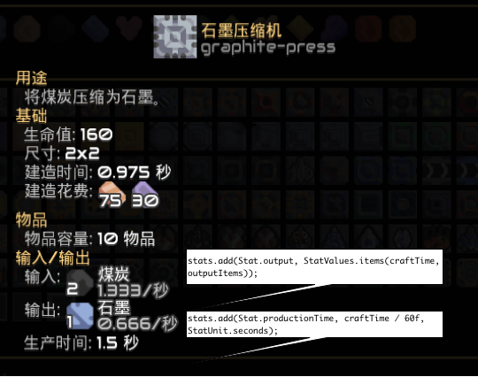
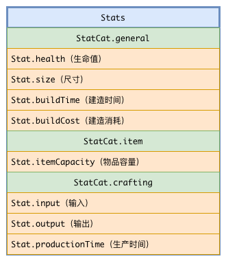

# 方块与建筑

恭喜你已成功掌握内容的创建流程。然而，这些并非你选择使用 Java 的全部原因。从本章开始，你将着手编写真正的代码，充分发挥 Java 的语言优势，实现天马行空的想法。但在此之前，仍需打好坚实基础，方能行稳致远。

## 一组辨析

方块（Block）与建筑（Building）是两个相关但本质不同的概念。在编写代码时，需要明确区分二者：

- 方块（Block）：指具有特定功能和属性的一类方块。例如，“石墨压缩机”是一种方块，其内部名称为`graphite-press`，属于通用工厂`GenericCrafter`类型。它定义了通用的行为，如消耗两单位“煤”并产出一单位“石墨”。方块的属性是所有同类建筑共用的，包括最大生命值`health`、尺寸`size`、建造消耗`requirements`等。前一章所配置的内容均属于此范畴。
- 建筑（Building）：指在世界（World）中实际存在的具体建筑实体，它是一个可独立绘制和更新的对象。例如，在游戏中放置一个“石墨压缩机”后，该实例就是一个建筑。它拥有自己独立的属性，如坐标`x`、`y`，当前生命值`health`、运行效率`efficiency`等。本章大部分操作直接或间接处理的对象都是建筑。

明确区分方块和建筑对于代码编写至关重要，它决定了代码的作用层面。例如，若需修改方块在核心数据库中的显示信息，应意识到这是对方块的配置，不涉及任何具体建筑实例。若希望建筑根据其当前生命值变化显示不同贴图，则应理解这是对建筑实例的处理，因为它依赖于每个建筑独立的状态属性`health`。

## 多态与继承

在深入探讨方块与建筑相关的代码实现之前，一个需要明确的基础问题是：模组的运行机制是怎样的？

这个问题有两种答案。第一种答案是，通过内容注册机制将你的内容注册到原版内容管理器中，再通过多态机制运行你的代码。另一件方式是通过事件系统在合适的时机运行代码，并从参数中获得必要的信息，对于这种机制，我们会在3.8中阐明。此处我们只会阐述内容-多态机制。

首先，我们要明确多态的概念。多态的定义是，允许不同类的对象对同一消息做出不同的响应。简单来说，就是"一个接口，多种实现"。对此问题，通过Mindustry中已有的代码解释再清晰不过。

例如，原版中设置方块在核心数据库显示内容的方法为`setStats()`，对于`GenericCrafter`、`Pump`、`ConsumeGenerator`三个类而言，内容分别如下：

``` java
@Override
public void setStats(){
    stats.timePeriod = craftTime;
    super.setStats();
    if((hasItems && itemCapacity > 0) || outputItems != null){
        stats.add(Stat.productionTime, craftTime / 60f, StatUnit.seconds);
    }

    if(outputItems != null){
        stats.add(Stat.output, StatValues.items(craftTime, outputItems));
    }

    if(outputLiquids != null){
        stats.add(Stat.output, StatValues.liquids(1f, outputLiquids));
    }
}
```

``` java
@Override
public void setStats(){
    super.setStats();
    stats.add(Stat.output, 60f * pumpAmount * size * size, StatUnit.liquidSecond);
}
```

``` java
@Override
public void setStats(){
    stats.timePeriod = itemDuration;
    super.setStats();

    if(hasItems){
        stats.add(Stat.productionTime, itemDuration / 60f, StatUnit.seconds);
    }

    if(outputLiquid != null){
        stats.add(Stat.output, StatValues.liquid(outputLiquid.liquid, outputLiquid.amount * 60f, true));
    }
}
```

对比各字段的含义与游戏内核心数据库页的具体显示内容，可以确认`setStats()`方法中的代码决定了显示内容。



然而，另一方面，大部分显示内容并未在这些类中定义，这是面向对象编程的另一特征——继承——所导致的结果。以下为其基类`Block`中的相关定义：

``` java
@Override
public void setStats(){
    super.setStats();

    stats.add(Stat.size, "@x@", size, size);

    if(synthetic()){
        stats.add(Stat.health, health, StatUnit.none);
        if(armor > 0){
            stats.add(Stat.armor, armor, StatUnit.none);
        }
    }

    if(canBeBuilt() && requirements.length > 0){
        stats.add(Stat.buildTime, buildTime / 60, StatUnit.seconds);
        stats.add(Stat.buildCost, StatValues.items(false, requirements));
    }

    for(var c : consumers){
        c.display(stats);
    }

    //Note: Power stats are added by the consumers.
    if(hasLiquids) stats.add(Stat.liquidCapacity, liquidCapacity, StatUnit.liquidUnits);
    if(hasItems && itemCapacity > 0) stats.add(Stat.itemCapacity, itemCapacity, StatUnit.items);
}
```

从上方的代码中可以看出，`Block`类中添加的统计信息是所有方块通用的。这是因为所有方块都继承了`Block`类，并且在执行`setStats()`时都调用了`super.setStats()`，即执行其超类的`setStats()`方法。实际上，向统计信息中添加方块的贴图和名称是`Block`超类`UnlockableContent`中的`setStats()`执行的结果。继承机制使得子类可以复用超类中已有的代码。

<!----让我画图要我老命了（哭）----->

最后，但也是最重要的，游戏是如何知道我们新建了一个内容？Mindustry的机制是，在内容对象的构造过程中自动完成注册。如果一个类直接或间接继承自内容的基类`Content`，其构造方法必须调用超类的构造方法，这个调用链最终会执行到`Content`的构造方法中：

``` java
public Content(){
    this.id = (short)Vars.content.getBy(getContentType()).size;
    Vars.content.handleContent(this);
}
```

这两行代码表明，游戏会通过内容管理器`Vars.content`为内容分配一个在其内容类型中唯一的id，并将内容自身注册到管理器中。在后续的加载过程中，该内容会与原版内容以相同的方式被处理。当玩家打开该物品的统计信息界面时，游戏会调用内容的`setStats()`方法来计算需要显示的信息，此时相关的代码逻辑才会被执行。

综上所述，我们可以得出以下结论：若要让游戏执行自定义的代码逻辑，必须创建一个继承自原版内容基类的子类，并实例化该子类。

## 创建一个自定义方块

根据以上的结论，我们已经准备好来向游戏中添加代码了。本教程将以“台灯”为例，向你展示创建一种新的方块的必要流程。

创建任何一种新方块之前，一定要先明确自己的需求，这些需求应当可以通过严谨的流程框图或伪代码来表述。在本例中，我们希望台灯能在玩家手动点击时切换亮/暗形态，点亮范围为5格。

接下来，你需要创建一个继承于`mindustry.type.Block`的类，命名其为`LampBlock`。在原版的代码架构中，方块的类一般放置在`world.blocks`包下，你可以选择效仿这种组织形式。在创建类后，IDE会自动提示你生成与超类符合的构造方法。

::: code-group
``` java
package example.world.blocks;

import mindustry.world.*;

public class LampBlock extends Block{
    public LampBlock(String name){
        super(name);
    }
}
```

``` kotlin
class LampBlock(name: String?) : Block(name) {}
```
:::

你需要将`update`字段设置为`true`，让游戏为这个方块的建筑生成实体。否则放置的建筑将会只能静态地绘制`Block#drawBase(Tile)`这一方块下的内容，而这正是原版环境方块、墙体等不需要复杂实体的方块的默认行为。

和方块一样，建筑实体也是由一个类型封装的。所有建筑实体的基类是`mindustry.gen.Building`。与方块不同的是，游戏通常会自动寻找一种方块所需的实体类型，而寻找的位置就是此类内部定义的第一个继承自`Building`的内部类。因此，在类的内部创建一个继承自`Building`的内部类即可满足此要求。Kotlin用户需要将这个内部类声明为`open inner`的。

在创建好建筑实体类后，我们可以向其中添加一些会用到的**状态（State）**。在本例中，台灯的亮灭就是一个状态，我们用一个布尔值来表示它。

::: code-group
``` java
public class LampBlock extends Block{
    public LampBlock(String name){
        super(name);
        update = true;
    }
    
    public class LampBuild extends Building{
        public boolean light;
    }
}
```

``` kotlin
class LampBlock(name: String?) : Block(name) {
    init {
        update = true
    }
    
    open inner class LampBuild: Building() {
        var light: boolean = false
    }
}
```
:::

这样，方块与建筑实体的代码区域便得以划分，它们分别对应`Block`中的方法和`Building`中的方法。后续的步骤是深入探究这两个区域中的方法。

## 加载贴图、添加进度条和统计信息

尽管`Block`类的方法非常多，但大部分都是用于查询，例如`isAir()` `canReplace(Block)`等。可以设置的方法主要有以下五个：

- `init()`：初始化；执行在所有内容已经加载完毕后，可以在这时将某些空字段赋值为默认值；
- `load()`：加载贴图；执行在所有内容初始化完毕之后，这时应当通过`Core.atlas`等手段获取贴图（`TextureRegion`）的引用，并存储起来以供绘制功能使用；
- `setStats()`：设置统计信息；执行在打开此方块的核心数据库时，这时应当向`stats`中添加统计信息的条目；
- `setBars()`：设置进度条；执行在初始化时，这时应当通过`addBar<T extends Building>(String, Func<T, Bar>)`和`removeBar(String)`等方法设置方块的进度条（Bar）；
- `drawPlace(int, int, int, boolean)`：玩家在建造栏中点选方块之后，放置之前所绘制的内容（仅桌面端）；因为此时还没有实例被创建，所以使用参数传递位置、方向（与任意角定义相同，`右0上1左2下3`）和建造是否有效；在`Block`中的实现已经包括绘制方块本身。

### `load()`

原版中几乎全部的显示效果都是使用贴图来呈现的，灯笼也不例外。你需要为灯笼准备一张点亮贴图和一张熄灭贴图。由于这次你需要自定义绘制过程，因此你不能再依赖游戏帮你引用贴图，而是需要自己引用贴图并编写绘制过程。你仍然需要把贴图放置在`assets/sprites/`目录下。你可以通过这样的语法来获得贴图的引用：

``` java
Core.atlas.find("<modName>-<fileName>");
```

这样获取的是一个类型为`TextureRegion`子类的、指向这张贴图的引用。在实践中，多次调用此方法可能会造成性能损失，因此你需要把此方法的返回值存在这个方法中。欲达到此目的，你需要在此方块的类中新建一个字段：

::: code-group
``` java
public class LampBlock extends Block{

    public TextureRegion lightRegion, darkRegion;

    public LampBlock(String name){
        super(name);
        update = true;
    }

    @Override
    public void load(){
        super.load();
        lightRegion = Core.atlas.find(name + "-light");
        darkRegion = Core.atlas.find(name + "-dark");
    }
    
    public class LampBuild extends Building{
        public boolean light;
    }
}
```

``` kotlin
class LampBlock(name: String?) : Block(name) {
    init {
        update = true
    }

    var lightRegion: TextureRegion? = null
    var darkRegion: TextureRegion? = null

    override fun load() {
        super.load()
        lightRegion = Core.atlas.find("$name-light")
        darkRegion = Core.atlas.find("$name-dark")
    }
    
    open inner class LampBuild: Building() {
        var light: Boolean = false
    }
}
```
:::

对于重写的方法，建议使用`@Override`注解（仅Java）/`override`修辞符（仅Kotlin）。同时，需要根据需求决定是否调用`super`方法，且`super`方法的调用位置可能影响程序行为。

::: info 小贴士

字段在不同的位置和不同的修辞符代表的含义并不相同：

- 在建筑区中创建的字段：代表一个建筑实体当前的“状态”，对于不同的实体来说是不同的。例如，两个不同的台灯可以一开一关；
- 在方块区中创建的字段：代表一种方块配置的属性，对于该方块的所有实体来说都是相同的。例如，所有台灯绘制的贴图都是相同的；
- 在方块区中创建的静态字段：代表对此类的所有种方块都相同的设置，对于所有类型为此类的方块都是相同的；
:::

Core.atlas.find有三种不同的重载版本，另两种重载版本允许你在找不到某张贴图时再尝试获取另一张贴图。如果都找不到，就会获取到`error`（即ohno）的引用。

### `setStats()`

统计信息在原版中被封装为类型`mindustry.world.meta.Stats`。`Stats`的本质为一个封装了一些工具方法的`OrderedMap<StatCat, OrderedMap<Stat, Seq<StatValue>>>`。这个类型声明可以这样理解：表示条目类别的`StatCat`下辖一个`OrderedMap<Stat, Seq<StatValue>>`，后者是由若干个表示条目名称的`Stat`和若干表示条目值的`StatValue`组成的键值对构成。下图是“石墨压缩机”的stats构成。



`StatValue`是一个 **函数式接口（Functional Interface）** ，又叫 **单一抽象方法类（Single Abstract Method，简称SAM）** 。在Java中，SAM和Lambda是等价的，因此我们可以方便地使用Lambda表达式来构造一个SAM对象。要想理解SAM，以StatValue为例 再好不过了。此接口定义了一个签名为`void display(Table)`的方法，实现此接口的类需要给出此方法，而这个方法要做的是正是向UI系统传来的表格（Table）中添加显示元素（Element），以用于在统计信息页中显示内容。此外，在原版Stats系统中还有一个类`StatUnit`，表示统计信息中使用的单位制，如`blocks`（格）、`itemsSecond`（物品/秒）。

原版在`Stats`中封装了大量现成的方法，使得在多数情况下无需直接处理`StatValue`。在此类中，需要创建一个新的条目来表示照亮范围，因为原版中不存在此`Stat`。要实现这一点，需先创建一个`Stat`。若此`Stat`无需重复使用，可直接在`setStats()`方法中创建；否则，建议参照原版做法，在专门的类/单例中定义模组所需的`Stat`。

::: code-group

``` java
public class TutorialStatJ{
    public static Stat lightRadius = new Stat("lightRadius", StatCat.function);
}
```

``` kotlin
object TutorialStat {
    val lightRadius = Stat("lightRadius", StatCat.function)
}
```

:::

接下来就可以在`setStats()`方法中添加新的Stat了，下列代码只展示此方法：

::: code-group

``` java
@Override
public void setStats(){
    super.setStats();
    stats.add(TutorialStat.lightRadius, 5f, StatUnit.blocks);
}
```

``` kotlin
override fun setStats() {
    super.setStats()
    stats.add(TutorialStat.lightRadius, 5f, StatUnit.blocks)
}
```

:::

以下是`add(...)`方法重载的介绍：

- `add(Stat, float)`：显示一个数字；虽然传入的是一个float，但会自动删除小数点后无效的0，最多保留小数点后三位；
- `add(Stat, float, StatUnit)`：显示一个数字和一个单位，数字的显示与上例相同；
- `add(Stat, boolean)`：显示“是”/“否”；
- `add(Stat, Item)`：显示一个物品图标；
- `add(Stat, ItemStack)`：显示一个物品图标，并在右下角显示个数；
- `add(Stat, Liquid, float, boolean)`：显示一个流体图标，并在右下角显示数量（false）或速率（true）；
- `add(Stat, Attribute)`：显示当前地图上拥有此属性的地板；
- `add(Stat, String, Object...)`：显示带格式的字符串，字符串中的`@`将会按照顺序替换成参数列表中的值；
- `add(Stat, StatValue)`：上述方法的母方法，传入一个`StatValue`，并显示其中代码显示的内容。

在绘制之前，`stats`内部会自动根据注册顺序整理显示顺序。

添加的`Stat`需要配置本地化条目。统计信息系统的本地化键名不会被`modName`前缀修饰，因此建议为键名添加独特前缀以避免与其他模组冲突。`Stat`和`StatUnit`的键名在本地化时会自动转换为全小写，而`StatCat`的键名则保持原样：

``` properties bundle_zh_CN.properties
# Stat的本地化格式
stat.lightradius = 照亮范围
# StatCat的本地化格式
category.tutorialStatCat = 教程
# StatUnit的本地化格式
unit.tutorialstatunit = 个教程
```

``` properties bundle.properties
# Stat的本地化格式
stat.lightradius = Light Radius
# StatCat的本地化格式
category.tutorialStatCat = Tutorial
# StatUnit的本地化格式
unit.tutorialstatunit = tutorial
```

### `setBars()`

在游戏中点击一个方块后，游戏右下角的建造栏（Placement Fragment）上方会显示出建筑的显示内容，其中就包括建筑的若干个条（Bar），包括血量条、电量条、物品量条等。你可以给自己的建筑添加自定义的条。本例中，我们希望给台灯添加一个表示其亮暗的条。

添加`Bar`的行为发生在`setBars()`方法中，通过`addBar<T extends Building>(String, Func<T, Bar>)`方法实现。此方法的第一个参数是进度条的内部名称，第二个参数是一个SAM，该SAM接受一个建筑实例，返回一个`Bar`对象。`Bar`是一个与建筑实例状态相关的类，其进度、显示文字和颜色可由建筑实例的独立状态决定，因此每个建筑实例可以拥有不同的`Bar`。控制`Bar`进度、显示文字和颜色的“因素”与建筑实例绑定，这决定了该参数的类型为这样一个SAM。

实际使用过程中，`Func` 只需返回一个 `new Bar` 实例，因此重点在于理解 `Bar` 构造方法的参数含义。`Bar` 提供两个构造方法：一个是 `Bar(String, Color, Floatp)`，其中文本与颜色为静态值，进度为动态值；另一个是 `Bar(Prov<CharSequence>, Prov<Color>, Floatp)`，其中文本、颜色和进度均为动态值，可随时间变化。这里的 `Prov` 表示一个动态提供器，其值会在每次访问时重新计算；相比之下，`String` 和 `Color` 作为静态值，在构造后保持不变。

在本例中，我们需要让文本和进度均可变，因此我们需要选用第二个构造方法。在其中我们可以引用先前用来表示亮暗状态的字段。为了能引用这个字段，这里我们要手动标明`Func`中参数的类型。否则其类型默认是`Building`，不会出现我们添加的字段：

::: code-group

``` java
@Override
public void setBars(){
    super.setBars();
    addBar("light", (LampBuild lamp) -> new Bar(() -> lamp.light ? "灯开" : "灯关",
    () -> Pal.accent,
    () -> lamp.light ? 1f : 0f));
}
```

``` kotlin
override fun setBars() {
    super.setBars()
    addBar("light") { lamp: LampBuild ->
        Bar(
            { if (lamp.light) "灯开" else "灯关" },
            { Pal.accent },
            { if (lamp.light) 1f else 0f }
        )
    }
}
```

:::

### 国际化
上述代码如果只在单一语言环境下运行，并不会造成什么问题。但如果模组的受众可能使用多种语言，那么用户可能会对非本地化的文字感到困惑。因此，我们需要对代码中的文本进行 **国际化处理（Internationalization，简称i18n）** 。事实上，原版处理国际化的手段就是`I18nBundle`。接下来让我们看看如何使用Bundle来进行国际化。

`I18nBundle`在游戏中是一个单例对象，其唯一的对象位于`Core.bundle`。使用时我们需要使用这样的语法：

``` java
//获取当前语言中键名为misc.lightOn的值
Core.bundle.get("misc.lightOn");
//获取当前语言中键名为misc.lightOn的值，并将其中的{0}替换成aaa，{1}替换成bbb
Core.bundle.format("misc.light", "aaa", "bbb");
```

例如以上的代码可以做如下改写：

::: code-group

``` java
@Override
public void setBars(){
    super.setBars();
    addBar("light", (LampBuild lamp) -> new Bar(() -> lamp.light ? "灯开" : "灯关", // [!code --]
    addBar("light", (LampBuild lamp) -> new Bar(() -> lamp.light ? Core.bundle.get("misc.lampOn") : Core.bundle.get("misc.lampOff"), // [!code ++]
    () -> Pal.accent,
    () -> lamp.light ? 1f : 0f));
}
```

``` kotlin
override fun setBars() {
    super.setBars()
    addBar("light") { lamp: LampBuild ->
        Bar(
            { if (lamp.light) "灯开" else "灯关" }, // [!code --]
            { if (lamp.light) Core.bundle.get("misc.lampOn") else Core.bundle.get("misc.lampOff") }, // [!code ++]
            { Pal.accent },
            { if (lamp.light) 1f else 0f }
        )
    }
}
```

:::

这需要你在Bundle文件中做相应的添加：

``` properties bundle_zh_CN.properties
misc.lampOn = 灯开
misc.lampOff = 灯关
```

``` properties bundle.properites
misc.lampOn = ON
misc.lampOff = OFF
```

关于`Core.bundle.format`方法有两点值得注意。首先，此方法的字符串格式化功能由`java.text.MessageFormat`提供，因此支持`MessageFormat`的所有语法，主要使用`{0}`、`{1}`、`{2}`等占位符依次代表传入的参数。其次，此方法返回的是静态字符串，不会随构造内容的变化而更新；若要响应新值，必须重新调用`format`方法。

在`get`方法无法在当前语言中获取到对应的值时，会尝试从英文bundle中读取。如果英文bundle中也没有此值，则会返回默认值。若未通过第二个参数传入默认值，则会显示`???键名???`。

## 绘制与更新

在处理完毕方块区的代码后，我们继续来处理建筑实体区的代码。实体区的方法大致可分为两类，一类是每时每刻都被调用的，如`update()`和`draw()`，这两者又分别被分拆出了若干个方法。一类是按需调用的，如建筑完毕后执行`placed()`，试图输出物品时调用`dump()`，其他建筑询问是否可以接受物品时调用`acceptItem(Building, Item)`，其中调用方可能是玩家、自身或其他实体。

本部分先讲解绘制部分的代码。虽然绘制与更新的顺序在逻辑上存在先后关系，但此处基于台灯功能的实现需求，将绘制部分置于更新部分之前进行说明。与更新相关的代码将在下一节中详细阐述。

### `draw()`

所有绘制方法中，这是最基本的一个。负责的是绘制方块本身的贴图。在本例中，因为我们没有按照原版的规范加载贴图，即没有提供与内容名称相同的贴图文件，因此这个方法我们需要重写。

在Mindustry中，有一系列专门用于在屏幕上绘制内容的类，他们的名字包括`arc.graphics.g2d.Draw Fill Lines`和`mindustry.graphics.Drawf`。这些类中的方法如果在实体的绘制方法中执行，则可以在屏幕上绘制内容。如果在绘制方法外执行这些方法则是没有意义的。在Arc中，在某个位置绘制一张贴图的方法是`Draw.rect()`。这个方法中的`x`和`y`指绘制区域的中心坐标，建筑实体自带的`x`和`y`即为建筑中心的绘制坐标，你可以直接使用，你还可以设置`w`和`h`来设置宽和高。这时，我们之前在`load()`方法中加载的贴图文件就派上用场了。这次我们不再调用`super.draw()`，这是因为我们不需要super方法中绘制的内容了。

::: code-group

``` java
@Override
public void draw(){
    Draw.rect(light ? lightRegion : darkRegion, x, y);
}
```

``` kotlin
override fun draw() {
    Draw.rect(if (light) lightRegion else darkRegion, x, y)
}
```

:::

### `drawLight()`

这也是基本的绘制方法之一。因为这个方法并不受`draw()`支配，而是自己被渲染系统`BlockRender`调用。把绘制光亮这个功能单独拿出来成为一个方法，是方便使用设置控制是否绘制光亮。

在这个方法中，应该只包括对`Drawf.light()`的调用，这个方法的参数即为光源坐标、半径、颜色和不透明度：

::: code-group

``` java
@Override
public void drawLight(){
    super.drawLight();
    Drawf.light(x, y, 5f, Color.white, 1f);
}
```

``` kotlin
override fun drawLight() {
    super.drawLight()
    Drawf.light(x, y, 5f, Color.white, 1f)
}
```

:::

::: danger 不要随意新建对象

如果你想给台灯换一个颜色，你可能会写出来这样的代码：

``` java{4}
@Override
public void drawLight(){
    super.drawLight();
    Drawf.light(x, y, 5f, new Color("39c5bb"), 1f);
}
```

在这种每帧都会执行的代码中直接或间接地新建对象是**非常可怕**的一件事，量化来说，如果同时有三十个方块执行这个代码，那么你的内存吞吐量将可能达到100MB/s，这对游戏体验是致命的。

正确的做法是把这些值不变的对象找个地方缓存起来：

``` java
public static final Color mikuGreen = new Color("39c5bb");

@Override
public void drawLight(){
    super.drawLight();
    Drawf.light(x, y, 5f, mikuGreen, 1f);
}
```

你也可以像原版一样，建一个`Pal`类来存储用到的颜色。至于确实可变的对象，你也应该尽量把他们临时化或池化来减少对象创建。

:::

### 其他实体绘制方法

其他的绘制方法和`drawLight()`有特定功能，并且是在特定时刻被绘制。这样的方法包括：

- `drawConfigure()`：当可配置（`configurable = true`）的建筑被单击并进入配置模式时，此方法用于绘制额外的视觉内容，原版默认实现为绘制一个黄色边框；
- `drawCrack()`：当方块因受损而生命值降低时，此方法负责绘制表示裂纹的贴图，只有方块`drawCrack = true`时才会绘制；
- `drawDisabled()`：当方块被禁用时，此方法用于绘制表示禁用状态的视觉标识，原版默认实现为绘制一个红色叉号（`Icon.cancel`）；
- `drawSelect()`：在桌面端，当玩家在建造栏中点选方块后、放置之前，此方法用于绘制相关的视觉指示；
- `drawStatus()`：此方法用于绘制方块的状态信息；
- `drawTeam()`：当建筑所属队伍与当前玩家队伍不同时，此方法用于绘制代表队伍颜色的边框；
- `drawTeamTop()`：此方法用于绘制会随建筑队伍变化而变化的贴图；

### 寄居在方块中的实体绘制

以上所述的绘制方法均针对具有实体方块的绘制。然而，Mindustry中还存在大量无实体的方块，其建筑没有实体，无法自行执行绘制方法。此外，当建筑尚未被放置时，也需要方块进行绘制。以下将分析各个方法的含义，因为此处的代码逻辑相对复杂。

- `drawBase(Tile)`：如果建筑有实体，这个方法就会委托给实体的`draw()`方法


