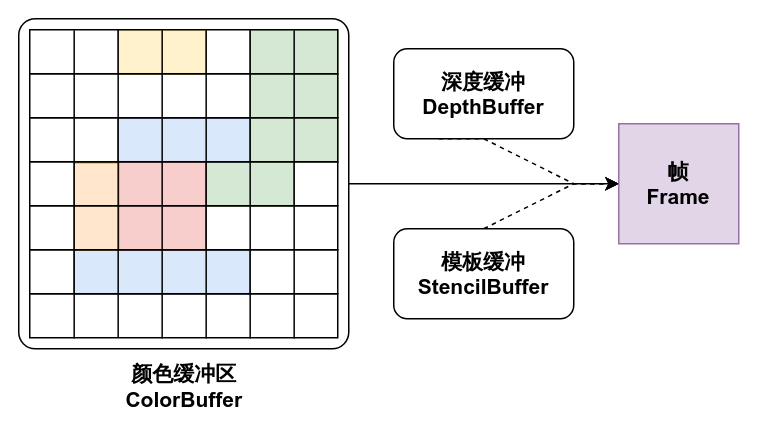
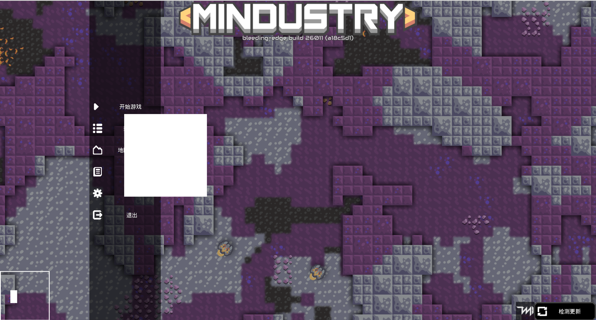
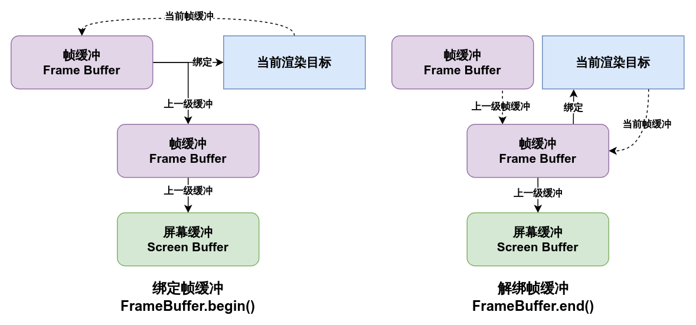
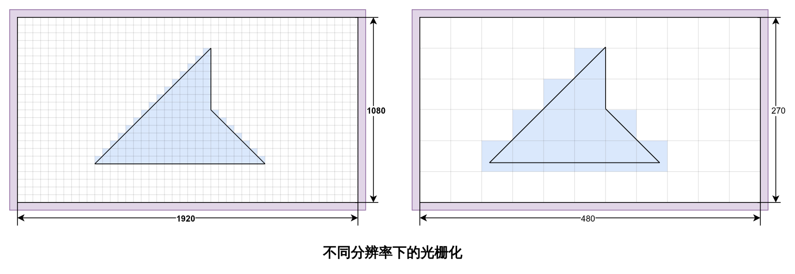
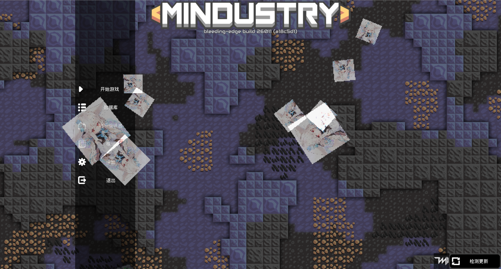

# 帧缓冲（FrameBuffer）与离屏渲染

> ***“别浪费内存，你个蠢货”***

到目前为止，我们讲到的渲染过程都是直接将结果输出到屏幕上的，这很符合直觉，即渲染结果直接呈现在屏幕上。

但是有许多时候我们会需要一些中间步骤，将图像进行一些中间处理后再输出到屏幕，这个时候就需要引入 **离屏渲染（Off-screen Rendering）** 这一概念了，而实现离屏渲染的工具，在OpenGL中也就是**帧缓冲（FrameBuffer）**。

## 帧结构

在讨论离屏渲染前，我们先讨论此前所讲的渲染过程是如何将结果呈现在屏幕上的。

并不需要了解硬件实现，这里只需要讨论输出的渲染结果内存结构。我们知道屏幕所呈现的是一个又一个像素点组成的点阵图，它在内存当中被描述为一片连续的内存区域，记录了每一个像素点的颜色信息。

可以这样理解，我们之前所讲的渲染工作，实际上就是将像素颜色写入到这个显存区域中，然后呈现在屏幕之上，而这个区域被称为**颜色缓冲（ColorBuffer）**。

一般着色器程序处理的目标均为颜色缓冲，而直接呈现在屏幕上的也是颜色缓冲，另外还有在绘图过程中间接作用的 **深度缓冲（DepthBuffer）** 及 **模板缓冲（StencilBuffer）** ，这二者分别被用于深度测试与模板测试，在稍后的章节中会进行介绍。

而这些缓冲区被统称为**渲染缓冲区（RenderBuffer）**，它们所存储的信息共同构成了一个完整的**帧（Frame）**。



## 帧缓冲（FrameBuffer）

离屏渲染的实质就是将上述的帧结构模型在另一片内存区域中进行模拟，而不将颜色信息显示在屏幕上，模拟这个内存模型的工具就是**帧缓冲（FrameBuffer）**。

具体来说，一个帧缓冲区内绑定了若干个渲染缓冲，这可以是多个颜色缓冲，至多一个深度缓冲和至多一个模板缓冲，一般情况下帧缓冲仅含单个颜色缓冲，而带有多个颜色缓冲的帧缓冲被称为**多目标渲染缓冲区（Multi Render Target Buffer, 简写为MRT）**，本节暂不讨论MRT。

在arc中，帧缓冲被封装为类型`arc.graphics.gl.FrameBuffer`，需要一个帧缓冲只需要构造一个该类型的实例即可，它带有多个构造函数，定义了多种默认帧缓冲的模板：

``` java
/**2x2像素尺寸，格式为RGBA8888的帧缓冲，无深度缓冲与模板缓冲*/
FrameBuffer(){/*...*/}
/**指定大小的格式为RGBA8888的帧缓冲，无深度缓冲与模板缓冲*/
FrameBuffer(int width, int height){/*...*/}
/**指定大小与格式的帧缓冲，无深度缓冲与模板缓冲*/
FrameBuffer(Pixmap.Format format, int width, int height){/*...*/}
/**指定大小与格式的帧缓冲，无模板缓冲
 * @param hasDepth 是否带有深度缓冲*/
FrameBuffer(Pixmap.Format format, int width, int height, boolean hasDepth){/*...*/}
/**指定大小的格式为RGBA8888的帧缓冲，无模板缓冲
 * @param hasDepth 是否带有深度缓冲*/
FrameBuffer(int width, int height, boolean hasDepth){/*...*/}
/**指定大小与格式的帧缓冲
 * @param hasDepth 是否带有深度缓冲
 * @param hasStencil 是否带有模板缓冲*/
FrameBuffer(Pixmap.Format format, int width, int height, boolean hasDepth, boolean hasStencil){/*...*/}
```

其中，类型为`Pixmap.Format`的参数`format`是一个枚举类型，它用于定义在颜色缓冲上的数据类型与数据到纹理的解析方式，枚举条目及释义如下表所列：

| 格式             | 释义                        | 解析颜色向量       |
|----------------|---------------------------|--------------|
| alpha          | 像素仅包含一个8位精度的数据a，仅记录透明度信息  | (0, 0, 0, a) |
| intensity      | 像素仅包含一个8位精度的数据i，记录像素灰度信息  | (i, i, i, i) |
| luminanceAlpha | 像素仅包含一个8位精度的数据l，记录像素的亮度信息 | (l, l, l, 1) |
| rgb565         | 像素为16位颜色，分割为5位的r和g以及6位的b  | (r, g, b, 1) |
| rgba4444       | 像素为16位颜色，四个数据rgba分别占4位    | (r, g, b, a) |
| rgb888         | 像素为24位颜色，三个数据rgb分别占8位     | (r, g, b, 1) |
| rgba8888       | 像素为32位颜色，四个数据rgba分别占8位    | (r, g, b, a) |

除非你很清楚你需要的效果，否则使用`rgba8888`始终是首选。

如下例所示：

::: code-group

``` java
public void example(){
  FrameBuffer buffer1 = new FrameBuffer();//尺寸为2x2，使用前必须通过resize(w, h)重设尺寸
  FrameBuffer buffer2 = new FrameBuffer(1024, 1024);//rgba8888格式的，大小为1024x1024的帧缓冲
  FrameBuffer buffer3 = new FrameBuffer(
      Pixmap.Format.rgba8888, //format
      Core.graphics.getWidth(), //width
      Core.graphics.getHeight(), //height
      true, //hasDepth
      true //hasStencil
  );//rgba8888格式的，大小为屏幕尺寸的带有深度缓冲与模板缓冲的帧缓冲
}
```

``` kotlin
fun example(){
  val buffer1 = FrameBuffer() //尺寸为2x2，使用前必须通过resize(w, h)重设尺寸
  val buffer2 = FrameBuffer(1024, 1024) //rgba8888格式的，大小为1024x1024的帧缓冲
  val buffer3 = FrameBuffer(
    format = Pixmap.Format.rgba8888,
    width = Core.graphics.getWidth(),
    height = Core.graphics.getHeight(),
    hasDepth = true,
    hasStencil = true
  ) //rgba8888格式的，大小为屏幕尺寸的带有深度缓冲与模板缓冲的帧缓冲
}
```

:::

## 离屏渲染

创建帧缓冲后，即可利用它来进行离屏渲染了。要使用帧缓冲，应在需要进行离屏渲染的任务前将帧缓冲绑定到渲染目标，我们可以这样理解，OpenGL默认绑定了一个内置的“帧缓冲”，这个帧缓冲称为**屏幕缓冲（ScreenBuffer）**，它直接将结果显示到屏幕上，而OpenGL的所有渲染工作均以**当前绑定到的帧缓冲**为目标输出结果。当我们将一个帧缓冲绑定到渲染目标，直到下一个帧缓冲绑定或者解除绑定（或者说是绑定到默认内置缓冲）之前，所有的渲染结果均会输出到这个绑定的帧缓冲中。


`FrameBuffer`通过方法`begin()`或`begin(color)`来绑定到当前渲染目标，这二者的区别在于是否清除该帧缓冲中的缓存数据，直到上一次结束绑定该帧缓冲为止，在该帧缓冲上所绘制的内容是不会被清除的。

通常情况下建议使用`begin(Color.clear)`以在离屏渲染开始前清除上一次渲染的遗留结果，以避免一些意料之外的情况，当然某些情况下可以沿用上一次绘制的结果，来制作一些有意思的效果，或者当你的渲染会完全覆盖掉整个帧缓冲时，也可以选择使用`begin()`来稍稍节省清除缓冲区的时间。

自调用`begin`方法绑定一个帧缓冲开始，之后的所有渲染工作均会输出到该帧缓冲中，直到调用该帧缓冲的`end()`方法结束绑定，或者绑定到了另一个帧缓冲时。

而帧缓冲中的图像可以通过`getTexture()`来获取**只读的仅OpenGL上的纹理**，该纹理中即存储了在该帧缓冲上渲染出来的图像，对帧缓冲最简单的利用就是利用该纹理将一段绘制任务的输出结果进行自由的缩放及裁剪。注意，在使用该纹理之前必须确保帧缓冲已经解绑，否则无法确保纹理中的图像正确性。

以一段简单的程序为例，该程序将同一个四边形绘制任务缩放到屏幕左下角长宽240x240的范围内：

::: code-group

``` java
FrameBuffer buffer = new FrameBuffer();
void example(){
  Fill.square(80f, 80f, 20f);//直接将四边形绘制到屏幕上
  
  //确保缓冲区尺寸
  buffer.resize(Core.graphics.getWidth(), Core.graphics.getHeight());
  //绑定到缓冲区，并重置帧缓冲的颜色为透明
  buffer.begin(Color.clear);

  Fill.square(80f, 80f, 20f);//四边形会被绘制到帧缓冲中
  
  //解除绑定缓冲区（必要！）
  buffer.end();
  //获取纹理
  Texture texture = buffer.getTexture();
  //对纹理创建uv自0到1的完整纹理区域
  TextureRegion region = new TextureRegion(texture); 
  //将帧缓冲中的图像绘制到屏幕左下角
  Draw.rect(region, 120, 120, 240, 240);
  //将帧缓冲的输出范围框出
  Lines.stroke(4f);
  Lines.rect(0f, 0f, 240f, 240f);
}
```

``` kotlin
val buffer = FrameBuffer()
fun example(){
  Fill.square(80f, 80f, 20f)//直接将四边形绘制到屏幕上
  
  //确保缓冲区尺寸
  buffer.resize(Core.graphics.getWidth(), Core.graphics.getHeight())
  //绑定到缓冲区，并重置帧缓冲的颜色为透明
  buffer.begin(Color.clear)

  Fill.square(80f, 80f, 20f)//四边形会被绘制到帧缓冲中
  
  //解除绑定缓冲区（必要！）
  buffer.end()
  //获取纹理
  val texture = buffer.getTexture()
  //对纹理创建uv自0到1的完整纹理区域
  val region = TextureRegion(texture)
  //将帧缓冲中的图像绘制到屏幕左下角
  Draw.rect(region, 120, 120, 240, 240)
  //将帧缓冲的输出范围框出
  Lines.stroke(4f)
  Lines.rect(0f, 0f, 240f, 240f)
}
```

:::

它将会先在你的屏幕上绘制出一个白色的正方形，接着，这个正方形绘制到一个帧缓冲后，被缩放到左下角的一个正方形小框中：



> 可以试试画一个更复杂的图像，然后尝试改变一下将帧缓冲绘制到屏幕上的尺寸甚至角度，看看绘制的效果。

::: tip 注意
注意新建`TextureRegion`的操作，频繁实例化会带来性能问题，在实际开发中应缓存一个对象通过`set(texture)`方法来更新该纹理区域的图像内容。
:::

你可能会困惑于这有什么作用，需要注意帧缓冲的绑定与解绑并不干扰其间的绘制任务，当我们将游戏的图形绘制工作完全包含在一个帧缓冲绑定内时，游戏输出的图像就会被完整的输出到帧缓冲中，而不是屏幕上，而对这个图像应用一些处理后再输出到屏幕，就可以实现如滤镜和像素化等效果，而游戏本身的像素化也就是利用帧缓冲实现的，稍后我们会去解析Mindustry的像素化处理原理。

## 嵌套帧缓冲

在讨论实际应用前需要排除一个易错点，即帧缓冲的嵌套。

在渲染过程中，我们可能会在绑定了一个帧缓冲以后，再一次绑定另一个帧缓冲，我们前面说过，**OpenGL只会维护一个当前渲染目标**，当你绑定一个新的帧缓冲时，当前渲染目标会被直接重设为你提供的这个帧缓冲，而之前绑定的帧缓冲则事实上的以绑定操作的**副作用**形式被解绑了，为了避免绑定与解绑的对称性出现问题，操作帧缓冲时需要有一定的顺序限制。

arc中封装的`FrameBuffer`模拟了一条类似链表的绑定结构，一定程度上维护了多个帧缓冲的层级结构，具体来说，每一个帧缓冲在绑定前，会记录当前已绑定的那个帧缓冲（或者当无帧缓冲被绑定时为屏幕缓冲）为它的上一级缓冲，通过`end()`方法解绑该帧缓冲实质上就是将当前渲染目标绑定到上一级帧缓冲，以自然解绑该帧缓冲。



但是，需要注意，在你解绑某一帧缓冲时，若它不是最上层的帧缓冲，那么其所有上级帧缓冲都会被弹出该链表并解绑，此时若再次解绑已被弹出的上层的帧缓冲将会发生意料之外的错误绑定。

:::code-group

``` java
void example(){
  FrameBuffer buf1 = new FrameBuffer();
  FrameBuffer buf2 = new FrameBuffer();
  FrameBuffer buf3 = new FrameBuffer();
  
  buf1.begin();
    buf2.begin();
      buf3.begin();//buf3.lastFrameBuffer -> buf2
      
    buf2.end();
    buf3.end();//这将会导致buf2被再次绑定！
  
  buf1.end();//这会解除自buf1至buf3的所有帧缓冲绑定
  
  FrameBuffer.unbind();//直接解除所有帧缓冲绑定，而无需获取第一级别的帧缓冲
  //慎用，这很可能会破坏渲染流程
}
```

``` kotlin
fun example(){
  val buf1 = FrameBuffer()
  val buf2 = FrameBuffer()
  val buf3 = FrameBuffer()
  
  buf1.begin()
    buf2.begin()
      buf3.begin()//buf3.lastFrameBuffer -> buf2
      
    buf2.end()
    buf3.end()//这将会导致buf2被再次绑定！
  
  buf1.end()//这会解除自buf1至buf3的所有帧缓冲绑定
  
  FrameBuffer.unbind()//直接解除所有帧缓冲绑定，而无需获取第一级别的帧缓冲
  //慎用，这很可能会破坏渲染流程
}
```

:::

::: tip 注意
***嵌套帧缓冲并不会使你渲染的图像被输出到所有上级帧缓冲，你的所有渲染操作只会以当前绑定的帧缓冲为目标！***

而对于需要逐级传递渲染结果的嵌套结构，还应在内层的帧缓冲解绑后将缓冲内容以任何形式去绘制到上一层。
:::

## 像素化的原理

在讲解像素化的工作原理之前，我们还需要补充一个知识点，即帧缓冲的尺寸对渲染任务的影响。

在你绑定到一个帧缓冲时，在将渲染目标设定到该帧缓冲的同时，`begin`方法还会将GL窗口的尺寸也重设为与帧缓冲一致，回顾我们在之前的章节中讲解的标准化屏幕坐标，当一个帧缓冲被绑定后，该坐标在屏幕空间的投射同样会指向该帧缓冲中，也就是说：**绑定的帧缓冲尺寸会改变渲染的比例与分辨率**。

现在，思考一下实现图像像素化需要做什么？

像素化的实质即通过降低图像的分辨率，来增强图像的边缘锯齿，为此，我们可以将游戏的主要渲染工作包围在一个长宽比不变，但是分辨率小于窗口实际尺寸的帧缓冲中，此时，游戏的渲染将会在一个更小的窗口中进行。



此时，在此缓冲内完成游戏的渲染流程后，游戏的一帧将会被输出到一个尺寸缩小后的纹理当中。将该纹理的过滤方式设置为最近邻过滤（见本章第四节 ***[纹理与点阵图（Pixmap）](04-texture-and-pixmap.md)***）以强化边界的锯齿，直接将该纹理放大绘制到屏幕尺寸上，即可实现图像的像素化。

以我们在第五节中绘制多个方形图像的[程序](05-transformation-projection-camera.md#摄像机的原理)为例，我们按照上述的逻辑编写一个帧缓冲包围那个`draw()`方法：

::: code-group

``` java
FrameBuffer pixelator = new FrameBuffer(){{ 
  getTexture().setFilter(Texture.TextureFilter.nearest);
}};
TextureRegion region = new TextureRegion();

public void drawPixelate(){
  int width = Core.graphics.getWidth();
  int height = Core.graphics.getHeight();
  
  pixelator.resize(width/4, height/4);
  pixelator.begin(Color.clear);
  
  draw();
  
  pixelator.end();
  
  region.set(pixelator.getTexture());
  Draw.rect(region, width/2f, height/2f, width, height);
}
```

``` kotlin
val pixelator = FrameBuffer().apply{
  getTexture().setFilter(Texture.TextureFilter.nearest)
}
val region = TextureRegion()

fun drawPixelate(){
  val width = Core.graphics.width
  val height = Core.graphics.height

  pixelator.resize(width/4, height/4)
  pixelator.begin(Color.clear)

  draw()

  pixelator.end()

  region.set(pixelator.getTexture())
  Draw.rect(region, width/2f, height/2f, width, height)
}
```

:::

将绘制中对`draw()`的调用更换为此处包围的`drawPixelate()`，最后的图像会明显的像素化：



而游戏本身的像素化实现原理与上述例子实际上是几乎完全一致的，只是那个`draw()`方法指向了游戏的核心渲染流程！

打开游戏本身实现像素化的工具类`mindustry.graphics.Pixelator`，查阅其两个核心方法:

``` java
public void drawPixelate(){
    //计算缓冲尺寸w与h，已省略
    //...

    buffer.resize(w, h);

    buffer.begin(Color.clear);
    renderer.draw();
}

public void register(){
  Draw.draw(Layer.end, () -> {
    buffer.end();

    Blending.disabled.apply();
    buffer.blit(Shaders.screenspace);

    //对齐摄像机坐标，已省略
    //...
  });
}
```

而这两个方法恰恰将整个游戏的世界渲染工作包含在了其中，这与我们前面所给出的例子的工作逻辑是**完全一致的**！而其中出现的帧缓冲的`buffer.blit(shader)`方法，其效用为使用参数提供的那个着色器，将帧缓冲的内容绘制在屏幕上，这等价于使用该着色器和帧缓冲中的纹理作为采样目标，去提交一个四个顶点分别为屏幕四个角的`Mesh`，而上述`Shaders.screenspace`就是简单的将纹理采样结果作为片段颜色进行染色。

## 小练习

试试编写一个小窗，在游戏正常渲染的同时，将游戏画面在一个小窗口中再次显示。

::: details 小提示
###### 参考一下本节的第一个例子是如何缩放的，然后想想像素化又是如何对游戏画面进行的？
:::
